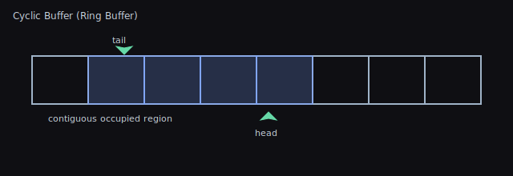
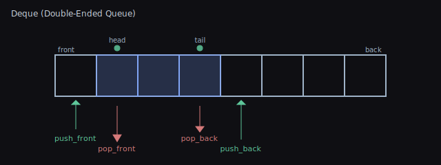

# Core Data Structures — Concepts, Usage, and Trade-offs

## TL;DR — What Problem This Solves

- Pick the right container for performance and clarity: ring buffers, deques, heaps, tries, sparse sets, etc.
- Each section gives a plain‑language “Use for / Pros / Cons” and a tiny code snapshot to copy.
- When in doubt, prefer simple .NET types; use these when you hit performance or ergonomics limits.

This guide covers several foundational data structures used across the library and when to use them.

## Cyclic Buffer (Ring Buffer)

- What it is: Fixed-capacity circular array with head/tail indices that wrap.
- Use for: Streaming data, fixed-size queues, audio/network buffers.
- Operations: enqueue/dequeue in O(1); overwriting old data optional.
- Pros: Constant-time, cache-friendly, no reallocations at steady size.
- Cons: Fixed capacity unless resized; must handle wrap-around.



When to use vs .NET queues
- Prefer `CyclicBuffer<T>` over `Queue<T>` when you want bounded memory with O(1) push/pop at both ends and predictable behavior under backpressure (drop/overwrite oldest, or pop proactively).
- Use `Queue<T>` when you need unbounded growth without wrap semantics.

API snapshot
```csharp
using WallstopStudios.UnityHelpers.Core.DataStructure;

var rb = new CyclicBuffer<int>(capacity: 4);
rb.Add(10); rb.Add(20); rb.Add(30);

// Pop from front/back
if (rb.TryPopFront(out var first)) { /* first == 10 */ }
if (rb.TryPopBack(out var last))  { /* last == 30  */ }

// Remove by value / predicate
rb.Add(40); rb.Add(50);
rb.Remove(20);                  // O(n) compacting via temp buffer
rb.RemoveAll(x => x % 2 == 0);  // remove evens

// Resize in place (may drop tail elements)
rb.Resize(8);
```

Tips and pitfalls
- Know your overflow policy. `Add` will wrap and overwrite the oldest only once capacity is reached; use `TryPopFront` periodically to keep buffer from evicting data you still need.
- Iteration enumerates logical order starting at head, not underlying storage order.
- `Remove`/`RemoveAll` are O(n); keep hot paths to `Add`/`TryPop*` when possible.

## Deque (Double-Ended Queue)

- What it is: Queue with efficient push/pop at both ends.
- Use for: Sliding windows, BFS frontiers, task schedulers.
- Operations: push_front/push_back/pop_front/pop_back in amortized O(1).
- Pros: Flexible ends; generalizes queue and stack behavior.
- Cons: Implementation complexity for block-based layouts.



When to use vs `Queue<T>` / `Stack<T>`
- Prefer `Deque<T>` when you need both `push_front` and `push_back` in O(1) amortized.
- Use `Queue<T>` for simple FIFO; `Stack<T>` for LIFO only.

API snapshot
```csharp
using WallstopStudios.UnityHelpers.Core.DataStructure;

var dq = new Deque<string>(capacity: 8);
dq.PushFront("start");
dq.PushBack("end");

if (dq.TryPopFront(out var a)) { /* a == "start" */ }
if (dq.TryPopBack(out var b))  { /* b == "end"   */ }

// Peeking without removal
dq.PushBack("x");
if (dq.TryPeekFront(out var f)) { /* f == "x" */ }
```

Tips
- Capacity grows geometrically as needed; call `TrimExcess()` after spikes to return memory.
- Indexer is in logical order (0 is front, Count-1 is back).

## Binary Heap (Priority Queue)

- What it is: Array-backed binary tree maintaining heap-order (min/max).
- Use for: Priority queues, Dijkstra/A*, event simulation.
- Operations: push/pop in O(log n); peek O(1); build-heap O(n).
- Pros: Simple; great constant factors; contiguous memory.
- Cons: Not ideal for decrease-key unless augmented.


When to use vs `SortedSet<T>`
- Prefer `Heap<T>`/`PriorityQueue<T>` for frequent push/pop top in O(log n) with low overhead.
- Use `SortedSet<T>` for ordered iteration and fast remove arbitrary item (by key), at higher constants.

API snapshot (Heap)
```csharp
using WallstopStudios.UnityHelpers.Core.DataStructure;

var minHeap = new Heap<int>();         // default comparer => min-heap
minHeap.Add(5); minHeap.Add(2); minHeap.Add(9);

if (minHeap.TryPop(out var top)) { /* top == 2 */ }
if (minHeap.TryPeek(out var peek)) { /* peek == 5 */ }
```

API snapshot (PriorityQueue)
```csharp
using WallstopStudios.UnityHelpers.Core.DataStructure;

var pq = PriorityQueue<(int priority, string job)>.CreateMin(
    capacity: 32
);
pq.Enqueue((1, "emergency"));
pq.Enqueue((5, "later"));
pq.TryDequeue(out var item); // (1, "emergency")
```

Tips
- Use `PriorityQueue<T>.CreateMax()` to flip ordering without writing a custom comparer.
- Heaps don’t support efficient decrease-key out of the box; reinsert updated items instead.

## Disjoint Set (Union-Find)

- What it is: Structure tracking partition of elements into sets.
- Use for: Connectivity, Kruskal’s MST, percolation, clustering.
- Operations: union/find in amortized near O(1) with path compression + union by rank.
- Pros: Extremely fast for bulk unions/finds; minimal memory.
- Cons: Not suited for deletions or enumerating members without extra indexes.


When to use
- Batch connectivity queries where the graph mutates only via unions (no deletions): MST (Kruskal), island labeling, clustering, grouping by equivalence.

API snapshot (int-based)
```csharp
using WallstopStudios.UnityHelpers.Core.DataStructure;

var uf = new DisjointSet(n: 6);        // elements 0..5
uf.TryUnion(0, 1);
uf.TryUnion(2, 3);
uf.TryIsConnected(0, 3, out var conn); // false
uf.TryUnion(1, 3);
uf.TryIsConnected(0, 3, out conn);     // true
```

API snapshot (generic)
```csharp
using WallstopStudios.UnityHelpers.Core.DataStructure;

var people = new[] { "Ana", "Bo", "Cy" };
var uf = new DisjointSet<string>(people);
uf.TryUnion("Ana", "Bo");
uf.TryIsConnected("Ana", "Cy", out var conn); // false
```

Tips
- Use the generic variant to work with domain objects; internally it maps to indices.
- No deletions: rebuild if you need dynamic splits.

## Sparse Set

- What it is: Two arrays (sparse and dense) enabling O(1) membership checks and iteration over active items.
- Use for: ECS entity sets, fast presence checks with dense iteration.
- Operations: insert/remove/contains in O(1); iterate dense in O(n_active).
- Pros: Very fast, cache-friendly on dense array; stable indices optional.
- Cons: Requires ID space for indices; sparse array sized by max ID.


When to use vs `HashSet<T>`
- Prefer `SparseSet` when your IDs are small integers (0..N) and you need O(1) contains with dense, cache-friendly iteration over active items.
- Use `HashSet<T>` for arbitrary keys, very large/unbounded key spaces, or when memory for `sparse` cannot scale to the max ID.

API snapshot (int IDs)
```csharp
using WallstopStudios.UnityHelpers.Core.DataStructure;

var set = new SparseSet(capacity: 1000); // supports IDs in [0,1000)
set.Add(42);
bool has42 = set.Contains(42); // true
set.Remove(42);

// Dense iteration order over active IDs
foreach (int id in set) { /* ... */ }
```

API snapshot (generic values)
```csharp
var set = new SparseSet<MyComponent>(capacity: 1024);
set.Add(100, new MyComponent()); // key 100 -> value
var comp = set[0];               // dense index 0 value
```

Tips
- Capacity equals the universe size for keys; do not set capacity larger than your maximum possible ID.
- Deletions swap-with-last in dense array; dense order is not stable.

## Trie (Prefix Tree)

- What it is: Tree keyed by characters for efficient prefix-based lookup.
- Use for: Autocomplete, spell-checking, dictionary prefix queries.
- Operations: insert/search O(m) where m is key length.
- Pros: Predictable per-character traversal; supports prefix enumeration.
- Cons: Memory overhead vs hash tables; compact with radix/compressed tries.


When to use vs dictionaries
- Prefer `Trie` for lots of prefix queries and auto-complete where per-character traversal beats repeated hashing.
- Use `Dictionary<string, T>` when you rarely do prefix scans and primarily need exact lookup.

API snapshot
```csharp
using WallstopStudios.UnityHelpers.Core.DataStructure;

// Words only
var words = new Trie(new[] { "cat", "car", "dog" });
bool hasDog = words.Contains("dog");          // true
List<string> outWords = new();
int count = words.SearchByPrefix("ca", outWords); // ["cat","car"]

// Key -> Value
var items = new Dictionary<string, int> { ["apple"] = 1, ["apricot"] = 2 };
var trie = new Trie<int>(items);
if (trie.TryGetValue("apricot", out var v)) { /* 2 */ }
List<int> values = new();
trie.SearchValuesByPrefix("ap", values);      // [1,2]
```

Tips
- Build once with full vocabulary; Tries here are immutable post-construction (no public insert) to stay compact.
- Memory scales with total characters; very large alphabets or long keys benefit from compressed/radix tries (not included here).

## Bitset

- What it is: Packed array of bits for boolean sets and flags.
- Use for: Fast membership bitmaps, masks, filters, small Bloom filters.
- Operations: set/clear/test O(1); bitwise ops on words are vectorizable.
- Pros: Extremely compact; very fast bitwise operations.
- Cons: Fixed maximum size unless dynamically extended; needs index mapping.


When to use vs `bool[]` / `HashSet<int>`
- Prefer `BitSet` for dense boolean sets with fast bitwise ops (masks, layers, filters) and compact storage.
- Use `bool[]` for tiny, fixed schemas you manipulate rarely; use `HashSet<int>` for sparse, very large universes.

API snapshot
```csharp
using WallstopStudios.UnityHelpers.Core.DataStructure;

var bits = new BitSet(initialCapacity: 128);
bits[3] = true;                 // indexer calls TrySet/TryClear
bits.TrySet(64);
bool any = bits.Any();          // any bit set?
int count = bits.CountSetBits();

// Bitwise ops
bits.Not();        // invert
bits.LeftShift(2); // multiply-by-4 mask window
bits.RightShift(1);
```

Tips
- Capacity grows automatically when setting beyond bounds; prefer sizing appropriately upfront for fewer resizes.
- Left/Right shift drop/zero-fill at the edges; use with care if capacity is small.

## Quick Selection Guide

- Need O(1) membership and dense iteration: Sparse Set
- Need priority scheduling: Binary Heap
- Need two-ended queueing: Deque
- Need circular fixed-capacity buffer: Cyclic Buffer
- Need prefix search: Trie
- Need compact boolean set: Bitset
- Need dynamic connectivity: Disjoint Set

Common pitfalls
- Sparse Set capacity equals the max key + 1; allocating for huge key spaces is memory-heavy.
- Heaps don’t give you sorted iteration; popping yields order, but enumerating the heap array is not sorted.
- Cyclic Buffer `Remove`/`RemoveAll` are O(n); keep hot paths to TryPop/Add.

## Complexity Summary

- Cyclic Buffer: enqueue/dequeue O(1)
- Deque: push/pop ends amortized O(1)
- Heap: push/pop O(log n), peek O(1)
- Disjoint Set: union/find ~O(1) amortized (with heuristics)
- Sparse Set: insert/remove/contains O(1), iterate dense O(n_active)
- Trie: insert/search O(m)
- Bitset: set/test O(1), bitwise ops O(n/word_size)

Notes on constants
- All structures are allocation-aware (enumerators avoid boxing; internal buffers reuse pools where applicable). Real-world throughput is often more important than asymptotic notation; these implementations are tuned for Unity/IL2CPP.
