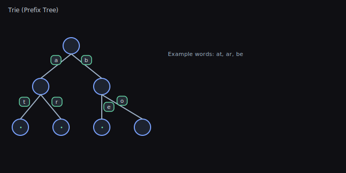

# Core Data Structures — Concepts, Usage, and Trade-offs

This guide covers several foundational data structures used across the library and when to use them.

## Cyclic Buffer (Ring Buffer)

- What it is: Fixed-capacity circular array with head/tail indices that wrap.
- Use for: Streaming data, fixed-size queues, audio/network buffers.
- Operations: enqueue/dequeue in O(1); overwriting old data optional.
- Pros: Constant-time, cache-friendly, no reallocations at steady size.
- Cons: Fixed capacity unless resized; must handle wrap-around.

Diagram: 

## Deque (Double-Ended Queue)

- What it is: Queue with efficient push/pop at both ends.
- Use for: Sliding windows, BFS frontiers, task schedulers.
- Operations: push_front/push_back/pop_front/pop_back in amortized O(1).
- Pros: Flexible ends; generalizes queue and stack behavior.
- Cons: Implementation complexity for block-based layouts.

Diagram: 

## Binary Heap (Priority Queue)

- What it is: Array-backed binary tree maintaining heap-order (min/max).
- Use for: Priority queues, Dijkstra/A*, event simulation.
- Operations: push/pop in O(log n); peek O(1); build-heap O(n).
- Pros: Simple; great constant factors; contiguous memory.
- Cons: Not ideal for decrease-key unless augmented.

Diagram: 

## Disjoint Set (Union-Find)

- What it is: Structure tracking partition of elements into sets.
- Use for: Connectivity, Kruskal’s MST, percolation, clustering.
- Operations: union/find in amortized near O(1) with path compression + union by rank.
- Pros: Extremely fast for bulk unions/finds; minimal memory.
- Cons: Not suited for deletions or enumerating members without extra indexes.

Diagram: 

## Sparse Set

- What it is: Two arrays (sparse and dense) enabling O(1) membership checks and iteration over active items.
- Use for: ECS entity sets, fast presence checks with dense iteration.
- Operations: insert/remove/contains in O(1); iterate dense in O(n_active).
- Pros: Very fast, cache-friendly on dense array; stable indices optional.
- Cons: Requires ID space for indices; sparse array sized by max ID.

Diagram: 

## Trie (Prefix Tree)

- What it is: Tree keyed by characters for efficient prefix-based lookup.
- Use for: Autocomplete, spell-checking, dictionary prefix queries.
- Operations: insert/search O(m) where m is key length.
- Pros: Predictable per-character traversal; supports prefix enumeration.
- Cons: Memory overhead vs hash tables; compact with radix/compressed tries.

Diagram: 

## Bitset

- What it is: Packed array of bits for boolean sets and flags.
- Use for: Fast membership bitmaps, masks, filters, small Bloom filters.
- Operations: set/clear/test O(1); bitwise ops on words are vectorizable.
- Pros: Extremely compact; very fast bitwise operations.
- Cons: Fixed maximum size unless dynamically extended; needs index mapping.

Diagram: 

## Quick Selection Guide

- Need O(1) membership and dense iteration: Sparse Set
- Need priority scheduling: Binary Heap
- Need two-ended queueing: Deque
- Need circular fixed-capacity buffer: Cyclic Buffer
- Need prefix search: Trie
- Need compact boolean set: Bitset
- Need dynamic connectivity: Disjoint Set

## Complexity Summary

- Cyclic Buffer: enqueue/dequeue O(1)
- Deque: push/pop ends amortized O(1)
- Heap: push/pop O(log n), peek O(1)
- Disjoint Set: union/find ~O(1) amortized (with heuristics)
- Sparse Set: insert/remove/contains O(1), iterate dense O(n_active)
- Trie: insert/search O(m)
- Bitset: set/test O(1), bitwise ops O(n/word_size)

