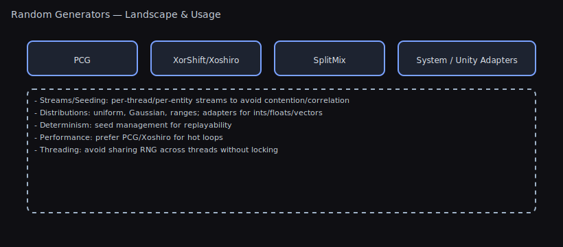

# Random Number Generator Performance Benchmarks

## TL;DR — What To Use

- **⭐ Use `PRNG.Instance` instead of `UnityEngine.Random` — 10-15x faster + seedable for determinism.**
- IllusionFlow (default): Great balance of speed, quality, and thread-safety.
- Need System.Random compatibility? Use `DotNetRandom` wrapper.
- Chasing max speed in hot loops? `LinearCongruentialGenerator`/`RomuDuo` are fastest.

### ⭐ The Speed & Determinism Killer Feature

**The Problem with UnityEngine.Random:**

```csharp
// 🔴 UnityEngine.Random:
// - Slow (~65-85M ops/sec)
// - Not seedable (no replays, no determinism)
// - Not thread-safe (main thread only)

void GenerateLevel()
{
    for (int i = 0; i < 10000; i++)
    {
        float value = Random.value;  // Slow!
        // Can't reproduce this exact level generation
    }
}
```

**The Solution - Unity Helpers Random:**

```csharp
// 🟢 Unity Helpers (PRNG.Instance):
// - Fast (655-885M ops/sec = 10-15x faster)
// - Seedable (perfect replays)
// - Thread-local (safe everywhere)

IRandom rng = new IllusionFlow(seed: 12345);

void GenerateLevel()
{
    for (int i = 0; i < 10000; i++)
    {
        float value = rng.NextFloat();  // Fast + reproducible!
        // Same seed = exact same level every time
    }
}
```

**When It Matters:**

- **Procedural generation**: Thousands of random rolls per level
- **Particle systems**: Hundreds of random values per frame
- **Networked games**: Clients must generate identical results
- **Replay systems**: Must reproduce exact gameplay
- **Performance-critical loops**: Every microsecond counts

**Speed Comparison:**

| Generator                    | NextFloat (ops/sec) | vs UnityEngine.Random |
| ---------------------------- | ------------------- | --------------------- |
| UnityEngine.Random           | 65M                 | 1x (baseline)         |
| PRNG.Instance (IllusionFlow) | 655M                | **10x faster**        |
| LinearCongruentialGenerator  | 829M                | **13x faster**        |
| SplitMix64                   | 739M                | **11x faster**        |

Threading

- Individual RNG instances are not thread‑safe.
- Use `PRNG.Instance` or each generator’s `TypeName.Instance` for thread‑local safety, or create one instance per thread.

Visual



This document contains performance benchmarks for the various random number generators included in Unity Helpers.

## Performance (Operations per Second)

<!-- RANDOM_BENCHMARKS_START -->

| Random                      | NextBool    | Next        | NextUInt      | NextFloat   | NextDouble  | NextUint - Range | NextInt - Range |
| --------------------------- | ----------- | ----------- | ------------- | ----------- | ----------- | ---------------- | --------------- |
| DotNetRandom                | 551,400,000 | 56,500,000  | 58,500,000    | 46,200,000  | 27,800,000  | 55,100,000       | 55,100,000      |
| LinearCongruentialGenerator | 809,300,000 | 812,000,000 | 1,331,000,000 | 184,700,000 | 406,700,000 | 583,700,000      | 499,700,000     |
| IllusionFlow                | 782,000,000 | 650,800,000 | 878,500,000   | 177,900,000 | 325,200,000 | 438,800,000      | 388,200,000     |
| PcgRandom                   | 786,600,000 | 653,200,000 | 903,600,000   | 183,800,000 | 332,500,000 | 453,500,000      | 409,200,000     |
| RomuDuo                     | 783,600,000 | 527,800,000 | 702,200,000   | 167,100,000 | 254,700,000 | 438,600,000      | 390,900,000     |
| SplitMix64                  | 800,100,000 | 709,000,000 | 1,064,500,000 | 184,400,000 | 353,700,000 | 485,600,000      | 440,700,000     |
| FlurryBurstRandom           | 786,300,000 | 682,300,000 | 939,400,000   | 183,900,000 | 342,000,000 | 454,800,000      | 407,400,000     |
| SquirrelRandom              | 765,500,000 | 406,900,000 | 413,400,000   | 172,200,000 | 202,300,000 | 368,900,000      | 339,200,000     |
| SystemRandom                | 146,500,000 | 148,100,000 | 66,000,000    | 132,700,000 | 140,700,000 | 60,500,000       | 61,200,000      |
| UnityRandom                 | 654,500,000 | 85,000,000  | 87,800,000    | 62,300,000  | 41,500,000  | 81,400,000       | 82,400,000      |
| WyRandom                    | 755,200,000 | 387,200,000 | 455,700,000   | 165,800,000 | 192,100,000 | 296,000,000      | 281,400,000     |
| XorShiftRandom              | 791,100,000 | 590,800,000 | 602,400,000   | 184,000,000 | 286,300,000 | 478,100,000      | 423,600,000     |
| XoroShiroRandom             | 788,100,000 | 592,700,000 | 761,500,000   | 167,300,000 | 255,200,000 | 425,100,000      | 379,400,000     |
| PhotonSpinRandom            | 736,600,000 | 245,800,000 | 268,300,000   | 120,100,000 | 121,500,000 | 218,700,000      | 207,200,000     |
| StormDropRandom             | 782,000,000 | 529,100,000 | 704,300,000   | 183,400,000 | 257,700,000 | 381,600,000      | 350,200,000     |

<!-- RANDOM_BENCHMARKS_END -->

## Interpreting the Results

- **NextBool**: Operations per second for generating random boolean values
- **Next**: Operations per second for generating random integers (0 to int.MaxValue)
- **NextUInt**: Operations per second for generating random unsigned integers
- **NextFloat**: Operations per second for generating random floats (0.0f to 1.0f)
- **NextDouble**: Operations per second for generating random doubles (0.0d to 1.0d)
- **NextUint - Range**: Operations per second for generating random unsigned integers within a range
- **NextInt - Range**: Operations per second for generating random integers within a range

## Recommendations

Based on the benchmarks:

- **For general use**: `IllusionFlow` (via `PRNG.Instance`) or `PCG` - Great balance of speed and quality
- **For maximum speed**: `LinearCongruentialGenerator` - Fastest overall (but not recommended for statistical quality)
- **For compatibility**: `DotNetRandom` - Uses .NET's built-in Random
- **Avoid for performance**: `UnityRandom` - Significantly slower than alternatives

All benchmarks are run for 1 second per operation type to ensure statistical significance.

---

## 📚 Related Documentation

**Core Guides:**

- [Getting Started](GETTING_STARTED.md) - Your first 5 minutes with Unity Helpers
- [Main README](../README.md) - Complete feature overview
- [Feature Index](INDEX.md) - Alphabetical reference

**Random Number Generator Features:**

- [README - Random Generators](../README.md#random-number-generators) - Full API reference
- [README - Quick Start](../README.md#random-number-generation) - 60-second tutorial

**Related Features:**

- [Math & Extensions](MATH_AND_EXTENSIONS.md) - Vector/color extensions and utilities
- [Data Structures](DATA_STRUCTURES.md) - Heaps, tries, and more

**Need help?** [Open an issue](https://github.com/wallstop/unity-helpers/issues)
