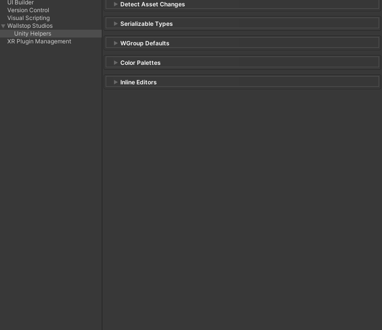
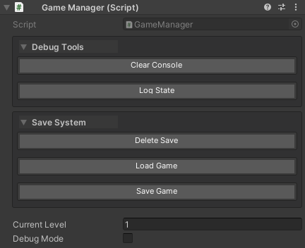
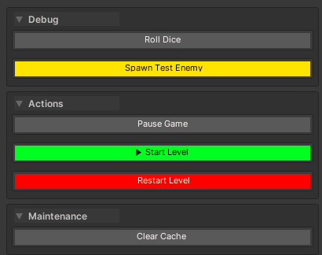
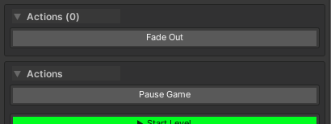
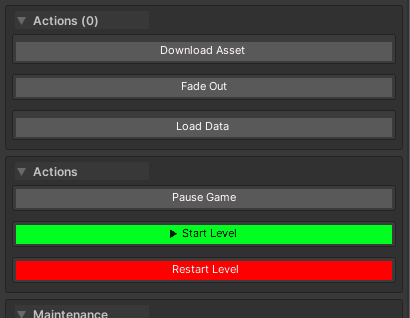

# Inspector Buttons (WButton)

**Execute methods from the inspector with one click.**

The `[WButton]` attribute exposes methods as clickable buttons in the Unity inspector, complete with result history, async support, cancellation, custom styling, and automatic grouping. Test gameplay features, debug systems, and prototype rapidly without writing custom editors.

---

## Table of Contents

- [Basic Usage](#basic-usage)
- [Parameters](#parameters)
- [Execution Types](#execution-types)
- [Result History](#result-history)
- [Draw Order & Positioning](#draw-order--positioning)
- [Grouping](#grouping)
- [Color Theming](#color-theming)
- [Configuration](#configuration)
- [Best Practices](#best-practices)
- [Examples](#examples)

---

## Basic Usage

```csharp
using UnityEngine;
using WallstopStudios.UnityHelpers.Core.Attributes;

public class PlayerController : MonoBehaviour
{
    public int health = 100;

    [WButton("Heal Player")]
    private void Heal()
    {
        health = 100;
        Debug.Log("Player healed!");
    }

    [WButton("Take Damage")]
    private void TakeDamage()
    {
        health -= 10;
        Debug.Log($"Player took damage! Health: {health}");
    }
}
```

---

## Parameters

The `[WButton]` attribute accepts several optional parameters to customize button appearance, behavior, and organization.

### Parameter Overview

```csharp
[WButton(
    string displayName = null,
    int drawOrder = 0,
    int historyCapacity = WButtonAttribute.UseGlobalHistory,
    string priority = null,
    string groupName = null
)]
```

---

### displayName (string, optional)

**Controls the text shown on the button in the inspector.**

- **Default:** Uses the method name (e.g., `"RollDice"` for `RollDice()`)
- **When to use:** Make buttons more readable or add context

```csharp
// Without displayName - shows "SpawnEnemy"
[WButton]
private void SpawnEnemy() { }

// With displayName - shows "🔫 Spawn Enemy"
[WButton("🔫 Spawn Enemy")]
private void SpawnEnemy1() { }

// More descriptive labels
[WButton("Reset Player to Checkpoint")]
private void ResetPlayer() { }

[WButton("Clear All Save Data")]
private void ClearSaveData() { }
```


---

### drawOrder (int, optional)

**Controls where the button appears relative to the inspector properties.**

- **Default:** `0` (appears below all inspector properties)
- **Negative values (`-1`, `-2`, etc.):** Appear above inspector properties
- **Positive values (`1`, `2`, etc.):** Appear below inspector properties
- **Grouping:** Buttons with the same `drawOrder` are grouped together

```csharp
public class PlayerController1 : MonoBehaviour
{
    public int health = 100;
    public float speed = 5f;

    // These appear ABOVE the health/speed properties
    [WButton("Initialize", drawOrder: -1)]
    private void Initialize() { }

    [WButton("Validate", drawOrder: -1)]
    private void Validate() { }

    // This appears BELOW the health/speed properties
    [WButton("Debug Info", drawOrder: 1)]
    private void ShowDebugInfo() { }
}
```

**Visual layout:**


---

### historyCapacity (int, optional)

**Controls how many previous results are stored for methods that return values.**

- **Default:** `WButtonAttribute.UseGlobalHistory` (uses project setting, typically 5)
- **Range:** `1` to `10` results, or `-1` for global default
- **Applies to:** Methods returning values, async tasks, or coroutines
- **Does not affect:** `void` methods (no history stored)

```csharp
// Use global setting (default: 5 results)
[WButton("Roll Dice")]
private int RollDice() => Random.Range(1, 7);

// Store only last result
[WButton("Get Timestamp", historyCapacity: 1)]
private string GetTimestamp() => DateTime.Now.ToString();

// Store up to 10 results for detailed history
[WButton("Measure Frame Time", historyCapacity: 10)]
private float MeasureFrameTime() => Time.deltaTime * 1000f;

// Disable history completely (1 = minimum)
[WButton("Ping Server", historyCapacity: 1)]
private async Task<string> PingServerAsync(CancellationToken ct)
{
    // ... ping logic
    return "Pong!";
}
```


**Performance tip:** Use lower values (`1-3`) for methods called frequently to reduce memory usage.

---

### priority (string, optional)

**Applies custom color themes to buttons using predefined color keys.**

- **Default:** `null` (uses default button color)
- **Common values:** `"Default"`, `"Default-Light"`, `"Default-Dark"`, or custom keys
- **Configure in:** Edit → Project Settings → Unity Helpers → WButton Color Palettes

```csharp
// Default blue button
[WButton("Standard Action")]
private void StandardAction() { }

// Custom themed button (requires setup in project settings)
[WButton("Dangerous Action", priority: "Danger")]
private void DangerousAction() { }

[WButton("Success Action", priority: "Success")]
private void SuccessAction() { }

[WButton("Warning Action", priority: "Warning")]
private void WarningAction() { }
```

![Image placeholder: inspector-button-color-themes.png - Buttons with different color themes]

**Setting up custom colors:**

1. Open Edit → Project Settings → Unity Helpers
2. Navigate to WButton Color Palettes
3. Add a new color key (e.g., `"Danger"`)
4. Set background/text colors
5. Use the key in your `[WButton]` attribute




---

### groupName (string, optional)

**Organizes buttons under labeled group headers.**

- **Default:** `null` (no group header)
- **Behavior:** All buttons with the same `groupName` and `drawOrder` appear together
- **Best practice:** Use with `drawOrder` to create organized button sections

```csharp
public class GameManager : MonoBehaviour
{
    // "Debug Tools" group above properties
    [WButton("Log State", drawOrder: -1, groupName: "Debug Tools")]
    private void LogState() { }

    [WButton("Clear Console", drawOrder: -1, groupName: "Debug Tools")]
    private void ClearConsole() { }

    // Inspector properties here
    public int currentLevel = 1;
    public bool debugMode = false;

    // "Save System" group below properties
    [WButton("Save Game", drawOrder: 1, groupName: "Save System")]
    private void SaveGame() { }

    [WButton("Load Game", drawOrder: 1, groupName: "Save System")]
    private void LoadGame() { }

    [WButton("Delete Save", drawOrder: 1, groupName: "Save System")]
    private void DeleteSave() { }
}
```



**Notes:**

- Group headers are collapsible (click the arrow to expand/collapse)
- Groups can be configured to start expanded or collapsed in project settings
- The first button in a group determines the group's display name

---

### Complete Example

```csharp
using UnityEngine;
using WallstopStudios.UnityHelpers.Core.Attributes;

public class LevelManager : MonoBehaviour
{
    public int currentLevel = 1;
    public bool debugMode = false;

    // Setup group - appears above properties
    [WButton("Initialize Level", drawOrder: -2, groupName: "Setup")]
    private void Initialize()
    {
        Debug.Log("Level initialized!");
    }

    [WButton("✓ Validate Configuration", drawOrder: -2, groupName: "Setup")]
    private void ValidateConfig()
    {
        Debug.Log("Configuration valid!");
    }

    // Debug group - appears above properties
    [WButton("Roll Dice", drawOrder: -1, historyCapacity: 10, groupName: "Debug")]
    private int RollDice() => Random.Range(1, 7);

    [WButton("🎯 Spawn Test Enemy", drawOrder: -1, priority: "Warning", groupName: "Debug")]
    private void SpawnTestEnemy()
    {
        // Spawn logic here
    }

    // Properties appear here in the inspector

    // Actions group - appears below properties
    [WButton("▶ Start Level", drawOrder: 1, priority: "Success", groupName: "Actions")]
    private void StartLevel()
    {
        Debug.Log($"Starting level {currentLevel}...");
    }

    [WButton("⏸ Pause Game", drawOrder: 1, groupName: "Actions")]
    private void PauseGame()
    {
        Time.timeScale = 0f;
    }

    [WButton("🔄 Restart Level", drawOrder: 1, priority: "Danger", groupName: "Actions")]
    private void RestartLevel()
    {
        // Restart logic here
    }

    // Maintenance group - appears below everything else
    [WButton("Clear Cache", drawOrder: 2, historyCapacity: 1, groupName: "Maintenance")]
    private string ClearCache()
    {
        return $"Cache cleared at {System.DateTime.Now:HH:mm:ss}";
    }
}
```


---

## Execution Types

WButton supports four method signatures:

### 1. Void Methods (Immediate)

```csharp
[WButton("Log Message")]
private void LogMessage()
{
    Debug.Log("Button clicked!");
}
```

**Behavior:** Executes immediately, no return value shown

---

### 2. Returning Values (With History)

```csharp
[WButton("Roll Dice", historyCapacity: 10, groupName: "Debug")]
private int RollDice()
{
    return Random.Range(1, 7);
}

[WButton("Get Position")]
private Vector3 GetPlayerPosition()
{
    return transform.position;
}
```




**Behavior:** Shows return value in a collapsible history panel

---

### 3. Coroutines (IEnumerator)

```csharp
[WButton("Fade Out")]
private IEnumerator FadeOut()
{
    SpriteRenderer sprite = GetComponent<SpriteRenderer>();
    Color color = sprite.color;

    for (float t = 1f; t >= 0f; t -= Time.deltaTime)
    {
        color.a = t;
        sprite.color = color;
        yield return null;
    }

    Debug.Log("Fade complete!");
}
```



**Behavior:**

- Shows "Running..." status
- Spinner animation during execution
- "Complete" message when finished

---

### 4. Async Methods (Task / ValueTask)

```csharp
using System.Threading;
using System.Threading.Tasks;

[WButton("Load Data")]
private async Task<string> LoadDataAsync(CancellationToken ct)
{
    Debug.Log("Loading...");
    await Task.Delay(2000, ct);  // Simulate async work
    return "Data loaded successfully!";
}

[WButton("Download Asset")]
private async ValueTask<Texture2D> DownloadAssetAsync(CancellationToken ct)
{
    Debug.Log("Downloading...");
    await Task.Delay(1000, ct);
    // Simulate download
    return new Texture2D(256, 256);
}
```



**Behavior:**

- Automatic `CancellationToken` injection (optional parameter)
- "Cancel" button appears during execution
- Result shown in history when complete
- Exceptions logged to console

**Cancellation Example:**

```csharp
[WButton("Long Operation")]
private async Task LongOperationAsync(CancellationToken ct)
{
    for (int i = 0; i < 10; i++)
    {
        ct.ThrowIfCancellationRequested();  // Check cancellation
        Debug.Log($"Step {i + 1}/10");
        await Task.Delay(500, ct);
    }
    return Task.CompletedTask;
}
```

**Supported Signatures:**

- `Task` (void async)
- `Task<T>` (async with a result)
- `ValueTask` (void async, no heap allocation)
- `ValueTask<T>` (async with a result, no heap allocation)

---

## Result History

### Automatic History

```csharp
[WButton("Generate ID", historyCapacity: 10)]
private string GenerateId()
{
    return System.Guid.NewGuid().ToString().Substring(0, 8);
}
```

![Image placeholder: History panel showing last 10 generated IDs]

**Features:**

- Per-method, per-target buffering (history survives inspector refresh)
- Collapsible foldout for each method
- Chronological order (newest first)
- Pagination when history exceeds the display threshold

---

### History Capacity Options

```csharp
// Use global setting (default: 5, configurable in UnityHelpersSettings)
[WButton("Use Global")]
private int UseGlobal() => Random.Range(1, 100);

// Custom capacity per method
[WButton("Keep 20 Results", historyCapacity: 20)]
private float KeepMany() => Random.value;

// Disable history (0 capacity)
[WButton("No History", historyCapacity: 0)]
private void NoHistory() => Debug.Log("No history stored");
```

**Global Setting:** `UnityHelpersSettings.WButtonHistorySize` (default: 5, range: 1-10)

---

## Draw Order & Positioning

Control where buttons appear in the inspector:

```csharp
public class ButtonPositioning : MonoBehaviour
{
    // Appears ABOVE default inspector (drawOrder >= -1)
    [WButton("Top Button", drawOrder: -1)]
    private void TopButton() => Debug.Log("Above inspector");

    // Default inspector fields appear here
    public int someField = 10;

    // Appears BELOW default inspector (drawOrder >= 0)
    [WButton("Bottom Button", drawOrder: 0)]
    private void BottomButton() => Debug.Log("Below inspector");

    [WButton("Another Bottom", drawOrder: 1)]
    private void AnotherBottom() => Debug.Log("Also below");
}
```

![Image placeholder: Inspector showing button above fields, then fields, then buttons below]

**Positioning Rules:**

- `drawOrder < -1`: Hidden (not drawn)
- `drawOrder == -1`: Drawn at top (before default inspector)
- `drawOrder >= 0`: Drawn at bottom (after default inspector)
- Higher `drawOrder` values appear later within their section

---

### Pagination by Draw Order

```csharp
[WButton("Action 1", drawOrder: 0)]
private void Action1() {}

[WButton("Action 2", drawOrder: 0)]
private void Action2() {}

// ... 10 more buttons with drawOrder: 0 ...

[WButton("Action 12", drawOrder: 0)]
private void Action12() {}
```

![Image placeholder: Button pagination controls showing "Page 1 of 2" with navigation buttons]

**Pagination Settings:**

- Page size controlled by `UnityHelpersSettings.WButtonPageSize` (default: 6)
- Pagination only applies within each draw order group
- Navigation: First, Previous, Next, Last buttons

---

## Grouping

Organize buttons into named sections:

```csharp
[WButton("Spawn Enemy", groupName: "Combat")]
private void SpawnEnemy() => Debug.Log("Enemy spawned");

[WButton("Clear Enemies", groupName: "Combat")]
private void ClearEnemies() => Debug.Log("Enemies cleared");

[WButton("Save Game", groupName: "Persistence")]
private void SaveGame() => Debug.Log("Game saved");

[WButton("Load Game", groupName: "Persistence")]
private void LoadGame() => Debug.Log("Game loaded");
```

![Image placeholder: Two button groups with headers "Combat" and "Persistence"]

**Grouping Behavior:**

- Groups are created automatically based on `groupName`
- Buttons within a group are organized by `drawOrder`
- Groups can be collapsible (controlled by `UnityHelpersSettings.WButtonFoldoutBehavior`)

---

### Foldout Behavior

**Global Setting:** `UnityHelpersSettings.WButtonFoldoutBehavior`

**Options:**

- `Always` - Always show group foldout triangles
- `StartExpanded` - Collapsible, starts open
- `StartCollapsed` - Collapsible, starts closed

**Animation:**

- Enable/disable via `UnityHelpersSettings.WButtonFoldoutTweenEnabled`
- Speed controlled by `UnityHelpersSettings.WButtonFoldoutSpeed` (default: 2.0, range: 2-12)

![GIF placeholder: Button group folding/unfolding with smooth animation]

---

## Color Theming

```csharp
[WButton("Dangerous Action", colorKey: "Default-Dark")]
private void DangerousAction() => Debug.LogWarning("Dangerous!");

[WButton("Safe Action", colorKey: "Default-Light")]
private void SafeAction() => Debug.Log("Safe operation");
```

![Image placeholder: Two buttons with different color themes (dark red and light green)]

**Built-in Color Keys:**

- `"Default"` - Theme-aware (adapts to Unity theme)
- `"Default-Dark"` - Dark theme colors
- `"Default-Light"` - Light theme colors
- `"WDefault"` - Legacy vibrant blue
- Custom keys defined in `UnityHelpersSettings.WButtonCustomColors`

**Define Custom Colors:**

1. Open `ProjectSettings/UnityHelpersSettings.asset`
2. Add entry to `WButtonCustomColors` dictionary
3. Set a button background, text color, border

![Image placeholder: UnityHelpersSettings showing WButton custom color configuration]

---

## Configuration

### Global Settings

All buttons respect project-wide settings defined in `UnityHelpersSettings`:

**Location:** `ProjectSettings/UnityHelpersSettings.asset`

**Settings:**

- `WButtonHistorySize` (default: 5, range: 1-10) - Results to keep per method
- `WButtonPlacement` (Top or Bottom) - Default button position
- `WButtonFoldoutBehavior` (Always, StartExpanded, StartCollapsed) - Group collapsibility
- `WButtonFoldoutTweenEnabled` (bool) - Enable group animations
- `WButtonFoldoutSpeed` (default: 2.0, range: 2-12) - Animation speed
- `WButtonPageSize` (default: 6) - Buttons per page for pagination
- `WButtonCustomColors` - Custom color palette dictionary

![Image placeholder: UnityHelpersSettings showing all WButton configuration options]

---

## Best Practices

### 1. Clear Button Names

```csharp
// ✅ GOOD: Action-oriented, descriptive
[WButton("Heal to Full")]
private void HealToFull() { ... }

[WButton("Spawn 10 Enemies")]
private void SpawnEnemies() { ... }

// ❌ BAD: Vague or technical
[WButton("DoStuff")]
private void DoStuff() { ... }

[WButton]  // Defaults to method name "HandlePlayerDeath"
private void HandlePlayerDeath() { ... }
```

---

### 2. Group Related Actions

```csharp
// ✅ GOOD: Grouped by feature
[WButton("Spawn Enemy", groupName: "Combat Testing")]
private void SpawnEnemy() { ... }

[WButton("Kill All Enemies", groupName: "Combat Testing")]
private void KillAll() { ... }

[WButton("Save Progress", groupName: "Persistence")]
private void Save() { ... }

// ❌ BAD: No grouping, cluttered inspector
[WButton("Spawn Enemy")]
private void SpawnEnemy() { ... }

[WButton("Save Progress")]
private void Save() { ... }

[WButton("Kill All Enemies")]
private void KillAll() { ... }
```

---

### 3. Use History for Random/Variable Results

```csharp
// ✅ GOOD: History helps track random values
[WButton("Roll Loot", historyCapacity: 10)]
private string RollLoot()
{
    return lootTable[Random.Range(0, lootTable.Length)];
}

// ✅ GOOD: No history needed for fixed actions
[WButton("Reset Position", historyCapacity: 0)]
private void ResetPosition()
{
    transform.position = Vector3.zero;
}
```

---

### 4. Async Best Practices

```csharp
// ✅ GOOD: Accept CancellationToken, check it
[WButton("Long Task")]
private async Task LongTaskAsync(CancellationToken ct)
{
    for (int i = 0; i < 100; i++)
    {
        ct.ThrowIfCancellationRequested();
        await Task.Delay(100, ct);
    }
}

// ✅ GOOD: Handle exceptions gracefully
[WButton("Risky Operation")]
private async Task RiskyOperationAsync()
{
    try
    {
        await SomeRiskyApiCall();
    }
    catch (Exception ex)
    {
        Debug.LogError($"Operation failed: {ex.Message}");
    }
}

// ❌ BAD: Long operation with no cancellation support
[WButton("Infinite Loop")]
private async Task InfiniteLoopAsync()
{
    while (true)  // No way to stop this!
    {
        await Task.Delay(1000);
    }
}
```

---

### 5. Color Usage

```csharp
// ✅ GOOD: Use colors to indicate risk/importance
[WButton("Delete All Data", colorKey: "Default-Dark")]  // Dark = danger
private void DeleteAllData() { ... }

[WButton("Quick Save", colorKey: "Default-Light")]  // Light = safe
private void QuickSave() { ... }

// ❌ BAD: Random colors without meaning
[WButton("Log Message", colorKey: "CustomPurple")]  // Why purple?
private void LogMessage() { ... }
```

---

## Examples

### Example 1: Gameplay Testing

```csharp
using UnityEngine;
using WallstopStudios.UnityHelpers.Core.Attributes;

public class PlayerDebug : MonoBehaviour
{
    public int health = 100;
    public int gold = 0;

    [WButton("Heal", groupName: "Health", colorKey: "Default-Light")]
    private void Heal()
    {
        health = 100;
        Debug.Log("Player healed!");
    }

    [WButton("Take Damage", groupName: "Health")]
    private void TakeDamage()
    {
        health -= 25;
        Debug.Log($"Took damage! Health: {health}");
    }

    [WButton("Kill Player", groupName: "Health", colorKey: "Default-Dark")]
    private void Kill()
    {
        health = 0;
        Debug.LogWarning("Player died!");
    }

    [WButton("Add Gold", groupName: "Economy")]
    private void AddGold()
    {
        gold += 100;
        Debug.Log($"Gold: {gold}");
    }

    [WButton("Roll Reward", groupName: "Economy", historyCapacity: 10)]
    private int RollReward()
    {
        int amount = Random.Range(10, 100);
        gold += amount;
        return amount;
    }
}
```

![Image placeholder: PlayerDebug inspector with Health and Economy button groups]

---

### Example 2: Async Data Loading

```csharp
using UnityEngine;
using System.Threading;
using System.Threading.Tasks;
using WallstopStudios.UnityHelpers.Core.Attributes;

public class DataManager : MonoBehaviour
{
    [WButton("Load Player Data")]
    private async Task<string> LoadPlayerDataAsync(CancellationToken ct)
    {
        Debug.Log("Loading player data...");

        // Simulate network request
        await Task.Delay(2000, ct);

        string playerName = "TestPlayer_" + Random.Range(1000, 9999);
        Debug.Log($"Loaded: {playerName}");

        return playerName;
    }

    [WButton("Batch Load", historyCapacity: 5)]
    private async Task<int> BatchLoadAsync(CancellationToken ct)
    {
        int count = 0;
        for (int i = 0; i < 10; i++)
        {
            ct.ThrowIfCancellationRequested();
            await Task.Delay(200, ct);
            count++;
            Debug.Log($"Loaded item {count}/10");
        }
        return count;
    }
}
```

![GIF placeholder: Async button showing loading spinner, then result]

---

### Example 3: Procedural Generation Testing

```csharp
using UnityEngine;
using WallstopStudios.UnityHelpers.Core.Attributes;

public class LevelGenerator : MonoBehaviour
{
    [WButton("Generate Seed", historyCapacity: 20)]
    private int GenerateSeed()
    {
        return Random.Range(1000, 9999);
    }

    [WButton("Generate Level")]
    private void GenerateLevel()
    {
        int seed = Random.Range(1000, 9999);
        Random.InitState(seed);
        Debug.Log($"Generating level with seed: {seed}");
        // ... generation logic ...
    }

    [WButton("Clear Level", colorKey: "Default-Dark")]
    private void ClearLevel()
    {
        // ... cleanup logic ...
        Debug.Log("Level cleared");
    }

    [WButton("Generate with Seed")]
    private void GenerateWithSeed(int seed)
    {
        Random.InitState(seed);
        Debug.Log($"Generating with seed: {seed}");
        // ... generation logic ...
    }
}
```

**Note:** Parameters are not yet supported in WButton. Use separate fields for configuration.

---

### Example 4: Coroutine Animation Testing

```csharp
using UnityEngine;
using System.Collections;
using WallstopStudios.UnityHelpers.Core.Attributes;

public class AnimationTester : MonoBehaviour
{
    private SpriteRenderer spriteRenderer;

    private void Awake()
    {
        spriteRenderer = GetComponent<SpriteRenderer>();
    }

    [WButton("Fade Out", groupName: "Animations")]
    private IEnumerator FadeOutCoroutine()
    {
        Color color = spriteRenderer.color;
        while (color.a > 0f)
        {
            color.a -= Time.deltaTime;
            spriteRenderer.color = color;
            yield return null;
        }
        Debug.Log("Fade out complete");
    }

    [WButton("Fade In", groupName: "Animations")]
    private IEnumerator FadeInCoroutine()
    {
        Color color = spriteRenderer.color;
        while (color.a < 1f)
        {
            color.a += Time.deltaTime;
            spriteRenderer.color = color;
            yield return null;
        }
        Debug.Log("Fade in complete");
    }

    [WButton("Pulse", groupName: "Animations")]
    private IEnumerator PulseCoroutine()
    {
        Vector3 originalScale = transform.localScale;
        for (int i = 0; i < 3; i++)
        {
            transform.localScale = originalScale * 1.2f;
            yield return new WaitForSeconds(0.2f);
            transform.localScale = originalScale;
            yield return new WaitForSeconds(0.2f);
        }
        Debug.Log("Pulse complete");
    }
}
```

![GIF placeholder: Animation buttons triggering visual effects]

---

## Troubleshooting

### Button Not Appearing

**Problem:** Method has `[WButton]` but button doesn't show

**Solutions:**

1. Check `drawOrder` - values < -1 hide the button
2. Ensure method is `private` or `protected` (public methods may conflict)
3. Verify the component is enabled and active

---

### History Not Showing

**Problem:** Method returns a value but no history appears

**Solutions:**

1. Check `historyCapacity` - make sure it's > 0
2. Verify that the return type is serializable
3. Check `UnityHelpersSettings.WButtonHistorySize` if using global setting

---

### Async Method Not Cancelling

**Problem:** Cancel button doesn't stop an async method

**Solutions:**

1. Ensure method accepts `CancellationToken` parameter
2. Check token periodically: `ct.ThrowIfCancellationRequested()`
3. Pass token to async operations: `await Task.Delay(1000, ct)`

```csharp
// ✅ CORRECT: Cancellable
[WButton("Long Task")]
private async Task LongTaskAsync(CancellationToken ct)
{
    for (int i = 0; i < 100; i++)
    {
        ct.ThrowIfCancellationRequested();  // Check token
        await Task.Delay(100, ct);  // Pass token
    }
}
```

---

## See Also

- **[Inspector Overview](inspector-overview.md)** - Complete inspector features overview
- **[Inspector Grouping Attributes](inspector-grouping-attributes.md)** - WGroup layouts
- **[Inspector Settings](inspector-settings.md)** - Configuration reference
- **[Editor Tools Guide](../editor-tools/editor-tools-guide.md)** - Other editor utilities

---

**Next Steps:**

- Add buttons to your components for quick testing
- Experiment with `groupName` to organize buttons
- Try async methods with `CancellationToken` support
- Customize colors in `UnityHelpersSettings.asset`
