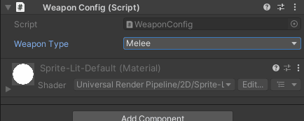

# Inspector Conditional Display (WShowIf)

**Show or hide fields dynamically based on runtime values.**

The `[WShowIf]` attribute creates dynamic inspector layouts that adapt to field values without writing custom PropertyDrawers. Perfect for reducing clutter, creating contextual UI, and guiding designers toward valid configurations.

---

## Table of Contents

- [Basic Usage](#basic-usage)
- [Comparison Operators](#comparison-operators)
- [Supported Types](#supported-types)
- [Advanced Features](#advanced-features)
- [Best Practices](#best-practices)
- [Examples](#examples)

---

## Basic Usage

```csharp
using UnityEngine;
using WallstopStudios.UnityHelpers.Core.Attributes;

public class WeaponConfig : MonoBehaviour
{
    public bool isRanged;

    [WShowIf(nameof(isRanged))]
    public float projectileSpeed = 10f;  // Only visible when isRanged == true

    [WShowIf(nameof(isRanged), inverse: true)]
    public float meleeRange = 2f;  // Only visible when isRanged == false
}
```


---

## Parameters

```csharp
[WShowIf(
    string conditionField,                    // Required: Field/property name to evaluate
    WShowIfComparison comparison = Equal,     // Comparison operator
    bool inverse = false,                     // Invert the result
    params object[] expectedValues            // Expected values for equality checks
)]
```

---

## Comparison Operators

```csharp
public enum WShowIfComparison
{
    Equal,                  // ==
    NotEqual,               // !=
    GreaterThan,            // >
    GreaterThanOrEqual,     // >=
    LessThan,               // <
    LessThanOrEqual,        // <=
    IsNull,                 // == null
    IsNotNull,              // != null
    IsNullOrEmpty,          // string.IsNullOrEmpty or collection.Count == 0
    IsNotNullOrEmpty        // !string.IsNullOrEmpty and collection.Count > 0
}
```

---

### Equal / NotEqual

```csharp
public enum WeaponType { Melee, Ranged, Magic }

public WeaponType weaponType;

[WShowIf(nameof(weaponType), WShowIfComparison.Equal, WeaponType.Ranged)]
public int ammoCapacity = 30;

[WShowIf(nameof(weaponType), WShowIfComparison.NotEqual, WeaponType.Melee)]
public float castTime = 1f;  // Visible for Ranged or Magic
```



---

### Numeric Comparisons

```csharp
public class Ability : ScriptableObject { }

[Range(0, 100)]
public int playerLevel = 1;

[WShowIf(nameof(playerLevel), WShowIfComparison.GreaterThan, 5)]
public Ability specialAbility;

[WShowIf(nameof(playerLevel), WShowIfComparison.GreaterThanOrEqual, 10)]
public Ability ultimateAbility;

[WShowIf(nameof(playerLevel), WShowIfComparison.LessThan, 5)]
public string tutorialMessage = "Level up to unlock abilities";
```


---

### Null Checks

```csharp
public GameObject targetPrefab;

[WShowIf(nameof(targetPrefab), WShowIfComparison.IsNotNull)]
public int spawnCount = 1;

[WShowIf(nameof(targetPrefab), WShowIfComparison.IsNull)]
public string warningMessage = "Assign a prefab to spawn!";
```


---

### Collection Checks

```csharp
public List<GameObject> enemies;

[WShowIf(nameof(enemies), WShowIfComparison.IsNotNullOrEmpty)]
public float spawnInterval = 2f;

[WShowIf(nameof(enemies), WShowIfComparison.IsNullOrEmpty)]
public string hint = "Add enemies to the list";
```

---

## Supported Types

### Boolean

```csharp
public bool enableFeature;

[WShowIf(nameof(enableFeature))]
public float featurePower = 1.0f;
```

---

### Numeric (int, float, double, byte, short, long, etc.)

```csharp
public float health = 100f;

[WShowIf(nameof(health), WShowIfComparison.LessThanOrEqual, 30f)]
public Color lowHealthColor = Color.red;
```

---

### Enum

```csharp
public enum Difficulty { Easy, Normal, Hard }

public Difficulty difficulty;

[WShowIf(nameof(difficulty), WShowIfComparison.Equal, Difficulty.Hard)]
public float hardModeMultiplier = 2.5f;
```

---

### String

```csharp
public string playerName;

[WShowIf(nameof(playerName), WShowIfComparison.IsNotNullOrEmpty)]
public Sprite playerAvatar;

[WShowIf(nameof(playerName), WShowIfComparison.Equal, "admin")]
public bool debugMode;
```

---

### UnityEngine.Object (GameObject, Component, ScriptableObject, etc.)

```csharp
public AudioSource audioSource;

[WShowIf(nameof(audioSource), WShowIfComparison.IsNotNull)]
public AudioClip soundEffect;
```

---

### Collections (List, Array, IEnumerable)

```csharp
public GameObject[] spawnPoints;

[WShowIf(nameof(spawnPoints), WShowIfComparison.IsNotNullOrEmpty)]
public GameObject enemyPrefab;
```

---

## Advanced Features

### Inverse Logic

```csharp
public bool useCustomColor;

// Show when useCustomColor == false
[WShowIf(nameof(useCustomColor), inverse: true)]
public string colorPreset = "Default";

// Show when useCustomColor == true
[WShowIf(nameof(useCustomColor))]
public Color customColor = Color.white;
```

---

### Multiple Expected Values

```csharp
public enum GameState { MainMenu, Playing, Paused, GameOver }

public GameState state;

// Show when state is Playing OR Paused
[WShowIf(nameof(state), WShowIfComparison.Equal, GameState.Playing, GameState.Paused)]
public float gameTimer;

// Show when state is MainMenu OR GameOver
[WShowIf(nameof(state), WShowIfComparison.Equal, GameState.MainMenu, GameState.GameOver)]
public string menuText;
```

---

### Stacking Conditions

```csharp
public bool isEnabled;
public int level;

// Both conditions must be true (AND logic)
[WShowIf(nameof(isEnabled))]
[WShowIf(nameof(level), WShowIfComparison.GreaterThan, 5)]
public Ability advancedFeature;
```

**Note:** Multiple `[WShowIf]` attributes create AND logic (all must be true).

---

### Properties and Methods

```csharp
public class Enemy : MonoBehaviour
{
    public float health = 100f;

    // Property (computed)
    public bool IsAlive => health > 0f;

    // Show when IsAlive == true
    [WShowIf(nameof(IsAlive))]
    public float damageResistance = 0.5f;

    // Method (no parameters)
    public bool ShouldShowDebug() => Application.isEditor && Debug.isDebugBuild;

    [WShowIf(nameof(ShouldShowDebug))]
    public string debugInfo;
}
```

**Supported:**

- Public fields
- Public properties (with getter)
- Public methods returning bool/int/float/enum/string/object (no parameters)

---

## Best Practices

### 1. Use for Contextual Fields

```csharp
// ✅ GOOD: Fields only relevant in specific contexts
public enum AbilityType { Passive, Active, Toggle }

public AbilityType abilityType;

[WShowIf(nameof(abilityType), WShowIfComparison.Equal, AbilityType.Active)]
public float cooldown = 5f;

[WShowIf(nameof(abilityType), WShowIfComparison.Equal, AbilityType.Toggle)]
public float energyDrainPerSecond = 10f;

// ❌ BAD: Hiding core settings
[WShowIf(nameof(advancedMode))]
public float maxHealth = 100f;  // Always needed, shouldn't hide!
```

---

### 2. Provide Hints When Hidden

```csharp
// ✅ GOOD: Show hint when condition is false
public GameObject weaponPrefab;

[WShowIf(nameof(weaponPrefab), WShowIfComparison.IsNull)]
public string hint = "⚠️ Assign a weapon prefab above";

[WShowIf(nameof(weaponPrefab), WShowIfComparison.IsNotNull)]
public int weaponDamage = 10;

// ❌ BAD: No indication why fields are missing
[WShowIf(nameof(weaponPrefab), WShowIfComparison.IsNotNull)]
public int weaponDamage = 10;  // User may not realize they need to assign prefab
```

---

### 3. Avoid Deep Nesting

```csharp
// ✅ GOOD: Flat conditions
public bool featureA;
public bool featureB;

[WShowIf(nameof(featureA))]
public float settingA;

[WShowIf(nameof(featureB))]
public float settingB;

// ❌ BAD: Overly complex dependencies
public bool enableAdvanced;
public bool enableExperimental;
public bool enableDangerous;

[WShowIf(nameof(enableAdvanced))]
[WShowIf(nameof(enableExperimental))]
[WShowIf(nameof(enableDangerous))]
public float obscureSetting;  // Too many hoops to jump through!
```

---

### 4. Use Enums for Multi-State UI

```csharp
// ✅ GOOD: Clean enum-based visibility
public enum InputMode { Keyboard, Gamepad, Touch }

public InputMode inputMode;

[WShowIf(nameof(inputMode), WShowIfComparison.Equal, InputMode.Keyboard)]
public KeyCode actionKey = KeyCode.Space;

[WShowIf(nameof(inputMode), WShowIfComparison.Equal, InputMode.Gamepad)]
public string gamepadButton = "A";

[WShowIf(nameof(inputMode), WShowIfComparison.Equal, InputMode.Touch)]
public Vector2 touchRegion = new Vector2(100, 100);

// ❌ BAD: Boolean spaghetti
public bool useKeyboard;
public bool useGamepad;

[WShowIf(nameof(useKeyboard))]
public KeyCode actionKey;  // What if both are true?

[WShowIf(nameof(useGamepad))]
public string gamepadButton;
```

---

## Examples

### Example 1: Weapon Configuration

```csharp
using UnityEngine;
using WallstopStudios.UnityHelpers.Core.Attributes;

public class Weapon : MonoBehaviour
{
    public enum WeaponType { Melee, Ranged, Magic }

    public WeaponType weaponType;

    [WShowIf(nameof(weaponType), WShowIfComparison.Equal, WeaponType.Melee)]
    public float meleeRange = 2f;

    [WShowIf(nameof(weaponType), WShowIfComparison.Equal, WeaponType.Melee)]
    public float swingSpeed = 1f;

    [WShowIf(nameof(weaponType), WShowIfComparison.Equal, WeaponType.Ranged)]
    public GameObject projectilePrefab;

    [WShowIf(nameof(weaponType), WShowIfComparison.Equal, WeaponType.Ranged)]
    public int maxAmmo = 30;

    [WShowIf(nameof(weaponType), WShowIfComparison.Equal, WeaponType.Magic)]
    public float manaCost = 15f;

    [WShowIf(nameof(weaponType), WShowIfComparison.Equal, WeaponType.Magic)]
    public ParticleSystem spellEffect;
}
```

![GIF placeholder: Switching weapon types and seeing different fields]

---

### Example 2: AI Configuration

```csharp
using UnityEngine;
using WallstopStudios.UnityHelpers.Core.Attributes;

public class AIController : MonoBehaviour
{
    public bool enableAI = true;

    [WShowIf(nameof(enableAI), inverse: true)]
    public string disabledMessage = "AI is disabled";

    [WShowIf(nameof(enableAI))]
    public float detectionRange = 10f;

    [WShowIf(nameof(enableAI))]
    public float attackRange = 2f;

    [WShowIf(nameof(enableAI))]
    public bool canFlee = true;

    [WShowIf(nameof(canFlee))]
    [WShowIf(nameof(enableAI))]
    public float fleeHealthThreshold = 0.3f;
}
```

---

### Example 3: Level-Based Progression

```csharp
using UnityEngine;
using WallstopStudios.UnityHelpers.Core.Attributes;

public class PlayerProgression : MonoBehaviour
{
    public int level = 1;

    [WShowIf(nameof(level), WShowIfComparison.LessThan, 5)]
    public string beginnerTip = "Complete quests to level up";

    [WShowIf(nameof(level), WShowIfComparison.GreaterThanOrEqual, 5)]
    public Ability specialAbility;

    [WShowIf(nameof(level), WShowIfComparison.GreaterThanOrEqual, 10)]
    public Ability advancedAbility;

    [WShowIf(nameof(level), WShowIfComparison.GreaterThanOrEqual, 20)]
    public Ability ultimateAbility;

    [WShowIf(nameof(level), WShowIfComparison.GreaterThanOrEqual, 20)]
    public GameObject legendaryWeapon;
}
```

---

### Example 4: Multiplayer Settings

```csharp
using UnityEngine;
using WallstopStudios.UnityHelpers.Core.Attributes;

public class MultiplayerConfig : MonoBehaviour
{
    public bool isHost = false;

    [WShowIf(nameof(isHost))]
    public int maxPlayers = 4;

    [WShowIf(nameof(isHost))]
    public string serverPassword;

    [WShowIf(nameof(isHost), inverse: true)]
    public string serverAddress = "localhost";

    [WShowIf(nameof(isHost), inverse: true)]
    public int serverPort = 7777;
}
```

---

### Example 5: Graphics Quality

```csharp
using UnityEngine;
using WallstopStudios.UnityHelpers.Core.Attributes;

public class GraphicsSettings : MonoBehaviour
{
    public enum QualityLevel { Low, Medium, High, Ultra }

    public QualityLevel quality = QualityLevel.Medium;

    [WShowIf(nameof(quality), WShowIfComparison.GreaterThanOrEqual, QualityLevel.Medium)]
    public bool enableShadows = true;

    [WShowIf(nameof(quality), WShowIfComparison.GreaterThanOrEqual, QualityLevel.High)]
    public bool enableReflections = true;

    [WShowIf(nameof(quality), WShowIfComparison.Equal, QualityLevel.Ultra)]
    public bool enableRayTracing = false;

    [WShowIf(nameof(quality), WShowIfComparison.Equal, QualityLevel.Ultra)]
    public int antiAliasingLevel = 8;
}
```

---

## Troubleshooting

### Field Not Showing

**Problem:** Field doesn't appear when condition should be true

**Solutions:**

1. Check field name spelling in `conditionField` parameter
2. Verify condition field is `public` (private fields not supported)
3. Test with `inverse: true` to see if logic is inverted
4. Use `WShowIfComparison.Equal` explicitly instead of relying on default

---

### Condition Field Not Found

**Problem:** Error: "Could not find field/property 'X'"

**Solutions:**

1. Ensure condition field exists and is spelled correctly
2. Make condition field `public` (not `private` or `protected`)
3. For properties, ensure they have a public getter
4. For methods, ensure they're public and parameterless

---

### Multiple Conditions Not Working

**Problem:** Stacking `[WShowIf]` doesn't work as expected

**Current Behavior:** Multiple attributes create AND logic (all must be true)

**Workaround for OR logic:** Use a helper property

```csharp
public bool condition1;
public bool condition2;

public bool EitherCondition => condition1 || condition2;

[WShowIf(nameof(EitherCondition))]
public float myField;
```

---

## See Also

- **[Inspector Overview](inspector-overview.md)** - Complete inspector features overview
- **[Inspector Grouping Attributes](inspector-grouping-attributes.md)** - WGroup layouts
- **[Inspector Selection Attributes](inspector-selection-attributes.md)** - Dropdowns and toggles
- **[Editor Tools Guide](../editor-tools/editor-tools-guide.md)** - Other editor utilities

---

**Next Steps:**

- Add conditional visibility to reduce inspector clutter
- Combine with `[WGroup]` for organized, dynamic layouts
- Use enums to create mode-based UIs
- Experiment with numeric comparisons for level/threshold-based features
