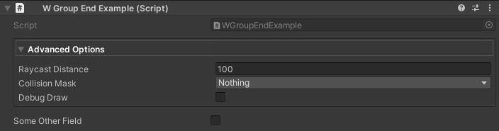
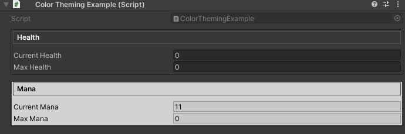
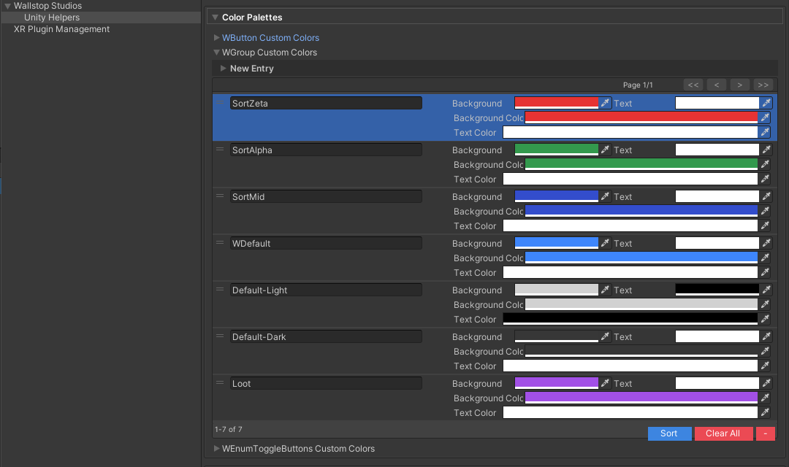
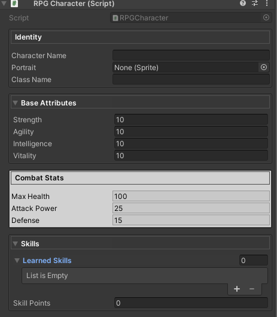
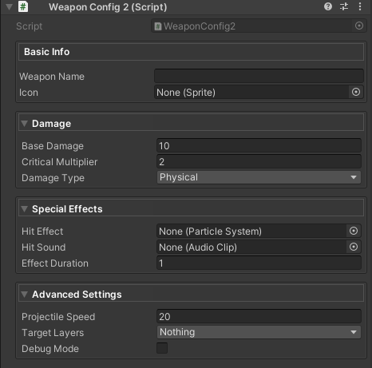

# Inspector Grouping Attributes

**Organize your inspector without writing custom editors.**

Unity Helpers provides powerful grouping attributes that create boxed sections and collapsible foldouts with zero boilerplate. These attributes rival commercial tools like Odin Inspector while offering unique features like auto-inclusion and project-wide color theming.

---

## Table of Contents

- [WGroup & WGroupEnd](#wgroup--wgroupend)
- [Common Features](#common-features)
- [Configuration](#configuration)
- [Best Practices](#best-practices)
- [Examples](#examples)
- [Collection Styling](#collection-styling)

---

## WGroup & WGroupEnd

Creates boxed inspector sections with optional collapsible headers and automatic field inclusion.

### Basic Usage

```csharp
using UnityEngine;
using WallstopStudios.UnityHelpers.Core.Attributes;

public class CharacterStatsWGroup : MonoBehaviour
{
    // Simple box with 4 fields
    [WGroup("combat", "Combat Stats")]
    public float maxHealth = 100f;
    public float defense = 10f;
    public float attackPower = 25f;
    [WGroupEnd("combat")]
    public float criticalChance = 0.15f;

    public string characterName; // Not in group
}
```


### Parameters

```csharp
[WGroup(
    string groupName,                    // Required: Unique identifier
    string displayName = null,           // Optional: Header text (defaults to groupName)
    int autoIncludeCount = UseGlobalAutoInclude,  // Auto-include N fields (or use global setting)
    bool collapsible = false,            // Enable foldout behavior
    bool startCollapsed = false,         // Initial collapsed state
    string colorKey = "Default",         // Color palette key
    bool hideHeader = false,             // Draw body without header bar
    string parentGroup = null            // Optional: Nest inside another group
)]
```

> 💡 Use the optional `CollapseBehavior` named argument (or `startCollapsed: true`) to override the project-wide default configured under **Project Settings ▸ Wallstop Studios ▸ Unity Helpers ▸ Start WGroups Collapsed**. Example:
>
> ```csharp
> [WGroup(
>     "advanced",
>     collapsible: true,
>     CollapseBehavior = WGroupAttribute.WGroupCollapseBehavior.ForceExpanded
> )]
> ```

`CollapseBehavior` options:

- `UseProjectSetting` (default) – defers to the Unity Helpers project setting.
- `ForceExpanded` – always starts expanded.
- `ForceCollapsed` – always starts collapsed (equivalent to `startCollapsed: true`).

---

### Auto-Inclusion Modes

#### 1. Explicit Count

```csharp
[WGroup("items", "Inventory", autoIncludeCount: 3)]
public GameObject weapon;
public GameObject armor;
[WGroupEnd("items")]  // Terminates auto-inclusion
public GameObject accessory;

public int gold;  // Not included
```

#### 2. Infinite Auto-Include

```csharp
[WGroup("settings", "Settings", autoIncludeCount: WGroupAttribute.InfiniteAutoInclude)]
public bool enableSound;
public bool enableMusic;
public float volume;
// ... 20 more fields ...
[WGroupEnd("settings")]  // Required to terminate, place on top of LAST FIELD TO INCLUDE
public bool lastField;
```

#### 3. Global Default

```csharp
// Uses WGroupAutoIncludeRowCount from ProjectSettings/UnityHelpersSettings.asset (default: 4)
[WGroup("stats", "Stats")]  // autoIncludeCount defaults to UseGlobalAutoInclude
public int strength;
public int intelligence;
public int agility;
[WGroupEnd("stats")]  // Optional if count matches setting
public int luck;
```

---

### Collapsible Groups

```csharp
using UnityEngine;
using WallstopStudios.UnityHelpers.Core.Attributes;

public class WGroupEndExample : MonoBehaviour
{
    [WGroup("advanced", "Advanced Options", collapsible: true, startCollapsed: true)]
    public float raycastDistance = 100f;
    public LayerMask collisionMask;

    [WGroupEnd("advanced")]
    public bool debugDraw;

    public bool someOtherField;
}
```



**Animation Settings:**

- Speed controlled by `UnityHelpersSettings.WGroupFoldoutSpeed` (default: 2.0, range: 2.0-12.0)
- Enable/disable via `UnityHelpersSettings.WGroupFoldoutTweenEnabled` (default: enabled)

Configure in **Project Settings → Unity Helpers** or see [Inspector Settings](inspector-settings.md#wgroup-settings) for details.

---

### Color Theming

```csharp
using UnityEngine;
using WallstopStudios.UnityHelpers.Core.Attributes;

public class ColorThemingExample : MonoBehaviour
{
    [WGroup("health", "Health", colorKey: "Default-Dark")]
    public float currentHealth;

    [WGroupEnd("health")]
    public float maxHealth;

    [WGroup("mana", "Mana", colorKey: "Default-Light")]
    public float currentMana;

    [WGroupEnd("mana")]
    public float maxMana;
}
```



**Built-in Color Keys:**

- `"Default"` - Theme-aware (light theme = light colors, dark theme = dark colors)
- `"Default-Dark"` - Dark theme palette
- `"Default-Light"` - Light theme palette
- `"WDefault"` - Legacy vibrant blue
- Custom keys defined in `UnityHelpersSettings.WGroupCustomColors`

**Define Custom Colors:**

1. Open `ProjectSettings/UnityHelpersSettings.asset`
2. Add entry to `WGroupCustomColors` dictionary
3. Set `Header Background`, `Border Color`, `Body Background`



---

### Hiding Headers

```csharp
using UnityEngine;
using WallstopStudios.UnityHelpers.Core.Attributes;

public class HealthExample : MonoBehaviour
{
    [WGroup("stealth", "", hideHeader: true, colorKey: "Default-Light")]
    public float opacity = 1f;

    [WGroupEnd("stealth")]
    public bool isVisible = true;
}
```


**Use Cases:**

- Visual separation without labels
- Nested grouping styles
- Minimalist inspector layouts

---

### Nested Groups

Use the `parentGroup` parameter to nest one group inside another. Nested groups render visually inside their parent's box, with accumulated indentation and padding.

```csharp
using UnityEngine;
using WallstopStudios.UnityHelpers.Core.Attributes;

public class NestedGroupExample : MonoBehaviour
{
    [WGroup("outer", "Character")]
    public string characterName;

    [WGroup("inner", "Stats", parentGroup: "outer", colorKey: "Default-Light")]
    public int level;
    public int experience;

    [WGroupEnd("inner")]
    [WGroupEnd("outer")]
    public string faction;
}
```


**How Nesting Works:**

1. Declare the parent group first with `[WGroup("outer", ...)]`
2. Declare child group with `parentGroup: "outer"` parameter
3. Child groups are rendered recursively inside parent content areas
4. Indentation and padding accumulate for each nesting level
5. Each group maintains its own foldout state when collapsible

**Multiple Nesting Levels:**

```csharp
[WGroup("level1", "Level 1")]
public string field1;

[WGroup("level2", "Level 2", parentGroup: "level1")]
public string field2;

[WGroup("level3", "Level 3", parentGroup: "level2")]
public string field3;
[WGroupEnd("level3")]
[WGroupEnd("level2")]
[WGroupEnd("level1")]
public string field4;
```

**Sibling Nested Groups:**

```csharp
[WGroup("parent", "Parent")]
public string parentField;

[WGroup("child1", "Child 1", parentGroup: "parent")]
public string child1Field;

[WGroupEnd("child1")]
[WGroup("child2", "Child 2", parentGroup: "parent")]
public string child2Field;

[WGroupEnd("child2")]
[WGroupEnd("parent")]
public string afterParent;
```

**Important Notes:**

- Parent group must be declared before or on the same property as the child
- Circular references are detected and logged as warnings; affected groups are treated as top-level
- If `parentGroup` references a non-existent group, the child is rendered as a top-level group

---

### WGroupEnd Variants

#### 1. End Specific Group

```csharp
[WGroupEnd("combat")]  // Closes only the "combat" group
public int wGroupMustBeAttachedToAField;
```

#### 2. Include Element in Group

```csharp
[WGroupEnd("stats", includeElement: true)]
public int totalPoints;  // Included in "stats" group, then closes it
```

#### 3. Close All Active Groups

```csharp
[WGroupEnd]  // Closes all active groups (no group name specified)
public int wGroupMustBeAttachedToAField;
```

---

## Common Features

### Auto-Include Constants

```csharp
public class WGroupAttribute
{
    public const int InfiniteAutoInclude = -1;    // Include until WGroupEnd
    public const int UseGlobalAutoInclude = -2;   // Default: use project setting
}
```

### Shared Group Names

```csharp
using UnityEngine;
using WallstopStudios.UnityHelpers.Core.Attributes;

public class WGroupOutOfOrderExample : MonoBehaviour
{
    [WGroup("settings", "Game Settings", autoIncludeCount: 1)]
    public float masterVolume;
    public float musicVolume;

    public int numChannels;

    // Later in the same script...
    [WGroup("settings", autoIncludeCount: 1)] // Reuses "Game Settings" header, included in original group
    public float sfxVolume;

    [WGroupEnd("settings")]
    public bool enableSound;
}
```


**Note:** Multiple `[WGroup]` attributes with the same `groupName` merge into a single group instance. This allows for logical grouping of related fields that may not be contiguous in code.

---

## Configuration

### Global Settings

All grouping attributes respect project-wide settings defined in `UnityHelpersSettings`:

**Location:** `ProjectSettings/UnityHelpersSettings.asset`

**Settings:**

- `WGroupAutoIncludeRowCount` (default: 4) - Default fields to auto-include
- `WGroupStartCollapsed` (default: true) - Whether collapsible groups start collapsed
- `WGroupFoldoutTweenEnabled` (default: true) - Enable expand/collapse animations
- `WGroupFoldoutSpeed` (default: 2.0, range: 2-12) - Animation speed
- `WGroupCustomColors` - Custom color palette dictionary


---

## Best Practices

### 1. Consistent Naming

```csharp
// ✅ GOOD: Clear, descriptive group names
[WGroup("combat", "Combat Stats")]
[WGroup("movement", "Movement Settings")]
[WGroup("visuals", "Visual Effects")]

// ❌ BAD: Vague or inconsistent
[WGroup("group1", "Stuff")]
[WGroup("misc", "Things")]
```

### 2. Auto-Inclusion Strategy

```csharp
// ✅ GOOD: Explicit count for small groups
[WGroup("position", "Position", autoIncludeCount: 3)]
public Vector3 position;
public Quaternion rotation;
[WGroupEnd("position")]
public Vector3 scale;

// ✅ GOOD: Infinite for dynamic/long lists
[WGroup("inventory", "Items", autoIncludeCount: WGroupAttribute.InfiniteAutoInclude)]
public List<GameObject> weapons;
public List<GameObject> consumables;
// ... many more fields ...
[WGroupEnd("inventory")]
public int lastFieldToIncludeInInventory;

// ❌ BAD: Infinite without WGroupEnd (includes everything below!)
[WGroup("bad", autoIncludeCount: WGroupAttribute.InfiniteAutoInclude)]
public int field1;
public int field2;
// Oops, forgot [WGroupEnd]!
public string unrelatedField;  // Also included!
```

### 3. Color Usage

```csharp
// ✅ GOOD: Use colors to differentiate categories
[WGroup("health", "Health", colorKey: "Default-Dark")]
// ... health fields ...

[WGroup("mana", "Mana", colorKey: "Default-Light")]
// ... mana fields ...

// ❌ BAD: Random colors without meaning
[WGroup("stats", colorKey: "CustomRed")]  // Why red?
```

### 4. Collapsible vs. Always-Open

```csharp
// ✅ GOOD: Always-visible for frequently accessed data
[WGroup("core", "Core Stats", collapsible: false)]
public float health;
[WGroupEnd("core")]
public float energy;

// ✅ GOOD: Collapsible for optional/advanced features
[WGroup("advanced", "Advanced", collapsible: true, startCollapsed: true)]
public float debugParameter;
[WGroupEnd("advanced")]
public bool experimentalFeature;

// ❌ BAD: Everything collapsible (hides important data)
[WGroup("important", "Critical Settings", collapsible: true, startCollapsed: true, autoIncludeCount: 0)]
public float maxHealth;  // Why hide this?
```

---

## Examples

### Example 1: RPG Character Stats

```csharp
using System.Collections.Generic;
using UnityEngine;
using WallstopStudios.UnityHelpers.Core.Attributes;

public class RPGCharacter : MonoBehaviour
{
    [WGroup("identity", "Identity", colorKey: "Default-Dark")]
    public string characterName;
    public Sprite portrait;
    public string className;

    [WGroupEnd("identity")]
    [WGroup("attributes", "Base Attributes", collapsible: true)]
    public int strength = 10;
    public int agility = 10;
    public int intelligence = 10;
    public int vitality = 10;

    [WGroupEnd("attributes")]
    [WGroup("combat", "Combat Stats", colorKey: "Default-Light")]
    public float maxHealth = 100f;
    public float attackPower = 25f;
    public float defense = 15f;

    [WGroupEnd("combat")]
    [WGroup("skills", "Skills", collapsible: true, startCollapsed: true)]
    public List<string> learnedSkills = new();

    [WGroupEnd("skills")]
    public int skillPoints = 0;
}
```



---

### Example 2: Weapon Configuration

```csharp
using UnityEngine;
using WallstopStudios.UnityHelpers.Core.Attributes;

public enum DamageType
{
    Physical,
    Magic,
}

public class WeaponConfig2 : MonoBehaviour
{
    [WGroup("basic", "Basic Info", autoIncludeCount: 2)]
    public string weaponName;

    [WGroupEnd("basic")]
    public Sprite icon;

    [WGroup("damage", "Damage", collapsible: true, colorKey: "Default-Dark")]
    public float baseDamage = 10f;
    public float criticalMultiplier = 2f;

    [WGroupEnd("damage")]
    public DamageType damageType;

    [WGroup("effects", "Special Effects", collapsible: true, startCollapsed: true)]
    public ParticleSystem hitEffect;
    public AudioClip hitSound;

    [WGroupEnd("effects")]
    public float effectDuration = 1f;

    [WGroup("advanced", "Advanced Settings", collapsible: true, startCollapsed: true)]
    public float projectileSpeed = 20f;
    public LayerMask targetLayers;

    [WGroupEnd("advanced")]
    public bool debugMode = false;
}
```



---

### Example 3: Dynamic Form with Many Fields

```csharp
using UnityEngine;
using WallstopStudios.UnityHelpers.Core.Attributes;

public class LevelSettings : MonoBehaviour
{
    [WGroup("general", "General", autoIncludeCount: 3)]
    public string levelName;
    public Sprite thumbnail;

    [WGroupEnd("general")]
    public string description;

    [WGroup(
        "environment",
        "Environment",
        collapsible: true,
        startCollapsed: true,
        autoIncludeCount: WGroupAttribute.InfiniteAutoInclude
    )]
    public Color skyColor;
    public Color fogColor;
    public float fogDensity;
    public Light directionalLight;
    public Cubemap skybox;
    public float ambientIntensity;

    [WGroupEnd("environment")]
    public float sunIntensity;

    [WGroup("gameplay", "Gameplay Rules", collapsible: true, startCollapsed: false)]
    public int enemyCount = 10;
    public float difficultyMultiplier = 1f;

    [WGroupEnd("gameplay")]
    public bool allowRespawns = true;

    [WGroup("debug", "Debug Options", collapsible: true, startCollapsed: true)]
    public bool godMode = false;
    public bool unlimitedAmmo = false;

    [WGroupEnd("debug")]
    public bool showHitboxes = false;
}
```


---

### Example 4: Nested Configuration

```csharp
using UnityEngine;
using WallstopStudios.UnityHelpers.Core.Attributes;

public class AIController : MonoBehaviour
{
    [WGroup("outer", "AI Configuration")]
    [WGroup("detection", "Detection", colorKey: "Default-Light", parentGroup: "outer")]
    public float sightRange = 10f;

    [WGroupEnd("detection")]
    public float hearingRange = 5f;

    [WGroup("behavior", "Behavior", colorKey: "Default-Dark", parentGroup: "outer")]
    public float aggressionLevel = 0.5f;

    [WGroupEnd("behavior")]
    [WGroupEnd("outer")]
    public float retreatThreshold = 0.2f;
}
```


---

## Collection Styling

When `SerializableDictionary` or `SerializableSet` fields are nested inside WGroup-attributed fields, they automatically inherit themed colors from the active palette.

### Automatic Color Derivation

By default, collection row colors are intelligently derived from the palette's `BackgroundColor`:

- **Dark palettes**: Row colors are lightened for readability
- **Light palettes**: Row colors are darkened for contrast

This fixes the dark-on-dark readability issue that occurred when using `Default-Dark` or other dark palettes with serializable collections.

### Custom Collection Colors

For fine-grained control, expand **"Collection Styling (Advanced)"** in **Project Settings → Unity Helpers → Custom Colors**:

| Setting             | Description                                       |
| ------------------- | ------------------------------------------------- |
| Row Color           | Base background for collection rows               |
| Alternate Row Color | Every-other-row background for visual distinction |
| Selection Color     | Highlight when hovering/selecting rows            |
| Border Color        | Outer border of collection containers             |
| Pending Background  | Background for new/pending entries                |

Unchecked options use auto-derived colors. Check the box and pick a custom color to override.

### Programmatic Color Derivation

Use the `WGroupColorDerivation` utility class for deriving collection colors programmatically:

```csharp
using WallstopStudios.UnityHelpers.Editor.Utils;

// Derive all collection colors from a base background color
Color backgroundColor = new Color(0.2f, 0.2f, 0.25f);
Color rowColor = WGroupColorDerivation.DeriveRowColor(backgroundColor);
Color alternateRowColor = WGroupColorDerivation.DeriveAlternateRowColor(backgroundColor);
Color selectionColor = WGroupColorDerivation.DeriveSelectionColor(backgroundColor);
```

### Reset to Defaults

Click **"Reset to Defaults"** to clear all custom collection colors and return to auto-derivation.

---

## Troubleshooting

### Group Not Appearing

**Problem:** Fields not showing in a group

**Solutions:**

1. Check `autoIncludeCount` - make sure it includes all desired fields
2. Verify `WGroupEnd` placement - fields after `WGroupEnd` won't be included
3. Ensure group names match between `WGroup` and `WGroupEnd`

```csharp
// ❌ WRONG: Count too low
[WGroup("stats", autoIncludeCount: 2)]
public int strength;
public int agility;
[WGroupEnd("stats")]
public int intelligence;  // Not included! (count is 2)


// ✅ CORRECT: Increase count
[WGroup("stats", autoIncludeCount: 3)]
public int strength;
public int agility;
[WGroupEnd("stats")]
public int intelligence;
```

---

### Animation Not Working

**Problem:** Groups don't animate when collapsed/expanded

**Solutions:**

1. Check `UnityHelpersSettings.WGroupFoldoutTweenEnabled` is `true`
2. Ensure `collapsible: true` is set for WGroup
3. Verify `WGroupFoldoutSpeed` isn't set too low (minimum is 2.0)
4. Open **Project Settings → Unity Helpers** to review settings

---

### Color Not Applied

**Problem:** Custom color key doesn't work

**Solutions:**

1. Verify the color key exists in `UnityHelpersSettings.WGroupCustomColors`
2. Check spelling - color keys are case-sensitive
3. Ensure the settings asset is saved

---

## Compatibility

WGroup operates at the inspector level, so existing property drawers and custom inspectors continue to work. Groups appear in the order of their first declaration, and multi-object editing remains fully supported.

---

## See Also

- **[Inspector Overview](inspector-overview.md)** - Complete inspector features overview
- **[Inspector Buttons](inspector-button.md)** - WButton for method invocation
- **[Inspector Settings](inspector-settings.md)** - Configuration reference
- **[Editor Tools Guide](../editor-tools/editor-tools-guide.md)** - Other editor utilities

---

**Next Steps:**

- Try grouping your existing scripts with `[WGroup]`
- Customize colors in `UnityHelpersSettings.asset`
- Explore `[WButton]` to add method buttons to your groups
