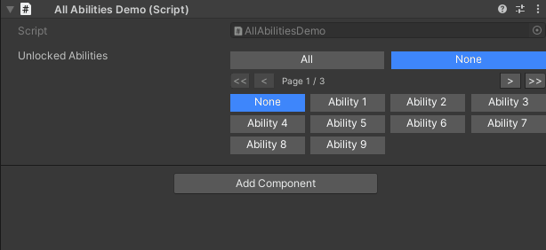
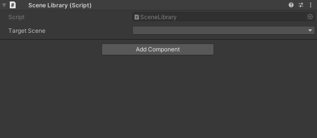

# Inspector Selection Attributes

**Transform selection controls from dropdowns to designer-friendly interfaces.**

Unity Helpers provides four powerful selection attributes that replace standard dropdowns with toggle buttons, searchable lists, and type-safe selection controls. Perfect for flags, enums, predefined values, and dynamic option lists.

---

## Table of Contents

- [WEnumToggleButtons](#wenumtogglebuttons)
- [WValueDropDown](#wvaluedropdown)
- [IntDropDown](#intdropdown)
- [StringInList](#stringinlist)
- [Comparison Table](#comparison-table)
- [Best Practices](#best-practices)
- [Examples](#examples)

---

## WEnumToggleButtons

Draws enum and flag enum fields as a toolbar of toggle buttons.

### Basic Usage

```csharp
using UnityEngine;
using WallstopStudios.UnityHelpers.Core.Attributes;

public class EntityPermissions : MonoBehaviour
{
    [System.Flags]
    public enum Permissions
    {
        None = 0,
        Move = 1 << 0,
        Attack = 1 << 1,
        UseItems = 1 << 2,
        CastSpells = 1 << 3,
    }

    [WEnumToggleButtons]
    public Permissions currentPermissions = Permissions.Move | Permissions.Attack;
}
```

> **Visual Reference**
>
> 
>
> _Flag enum permissions rendered as toggle buttons_

---

### Parameters

```csharp
[WEnumToggleButtons(
    int buttonsPerRow = 0,                  // Force column count (0 = automatic)
    bool showSelectAll = false,             // Show "Select All" button (flags only)
    bool showSelectNone = false,            // Show "Select None" button (flags only)
    bool enablePagination = true,           // Allow pagination for many options
    int pageSize = -1,                      // Override page size (defaults to project setting)
    string colorKey = "Default"             // Color palette key
)]
```

---

### Flag Enums

```csharp
[System.Flags]
public enum DamageTypes
{
    None = 0,
    Physical = 1 << 0,
    Fire = 1 << 1,
    Ice = 1 << 2,
    Lightning = 1 << 3,
    Poison = 1 << 4,
}

[WEnumToggleButtons(showSelectAll: true, showSelectNone: true, buttonsPerRow: 3)]
public DamageTypes resistances = DamageTypes.Fire | DamageTypes.Ice;
```

> **Visual Reference**
>
> 
>
> _Flag enum with Select All and Select None quick action buttons_

**Behavior:**

- Each flag value gets its own toggle button
- Multiple flags can be active simultaneously
- "Select All" and "Select None" buttons for quick configuration

---

### Standard Enums (Radio Buttons)

```csharp
public enum WeaponType { Melee, Ranged, Magic }

[WEnumToggleButtons(buttonsPerRow: 3, colorKey: "Default-Dark")]
public WeaponType weaponType = WeaponType.Melee;
```

> **Visual Reference**
>
> 
>
> _Standard enum rendered as radio-style toggle buttons (only one active)_

**Behavior:**

- Only one option can be selected at a time
- Clicking a button deselects others

---

### Pagination

```csharp
[System.Flags]
public enum AllAbilities
{
    None = 0,
    Ability1 = 1 << 0,
    Ability2 = 1 << 1,
    // ... 20 more abilities ...
    Ability22 = 1 << 21,
}

[WEnumToggleButtons(enablePagination: true, pageSize: 10)]
public AllAbilities unlockedAbilities;
```

> **Visual Reference**
>
> 
>
> _Paginated toggle buttons with First, Previous, Next, Last navigation controls_

**Features:**

- Automatic pagination for many options
- Page size controlled by `pageSize` parameter or `UnityHelpersSettings.EnumToggleButtonsPageSize`
- Navigation: First, Previous, Next, Last buttons
- Summary badge shows selections on other pages

---

### Layout Control

```csharp
// Automatic layout (fits to inspector width)
[WEnumToggleButtons]
public Permissions autoLayout;

// Force 2 columns
[WEnumToggleButtons(buttonsPerRow: 2)]
public Permissions twoColumns;

// Force single column
[WEnumToggleButtons(buttonsPerRow: 1)]
public Permissions singleColumn;
```

> **Visual Reference**
>
> 
>
> _Different column layouts: automatic, 2 columns, and single column_

---

### Color Theming

```csharp
[WEnumToggleButtons(colorKey: "Default-Dark")]
public Permissions darkTheme;

[WEnumToggleButtons(colorKey: "Default-Light")]
public Permissions lightTheme;
```

> **Visual Reference**
>
> 
>
> _Toggle buttons with dark and light color themes_

---

### Combining with Other Attributes

```csharp
// Works with IntDropDown/StringInList/WValueDropDown!
[IntDropDown(0, 30, 60, 120)]
[WEnumToggleButtons]
public int frameRate = 60;  // Shows as toggle buttons instead of dropdown
```

---

## WValueDropDown

Generic dropdown for any type with fixed values or provider methods.

### Basic Usage (Fixed Values)

```csharp
// Primitive types
[WValueDropDown(0, 25, 50, 100)]
public int staminaThreshold = 50;

[WValueDropDown(0.5f, 1.0f, 1.5f, 2.0f)]
public float damageMultiplier = 1.0f;

[WValueDropDown("Easy", "Normal", "Hard", "Insane")]
public string difficulty = "Normal";
```

> **Visual Reference**
>
> 
>
> _Dropdown showing predefined integer, float, and string values_

---

### Provider Methods

```csharp
public class PowerUpConfig : MonoBehaviour
{
    [WValueDropDown(typeof(PowerUpLibrary), nameof(PowerUpLibrary.GetAvailablePowerUps))]
    public PowerUpDefinition selectedPowerUp;
}

public static class PowerUpLibrary
{
    public static IEnumerable<PowerUpDefinition> GetAvailablePowerUps()
    {
        // Return all power-ups from database/resources/etc.
        return Resources.LoadAll<PowerUpDefinition>("PowerUps");
    }
}
```

---

### Primitive Overloads

```csharp
// All primitive types supported:
[WValueDropDown(true, false)]  // bool
public bool boolValue;

[WValueDropDown('A', 'B', 'C')]  // char
public char charValue;

[WValueDropDown((byte)1, (byte)2, (byte)3)]  // byte
public byte byteValue;

[WValueDropDown((short)10, (short)20, (short)30)]  // short
public short shortValue;

[WValueDropDown(100, 200, 300)]  // int
public int intValue;

[WValueDropDown(1000L, 2000L, 3000L)]  // long
public long longValue;

[WValueDropDown(0.1f, 0.5f, 1.0f)]  // float
public float floatValue;

[WValueDropDown(0.1, 0.5, 1.0)]  // double
public double doubleValue;
```

---

### Custom Types

```csharp
[System.Serializable]
public class Preset
{
    public string name;
    public float value;

    public override string ToString() => name;  // Used for dropdown label
}

public class Config : MonoBehaviour
{
    [WValueDropDown(typeof(Config), nameof(GetPresets))]
    public Preset selectedPreset;

    public static IEnumerable<Preset> GetPresets()
    {
        return new[]
        {
            new Preset { name = "Low", value = 0.5f },
            new Preset { name = "Medium", value = 1.0f },
            new Preset { name = "High", value = 2.0f },
        };
    }
}
```

---

## IntDropDown

Integer field rendered as a dropdown with predefined options.

### Basic Usage

```csharp
[IntDropDown(0, 30, 60, 120, 240)]
public int refreshRate = 60;

[IntDropDown(1, 2, 4, 8, 16, 32)]
public int threadCount = 4;
```

> **Visual Reference**
>
> 
>
> _Integer dropdown showing predefined frame rate options_

---

### Provider Method

```csharp
public class FrameRateConfig : MonoBehaviour
{
    [IntDropDown(typeof(FrameRateLibrary), nameof(FrameRateLibrary.GetSupportedFrameRates))]
    public int targetFrameRate = 60;
}

public static class FrameRateLibrary
{
    public static IEnumerable<int> GetSupportedFrameRates()
    {
        return new[] { 30, 60, 90, 120, 144, 240 };
    }
}
```

---

### Fallback Behavior

```csharp
[IntDropDown(10, 20, 30)]
public int value = 25;  // Not in list! Shows as standard IntField
```

**Note:** If the current value isn't in the list, falls back to standard IntField for editing.

---

## StringInList

String field constrained to a set of allowed values with an inline dropdown that opens a searchable popup.

### Basic Usage

```csharp
[StringInList("Easy", "Normal", "Hard", "Nightmare")]
public string difficulty = "Normal";

[StringInList("Red", "Green", "Blue", "Yellow", "Purple")]
public string teamColor = "Red";
```

> **Visual Reference**
>
> 
>
> _String dropdown with an inline popup showing search bar and results_

---

### Provider Method

```csharp
public class LocalizationConfig : MonoBehaviour
{
    [StringInList(typeof(LocalizationKeys), nameof(LocalizationKeys.GetAllKeys))]
    public string dialogKey;
}

public static class LocalizationKeys
{
    public static IEnumerable<string> GetAllKeys()
    {
        // Return keys from localization database
        return new[] { "DIALOG_GREETING", "DIALOG_FAREWELL", "DIALOG_QUEST_START" };
    }
}
```

---

### Instance Provider (context-aware)

```csharp
public class StateMachine : MonoBehaviour
{
    [StringInList(nameof(BuildAvailableStates))]
    public string currentState;

    private IEnumerable<string> BuildAvailableStates()
    {
        // Instance data drives the dropdown
        yield return $"{gameObject.name}_Idle";
        yield return $"{gameObject.name}_Run";
    }

    public static IEnumerable<string> StaticStates()
    {
        // Static helpers still work when referenced by name
        return new[] { "Global_A", "Global_B" };
    }
}
```

> Passing only a method name instructs the drawer to search the decorated type for a parameterless
> method. Instance methods run on the serialized object; static methods are also supported.

---

### Search and Pagination

```csharp
[StringInList(typeof(SceneLibrary), nameof(SceneLibrary.GetAllSceneNames))]
public string targetScene;

public static class SceneLibrary
{
    public static IEnumerable<string> GetAllSceneNames()
    {
        // Return 100+ scene names
        return EditorBuildSettings.scenes.Select(s => s.path);
    }
}
```

When the menu contains more entries than the configured limit, clicking the field opens a popup that embeds the search bar and pagination controls directly in the dropdown itself. The inspector row remains single-line, but the popup still supports fast filtering and page navigation.

> **Visual Reference**
>
> 
>
> _Popup window with a search box filtering results in real-time_

**Features:**

- Dedicated popup hosts search + pagination when the option count exceeds `UnityHelpersSettings.StringInListPageLimit`
- Inspector row stays single-line; the popup includes filtering, paging, and keyboard navigation
- Works in both IMGUI and UI Toolkit inspectors (including `SerializableTypeDrawer`)
- Accepts fixed lists, static provider methods, or instance provider methods resolved on the component

---

### Use Cases

**Scene Names:**

```csharp
[StringInList(typeof(SceneHelper), nameof(SceneHelper.GetAllScenes))]
public string loadScene;
```

**Animation States:**

```csharp
[StringInList("Idle", "Walk", "Run", "Jump", "Attack")]
public string currentAnimation = "Idle";
```

**Localization Keys:**

```csharp
[StringInList(typeof(LocaleManager), nameof(LocaleManager.GetKeys))]
public string textKey;
```

**Tag/Layer Names:**

```csharp
[StringInList("Player", "Enemy", "Projectile", "Environment")]
public string entityTag = "Player";
```

---

## Comparison Table

| Feature                | WEnumToggleButtons | WValueDropDown | IntDropDown | StringInList      |
| ---------------------- | ------------------ | -------------- | ----------- | ----------------- |
| **Primary Use**        | Enums, flag enums  | Any type       | Integers    | Strings           |
| **Visual Style**       | Toggle buttons     | Dropdown       | Dropdown    | Dropdown + search |
| **Multiple Selection** | Yes (flags)        | No             | No          | No                |
| **Pagination**         | Yes                | No             | No          | Yes               |
| **Search**             | No                 | No             | No          | Yes               |
| **Provider Methods**   | No                 | Yes            | Yes         | Yes               |
| **Custom Types**       | No                 | Yes            | No          | No                |
| **Color Theming**      | Yes                | No             | No          | No                |

---

## Best Practices

### 1. Choose the Right Attribute

```csharp
// ✅ GOOD: WEnumToggleButtons for flags (visual toggle state)
[System.Flags]
public enum Features { None = 0, Feature1 = 1, Feature2 = 2, Feature3 = 4 }

[WEnumToggleButtons]
public Features enabledFeatures;

// ✅ GOOD: WValueDropDown for fixed type-safe options
[WValueDropDown(0.5f, 1.0f, 1.5f, 2.0f)]
public float speedMultiplier;

// ✅ GOOD: IntDropDown for integer-specific options
[IntDropDown(30, 60, 120, 240)]
public int frameRate;

// ✅ GOOD: StringInList for string validation
[StringInList("Easy", "Normal", "Hard")]
public string difficulty;

// ❌ BAD: Using strings when enum would be better
[StringInList("Easy", "Normal", "Hard")]
public string difficulty;  // Should be an enum!
```

---

### 2. Use Provider Methods for Dynamic Data

```csharp
// ✅ GOOD: Provider method for data that changes
[WValueDropDown(typeof(AssetDatabase), nameof(GetAllPrefabs))]
public GameObject prefab;

public static IEnumerable<GameObject> GetAllPrefabs()
{
    return Resources.LoadAll<GameObject>("Prefabs");
}

// ❌ BAD: Hardcoded values for dynamic data
[WValueDropDown/* hardcoded list of 50 prefabs */]
public GameObject prefab;  // Nightmare to maintain!
```

---

### 3. Enable Helpful UI Features

```csharp
// ✅ GOOD: Select All/None for flag enums
[System.Flags]
public enum Permissions { None = 0, Read = 1, Write = 2, Execute = 4 }

[WEnumToggleButtons(showSelectAll: true, showSelectNone: true)]
public Permissions permissions;

// ✅ GOOD: Pagination for many options
[WEnumToggleButtons(enablePagination: true, pageSize: 10)]
public ManyOptionsEnum options;

// ❌ BAD: No pagination with 50 options (cluttered inspector!)
[WEnumToggleButtons(enablePagination: false)]
public ManyOptionsEnum options;
```

---

## Examples

### Example 1: Damage Type Resistances

```csharp
using UnityEngine;
using WallstopStudios.UnityHelpers.Core.Attributes;

public class Armor : MonoBehaviour
{
    [System.Flags]
    public enum DamageType
    {
        None = 0,
        Physical = 1 << 0,
        Fire = 1 << 1,
        Ice = 1 << 2,
        Lightning = 1 << 3,
        Poison = 1 << 4,
        Magic = 1 << 5,
    }

    [WEnumToggleButtons(showSelectAll: true, showSelectNone: true,
                        buttonsPerRow: 3, colorKey: "Default-Dark")]
    public DamageType resistances = DamageType.Physical;

    [WEnumToggleButtons(showSelectAll: true, showSelectNone: true,
                        buttonsPerRow: 3, colorKey: "Default-Light")]
    public DamageType vulnerabilities = DamageType.None;
}
```

---

### Example 2: Graphics Presets

```csharp
using UnityEngine;
using WallstopStudios.UnityHelpers.Core.Attributes;

public class GraphicsConfig : MonoBehaviour
{
    [System.Serializable]
    public class QualityPreset
    {
        public string name;
        public int textureQuality;
        public int shadowDistance;

        public override string ToString() => name;
    }

    [WValueDropDown(typeof(GraphicsConfig), nameof(GetPresets))]
    public QualityPreset selectedPreset;

    public static IEnumerable<QualityPreset> GetPresets()
    {
        return new[]
        {
            new QualityPreset { name = "Low", textureQuality = 0, shadowDistance = 50 },
            new QualityPreset { name = "Medium", textureQuality = 1, shadowDistance = 100 },
            new QualityPreset { name = "High", textureQuality = 2, shadowDistance = 200 },
            new QualityPreset { name = "Ultra", textureQuality = 3, shadowDistance = 500 },
        };
    }
}
```

---

### Example 3: Scene Selection

```csharp
using UnityEngine;
using WallstopStudios.UnityHelpers.Core.Attributes;
using System.Linq;

public class SceneLoader : MonoBehaviour
{
    [StringInList(typeof(SceneLoader), nameof(GetAllSceneNames))]
    public string mainMenuScene;

    [StringInList(typeof(SceneLoader), nameof(GetAllSceneNames))]
    public string gameplayScene;

    [StringInList(typeof(SceneLoader), nameof(GetAllSceneNames))]
    public string creditsScene;

    public static IEnumerable<string> GetAllSceneNames()
    {
#if UNITY_EDITOR
        return UnityEditor.EditorBuildSettings.scenes
            .Select(s => System.IO.Path.GetFileNameWithoutExtension(s.path));
#else
        return new string[0];
#endif
    }
}
```

---

### Example 4: Framerate Configuration

```csharp
using UnityEngine;
using WallstopStudios.UnityHelpers.Core.Attributes;

public class PerformanceSettings : MonoBehaviour
{
    [IntDropDown(30, 60, 90, 120, 144, 240, -1)]
    public int targetFrameRate = 60;  // -1 = unlimited

    [IntDropDown(0, 1, 2, 3, 4)]
    public int vsyncCount = 0;  // 0 = disabled

    [WEnumToggleButtons]
    public enum FrameLimitMode { Unlimited, Target, VSync }

    public FrameLimitMode limitMode = FrameLimitMode.Target;

    private void OnValidate()
    {
        Application.targetFrameRate = targetFrameRate;
        QualitySettings.vSyncCount = vsyncCount;
    }
}
```

---

## See Also

- **[Inspector Overview](inspector-overview.md)** - Complete inspector features overview
- **[Inspector Grouping Attributes](inspector-grouping-attributes.md)** - WGroup layouts
- **[Inspector Conditional Display](inspector-conditional-display.md)** - WShowIf
- **[Inspector Settings](inspector-settings.md)** - Configuration reference

---

**Next Steps:**

- Replace flag enum dropdowns with `[WEnumToggleButtons]` for better UX
- Use `[StringInList]` for scene names, animation states, localization keys
- Create provider methods for dynamic option lists
- Experiment with `[WValueDropDown]` for type-safe selection controls
