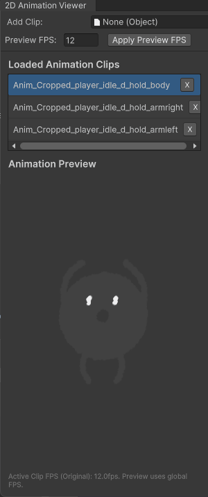

# Visual Components Guide

## TL;DR — Why Use These

- **AnimatedSpriteLayer**: Data structure for packaging sprite animation frames with per-frame offsets and transparency
- **LayeredImage**: UI Toolkit element that composites multiple sprite animation layers into a single animated image
- **EnhancedImage**: Extended Unity UI Image with HDR color support and shape masking

These components solve the problem of creating complex, multi-layer sprite animations without pre-rendering every combination into massive sprite sheets.

---

## AnimatedSpriteLayer

**What it is:** An immutable data structure (struct) that packages a sprite animation sequence with per-frame position offsets and layer-wide alpha transparency.

**Why it exists:** When building complex sprite animations (like a character with equipment, effects, or layered body parts), you need a standardized way to represent each layer with its timing, positioning, and transparency. This struct is the building block for the LayeredImage composition system.

**Problem it solves:**

- Eliminates manually syncing sprite frames, offsets, and alpha values across multiple systems
- Provides type-safe storage for animation layer data
- Automatically converts world-space offsets to pixel-space for rendering
- Validates texture readability at construction time (catches import setting errors early)

### When to Use

✅ **Use when:**

- Building `LayeredImage` compositions
- Creating character animations with separate layers for body parts
- Combining sprite effects (glow, shadow, outline) with base sprites
- You need frame-by-frame position adjustments (bobbing, recoil, etc.)
- Working with sprite-based animations that need dynamic layering

❌ **Don't use when:**

- You only have a single sprite sequence (just use `Animator`)
- Sprites don't need per-frame offsets (just use sprite arrays)
- You're working with UI Toolkit animations (use USS transitions)
- Performance is critical and you can pre-render combinations

### Basic Usage

```csharp
using WallstopStudios.UnityHelpers.Visuals;
using UnityEngine;

// Create a layer from sprite sequence
Sprite[] walkCycleFrames = LoadWalkCycleSprites(); // Must have Read/Write enabled!

// Optional: per-frame offsets in world space (e.g., for bobbing motion)
Vector2[] walkBobOffsets = new[]
{
    new Vector2(0, 0.1f),   // Frame 0: slight up
    new Vector2(0, 0),      // Frame 1: neutral
    new Vector2(0, 0.1f),   // Frame 2: slight up
    new Vector2(0, 0)       // Frame 3: neutral
};

AnimatedSpriteLayer bodyLayer = new AnimatedSpriteLayer(
    sprites: walkCycleFrames,
    worldSpaceOffsets: walkBobOffsets,
    alpha: 1f  // Fully opaque
);

// Create equipment layer (same frame count, different sprites)
Sprite[] helmetFrames = LoadHelmetSprites();
AnimatedSpriteLayer helmetLayer = new AnimatedSpriteLayer(
    sprites: helmetFrames,
    worldSpaceOffsets: null, // No offsets
    alpha: 0.9f  // Slightly transparent
);

// Combine in LayeredImage (see below)
```

### Editor-Only: Creating from AnimationClip

In editor code, you can create layers directly from AnimationClips:

```csharp
#if UNITY_EDITOR
using UnityEditor;

AnimationClip walkClip = AssetDatabase.LoadAssetAtPath<AnimationClip>("Assets/Animations/Walk.anim");
AnimatedSpriteLayer layer = new AnimatedSpriteLayer(
    clip: walkClip,
    worldSpaceOffsets: null,
    alpha: 1f
);
#endif
```

### Important Notes

**Texture Readability:**
All sprites must have **Read/Write Enabled** in their texture import settings. The constructor validates this and logs errors for non-readable textures.

To fix:

1. Select the texture asset
2. In Inspector, check "Read/Write Enabled"
3. Click Apply

**Frame Rate:**
Default frame rate is 12 fps (stored in `AnimatedSpriteLayer.FrameRate` constant). This matches classic sprite animation timing.

**Offset Conversion:**
World-space offsets are automatically converted to pixel-space using sprite pixels-per-unit. This ensures offsets scale correctly with sprite resolution.

---

## LayeredImage

**What it is:** A UI Toolkit `VisualElement` that composites multiple `AnimatedSpriteLayer` instances into a single animated image with alpha blending, automatic cropping, and frame timing.

**Why it exists:** Creating character customization systems (body + equipment), visual effects (base + glow), or any multi-layer sprite animation traditionally requires pre-rendering every combination into massive sprite sheets. LayeredImage composes layers dynamically at runtime.

**Problem it solves:**

- **Sprite sheet explosion**: Instead of 10 bodies × 20 helmets × 15 armors = 3,000 pre-rendered sprites, you have 10 + 20 + 15 = 45 source sprites
- **Memory efficiency**: Only active layers are loaded, not every possible combination
- **Runtime flexibility**: Change equipment/effects without new assets
- **Automatic composition**: Handles alpha blending, pivot alignment, and cropping

### When to Use

✅ **Use when:**

- Character customization systems (swap equipment, clothing, accessories)
- Visual effects that layer over base sprites (shields, auras, damage flashes)
- Procedural sprite generation from components
- UI that needs animated, multi-layer sprites
- You want to avoid combinatorial explosion of pre-rendered sprites

❌ **Don't use when:**

- Single-layer animations (use Unity's `Image` or `Animator`)
- 3D models (use skinned mesh renderers)
- Performance is absolutely critical and you can afford pre-rendered sheets
- Sprites don't share the same frame count/timing
- Working in UGUI (use `EnhancedImage` for UGUI, though it doesn't support layering)

### Basic Usage

```csharp
using WallstopStudios.UnityHelpers.Visuals.UIToolkit;
using UnityEngine.UIElements;

// Create layers (see AnimatedSpriteLayer section above)
AnimatedSpriteLayer[] layers = new[]
{
    bodyLayer,    // Base character
    armorLayer,   // Equipment layer 1
    helmetLayer,  // Equipment layer 2
    glowLayer     // Effect layer
};

// Create LayeredImage
LayeredImage characterImage = new LayeredImage(
    inputSpriteLayers: layers,
    backgroundColor: null,  // Transparent background (or use Color for solid background)
    fps: 12f,               // Animation speed
    updatesSelf: true,      // Automatically advances frames (uses Unity editor ticks or coroutines)
    pixelCutoff: 0.01f      // Alpha threshold for cropping transparent pixels
);

// Add to UI Toolkit hierarchy
rootVisualElement.Add(characterImage);
```

### Manual Frame Control

If you need precise control over frame advancement:

```csharp
LayeredImage manualImage = new LayeredImage(
    inputSpriteLayers: layers,
    backgroundColor: null,
    fps: 12f,
    updatesSelf: false,  // Disable automatic updates
    pixelCutoff: 0.01f
);

// In your update loop
void Update()
{
    manualImage.Update(force: false); // Advances frame based on elapsed time
}

// Or force immediate frame advance
manualImage.Update(force: true);
```

### Changing Animation Speed

```csharp
// Set frames per second at runtime
characterImage.Fps = 24f; // Speed up animation
characterImage.Fps = 6f;  // Slow down animation
```

### Visual Demo

> **LayeredImage in Action**
>
> 
> _Character with dynamically composited equipment layers animating at runtime_
>
> 
> _Swapping equipment layers at runtime without pre-rendered sprite sheets_

### How Compositing Works

LayeredImage performs these steps each frame:

1. **Allocates canvas**: Creates a texture large enough to hold all layers with their offsets
2. **Alpha blending**: Layers are composited back-to-front with alpha blending
3. **Pivot alignment**: Each sprite's pivot point is respected during positioning
4. **Offset application**: Per-frame pixel offsets are applied
5. **Cropping**: Transparent borders are trimmed (configurable via `pixelCutoff`)
6. **Rendering**: Final composited texture is displayed

**Performance optimization:**

- Uses parallel processing for large sprites (2048+ pixels total)
- Employs array pooling to minimize GC allocations
- Caches composited frames when possible

### Pixel Cutoff Parameter

Controls how aggressive transparent pixel cropping is:

```csharp
// More aggressive cropping (removes near-transparent pixels)
layeredImage.pixelCutoff = 0.05f;

// Less aggressive (keeps more semi-transparent pixels)
layeredImage.pixelCutoff = 0.001f;

// No cropping (includes fully transparent border)
layeredImage.pixelCutoff = 0f;
```

Higher values = smaller final image, but may clip soft edges (glows, shadows).

### Important Notes

**Frame Synchronization:**
All layers must have the same number of frames. Mixing 4-frame and 8-frame animations will cause visual glitches.

**Performance Considerations:**

- Compositing happens every frame for animated images
- Large sprite resolutions (1024×1024+) will impact performance
- Consider pre-rendering if targeting low-end devices
- Parallel processing threshold is 2048 pixels (width × height)

**Editor vs Runtime:**

- In Editor: Uses Unity's editor update ticks for animation
- In Runtime: Uses coroutines for frame timing
- Both honor `updatesSelf` setting

---

## EnhancedImage (UGUI)

**What it is:** An extended version of Unity's UI `Image` component with HDR color support and texture-based shape masking.

**Why it exists:** Unity's standard `Image` component doesn't support:

- HDR colors (for bloom/glow effects)
- Complex shape masks (beyond sprite masks)
- Shader-based shape rendering

**See full documentation:** [Editor Tools Guide - EnhancedImage](../editor-tools/editor-tools-guide.md#enhancedimage-editor)

> **Visual Demo**
>
> 
> _HDR color values above 1.0 create bloom effects when post-processing is enabled_

**Quick example:**

```csharp
using WallstopStudios.UnityHelpers.Visuals.UGUI;

EnhancedImage image = GetComponent<EnhancedImage>();

// HDR color for bloom
image.HdrColor = new Color(2f, 0.5f, 0.1f, 1f); // RGB values > 1 for bloom

// Shape mask
image.shapeMask = myMaskTexture; // Black areas are transparent
```

---

## Best Practices

### AnimatedSpriteLayer

- **Always enable Read/Write** on source textures (build will fail otherwise)
- **Keep frame counts consistent** across layers for the same animation
- **Use world-space offsets** for consistent motion across different sprite resolutions
- **Cache layer instances** when using the same animation repeatedly (they're immutable)

### LayeredImage

- **Layer order matters**: Layers are rendered front-to-back in array order
- **Optimize sprite sizes**: Trim transparent borders before importing (use Sprite Editor's "Tight" mode)
- **Profile on target hardware**: Mobile devices may struggle with 512×512+ composites at 60fps
- **Use manual updates** when syncing with non-UI systems (like gameplay state)
- **Pre-render** if combinations are limited and performance is critical

### EnhancedImage

- **Don't mix with Image**: EnhancedImage replaces Unity's Image, don't use both
- **Material cleanup** is automatic but test in edit mode transitions
- **HDR requires post-processing**: Ensure Bloom is enabled in your camera's post-processing

---

## Related Documentation

- [Editor Tools Guide](../editor-tools/editor-tools-guide.md) - EnhancedImage editor integration
- [Samples](../../../Samples~/) - Example projects for each component
- [Math & Extensions](../utilities/math-and-extensions.md) - Color utilities used internally

---

## FAQ

**Q: Can I mix different frame counts in LayeredImage?**
A: No, all layers must have the same frame count. Pad shorter animations with duplicate frames if needed.

**Q: Why are my layers not aligned correctly?**
A: Check that sprite pivots are set correctly (usually center). LayeredImage respects sprite pivot points.

**Q: Can I change layers at runtime?**
A: Currently no, LayeredImage is immutable after construction. Create a new instance with updated layers.

**Q: Performance impact vs pre-rendered sprites?**
A: Compositing costs ~1-3ms per image on modern hardware. Pre-rendered is faster but uses more memory/storage.

**Q: Does this work with Unity's Animator?**
A: No, LayeredImage is independent. It's designed for UI Toolkit programmatic control.

**Q: Can I export the composited result?**
A: Not directly, but you could capture the rendered texture using `Texture2D.ReadPixels` in a render texture setup.
