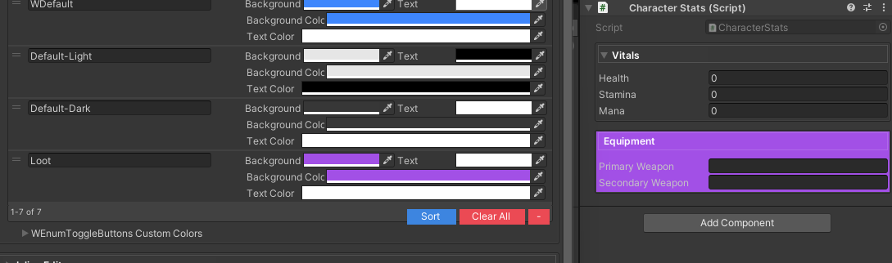

# WGroup Inspector Groups

`WGroupAttribute` provides Odin-like boxed group rendering for serialized fields without the boilerplate of repeating attributes for every member. Inspector groups can expand automatically, inherit palette colors, and opt into collapsible headers.

## Usage

```csharp
using UnityEngine;
using WallstopStudios.UnityHelpers.Core.Attributes;

public sealed class CharacterStats : MonoBehaviour
{
    [WGroup("Vitals", autoIncludeCount: WGroupAttribute.InfiniteAutoInclude, collapsible: true)]
    public int health;

    public int stamina;

    [WGroupEnd]
    public int mana;

    [WGroup("Equipment", autoIncludeCount: 1, colorKey: "Loot")]
    public string primaryWeapon;

    public string secondaryWeapon;
}
```

> **Visual Reference**
>
> 
>
> _Grouped fields with collapsible Vitals section and Equipment group with custom color_

- Fields marked with `[WGroup]` define the first member of a group. The next serialized members are automatically captured up to the configured limit.
- When auto-including infinitely, add `[WGroupEnd]` to the member that should terminate grouping.
- Applying `[WGroup]` again later in the type merges the members into the existing group and resets the auto-include budget.
- Set `hideHeader: true` to render a border without a header label.

## Project Settings defaults

`Project Settings → Wallstop Studios → Unity Helpers` exposes **WGroup Auto Include Mode**:

- **None** – only annotated members are grouped.
- **Finite** – automatically includes the configured number of later members.
- **Infinite** – keep including members until reaching `[WGroupEnd]` or another group declaration.

Per-attribute `autoIncludeCount` overrides the global mode. Use `WGroupAttribute.InfiniteAutoInclude` for local infinite groups or `0` to disable extension for a specific declaration.

## Color palette integration

Group headers use a dedicated WGroup palette:

- Omitting `colorKey` resolves to a theme-aware default (`Default`), producing a subtle Unity-style frame in both light and dark editors.
- Two editable entries (`Default-Light`, `Default-Dark`) back those defaults so you can tweak each theme independently.
- The vibrant blue style that shipped initially now lives under `WDefault`; apply that key to keep the saturated accent.
- Additional keys register automatically in **Project Settings → Wallstop Studios → Unity Helpers → WGroup Custom Colors**. New entries receive suggested colors and readable text, and you can adjust them at any time.

## Compatibility

WGroup operates at the inspector level, so existing property drawers and custom inspectors continue to work. Groups appear in the order of their first declaration, and operations like multi-object editing remain supported.
