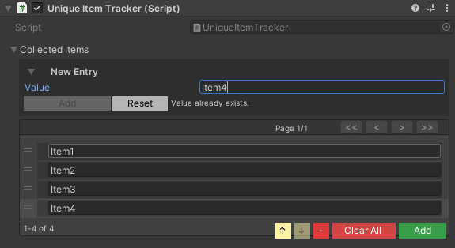

# Serialization Types

**Unity-friendly wrappers for complex data.**

Unity Helpers provides serializable wrappers for types that Unity can't serialize natively: GUIDs, dictionaries, sets, type references, and nullable values. All types include custom property drawers for a seamless inspector experience and support JSON/Protobuf serialization.

---

## Table of Contents

- [WGuid](#wguid)
- [SerializableDictionary](#serializabledictionary)
- [SerializableHashSet & SerializableSortedSet](#serializablehashset--serializablesortedset)
- [SerializableType](#serializabletype)
- [SerializableNullable](#serializablenullable)
- [Best Practices](#best-practices)
- [Examples](#examples)

---

## WGuid

Immutable version-4 GUID wrapper using two longs for efficient Unity serialization.

### Why WGuid?

**Problem:** Unity doesn't serialize `System.Guid` directly
**Solution:** `WGuid` stores as two `long` fields (`_low` and `_high`) for fast Unity serialization

**Performance:**

- 2x faster serialization than string-based GUID storage
- Smaller memory footprint (16 bytes vs 36 bytes for string)
- Immutable design prevents accidental modification

---

### Basic Usage

```csharp
using UnityEngine;
using WallstopStudios.UnityHelpers.Core.DataStructure.Adapters;

public class Entity : MonoBehaviour
{
    public WGuid entityId = WGuid.NewGuid();
}
```

> **Visual Reference**
>
> 

---

### Creating GUIDs

```csharp
// Generate new GUID
WGuid id1 = WGuid.NewGuid();

// From System.Guid
System.Guid sysGuid = System.Guid.NewGuid();
WGuid id2 = (WGuid)sysGuid;

// Parse from string
WGuid id3 = WGuid.Parse("12345678-1234-1234-1234-123456789abc");

// Try parse (safe)
if (WGuid.TryParse("...", out WGuid id4))
{
    Debug.Log($"Parsed: {id4}");
}

// Empty GUID
WGuid empty = WGuid.EmptyGuid;
```

---

### Inspector Features

**Custom Drawer:**

- Text field displays GUID in standard format
- "Generate" button creates new GUID
- Validation warns if GUID is not version-4
- Undo/redo support


---

### Conversions

```csharp
// WGuid <-> System.Guid
WGuid wguid = WGuid.NewGuid();
System.Guid sysGuid = wguid.ToGuid();
WGuid back = (WGuid)sysGuid;

// ToString() formats
string standard = wguid.ToString();  // "xxxxxxxx-xxxx-xxxx-xxxx-xxxxxxxxxxxx"
string formatted = wguid.ToString("N");  // Without hyphens
```

---

### Equality & Comparison

```csharp
WGuid id1 = WGuid.NewGuid();
WGuid id2 = id1;

// Implements IEquatable<WGuid>
bool equal = id1.Equals(id2);  // true
bool opEqual = id1 == id2;     // true

// Implements IComparable<WGuid>
int comparison = id1.CompareTo(id2);  // 0
```

---

### Serialization Support

- **Unity:** Serialized as two `long` fields
- **JSON:** Serialized as GUID string
- **Protobuf:** Serialized as two `long` fields

```csharp
using ProtoBuf;

[ProtoContract]
public class SaveData
{
    [ProtoMember(1)] public WGuid playerId;
    [ProtoMember(2)] public WGuid sessionId;
}
```

---

## SerializableDictionary

Unity-friendly dictionary with synchronized key/value arrays and custom drawer.

### Why SerializableDictionary?

**Problem:** Unity doesn't serialize `Dictionary<TKey, TValue>`
**Solution:** `SerializableDictionary<TKey, TValue>` maintains synchronized arrays for Unity serialization and a runtime dictionary for fast lookups

---

### Basic Usage

```csharp
using UnityEngine;
using WallstopStudios.UnityHelpers.Core.DataStructure.Adapters;

public class PrefabRegistry : MonoBehaviour
{
    public GameObject enemyPrefab;
    public GameObject playerPrefab;

    public SerializableDictionary<string, GameObject> prefabs;

    private void Start()

        // Access entries
        if (prefabs.TryGetValue("Enemy", out GameObject prefab))
        {
            Instantiate(prefab);
        }

        // Count
        Debug.Log($"Prefab count: {prefabs.Count}");

        // Iteration
        foreach (var kvp in prefabs)
        {
            Debug.Log($"{kvp.Key}: {kvp.Value}");
        }

        /*
            Add entries (or overwrite)
            WARNING: This is just for demo purposes! SerializableDictionary is meant for editor-mode persistence.
            Nothing stops you from changing this at runtime, but it will be lost on next playthrough.
        */
        prefabs["Player"] = playerPrefab;
        prefabs["Enemy"] = enemyPrefab;
    }
}
```

---

### Inspector Features

> **Visual Reference**
>
> 
>
> _Dictionary inspector showing key-value pairs with pagination and inline editing_

**Custom Drawer:**

- Key/value pair editing
- Add/Remove buttons
- Reorderable list
- Duplicate key detection (visual warning)
- Null value highlighting
- Pagination for large dictionaries

![Image placeholder: Dictionary with duplicate key warning (red highlight)]
![Image placeholder: Dictionary pagination controls]

---

### Dictionary Operations

```csharp
// Implements IDictionary<TKey, TValue> and IReadOnlyDictionary<TKey, TValue>
SerializableDictionary<int, string> dict = new();

// Add
dict.Add(1, "One");
dict[2] = "Two";

// Read
string value = dict[1];
bool exists = dict.TryGetValue(2, out string val);
bool contains = dict.ContainsKey(1);

// Update
dict[1] = "First";

// Remove
dict.Remove(1);
dict.Clear();

// Iteration
foreach (KeyValuePair<int, string> kvp in dict)
{
    Debug.Log($"{kvp.Key} = {kvp.Value}");
}

// Keys/Values collections
ICollection<int> keys = dict.Keys;
ICollection<string> values = dict.Values;
```

---

### Specialized Dictionaries

```csharp
// Sorted dictionary (maintains key order)
public SerializableSortedDictionary<int, string> sortedDict;
```

**Note:** `SerializableSortedDictionary` uses `SortedDictionary<TKey, TValue>` internally for ordered keys.

---

### Serialization Support

**Unity:** Synchronized `_keys` and `_values` arrays
**JSON:** Standard dictionary format
**Protobuf:** Supported via surrogates

```csharp
// JSON example
{
    "prefabs": {
        "Enemy": { "instanceId": 12345 },
        "Player": { "instanceId": 67890 }
    }
}
```

---

## SerializableHashSet & SerializableSortedSet

Unity-friendly set collections with duplicate detection and custom drawers.

### Why Serializable Sets?

**Problem:** Unity doesn't serialize `HashSet<T>` or `SortedSet<T>`
**Solution:** `SerializableHashSet<T>` and `SerializableSortedSet<T>` maintain a serialized array and runtime set for fast lookups

---

### Basic Usage

```csharp
using UnityEngine;
using WallstopStudios.UnityHelpers.Core.DataStructure.Adapters;

public class UniqueItemTracker : MonoBehaviour
{
    public SerializableHashSet<string> collectedItems;

    private void Start()
    {
        foreach (var item in collectedItems)
        {
            Debug.Log($"Found item: {item}");
        }
    }
}
```

> **Visual Reference**
>
> 
>
> _Set inspector with add/remove controls, duplicate highlighting, and pagination_

---

### Inspector Features

**Custom Drawer:**

- Reorderable list
- Add/Remove/Clear/Sort buttons
- **Duplicate detection** with visual highlighting (shake animation + color)
- **Null entry highlighting** (red background)
- Pagination for large sets
- Move Up/Down buttons
- Current selection badge for items on other pages
- **New Entry foldout** to stage values before adding them to the runtime set (tune its animation via **Project Settings ▸ Wallstop Studios ▸ Unity Helpers ▸ Set Foldouts**)

> **Visual Reference**
>
> 
>
> _Visual feedback for duplicate entries (yellow shake) and null values (red background)_
> 

---

### Set Operations

```csharp
// Implements ISet<T> and IReadOnlyCollection<T>
SerializableHashSet<int> set = new();

// Add (returns true if new)
bool added = set.Add(42);

// Read
bool contains = set.Contains(42);
int count = set.Count;

// Remove
bool removed = set.Remove(42);
set.Clear();

// Set operations
HashSet<int> other = new HashSet<int> { 1, 2, 3 };
set.UnionWith(other);        // Add all from other
set.IntersectWith(other);    // Keep only common elements
set.ExceptWith(other);       // Remove elements in other
bool overlaps = set.Overlaps(other);

// Iteration
foreach (int item in set)
{
    Debug.Log(item);
}
```

### New Entry Foldout

Expandable "New Entry" controls let you configure the exact value that will be inserted, which is especially helpful for complex structs, managed references, or ScriptableObjects. The foldout supports the same field variety as the inline list and respects your duplicate/null validation. Animation for the New Entry foldout is governed by the **Serializable Set Foldouts** settings; adjust tweening and speed independently for `SerializableHashSet<T>` and `SerializableSortedSet<T>`.

---

### Foldout Defaults & Overrides

By default, SerializableSet inspectors start collapsed until you open them. This baseline comes from **Project Settings ▸ Wallstop Studios ▸ Unity Helpers** via the **Serializable Set Start Collapsed** toggle (and the equivalent **Serializable Dictionary Start Collapsed** toggle for dictionaries). You can override the default per-field with `[WSerializableCollectionFoldout]`:

```csharp
using WallstopStudios.UnityHelpers.Core.Attributes;

[WSerializableCollectionFoldout(WSerializableCollectionFoldoutBehavior.StartExpanded)]
public SerializableHashSet<string> unlockedBadges = new();
```

- **Project setting** establishes the initial state only.
- **`[WSerializableCollectionFoldout]`** can request expanded or collapsed behavior for specific collections.
- **Explicit changes** to `SerializedProperty.isExpanded` (scripts, custom inspectors, or tests) take ultimate precedence. The drawer now respects those manual decisions, so opting-in via code no longer gets undone by the attribute or the global default.

The attribute applies to both `SerializableHashSet<T>`/`SerializableSortedSet<T>` and the dictionary equivalents, making it straightforward to mix project-wide defaults with per-field intentions.

---

### Sorted Sets

```csharp
// Maintains sorted order automatically
public SerializableSortedSet<int> scoreThresholds;

private void Start()
{
    scoreThresholds.Add(100);
    scoreThresholds.Add(500);
    scoreThresholds.Add(1000);
    scoreThresholds.Add(250);  // Inserted in correct position

    // Iteration is always sorted: 100, 250, 500, 1000
    foreach (int threshold in scoreThresholds)
    {
        Debug.Log(threshold);
    }
}
```

![Image placeholder: SerializableSortedSet showing sorted numeric values]

---

### Serialization Support

**Unity:** Serialized `_items` array
**JSON:** Array format
**Protobuf:** Supported via collection surrogates

```csharp
// JSON example
{
    "collectedItems": ["item_001", "item_042", "item_137"]
}
```

---

## SerializableType

Unity-friendly type reference that survives refactoring and namespace changes.

> **Visual Reference**
>
> 
> _Type selection with searchable dropdown, namespace filtering, and validation_

### Why SerializableType?

**Problem:** Unity doesn't serialize `System.Type`, and type names break when refactoring
**Solution:** `SerializableType` stores assembly-qualified names with fallback resolution on rename/namespace changes

---

### Basic Usage

```csharp
using UnityEngine;
using WallstopStudios.UnityHelpers.Core.DataStructure.Adapters;

public class BehaviorSpawner : MonoBehaviour
{
    [StringInList(typeof(TypeHelper), nameof(TypeHelper.GetAllMonoBehaviours))]
    public SerializableType behaviorType;

    private void SpawnBehavior()
    {
        if (behaviorType.IsEmpty)
        {
            Debug.LogWarning("No behavior type assigned!");
            return;
        }

        Type type = behaviorType.GetResolvedType();
        if (type != null)
        {
            GameObject go = new GameObject(type.Name);
            go.AddComponent(type);
        }
    }
}
```

![Image placeholder: SerializableType inspector with type browser and search]

---

### Inspector Features

**Custom Drawer (Two-Line):**

- **Search row:** Text field for filtering types
- **Popup row:** Dropdown showing matched types
- Clear button to unset type
- Pagination for large type catalogs
- Auto-complete suggestions

![Image placeholder: SerializableType search showing filtered results]
![Image placeholder: SerializableType popup with pagination]

---

### Type Operations

```csharp
// Create
SerializableType typeRef = new SerializableType(typeof(PlayerController));

// Resolve
Type resolvedType = typeRef.GetResolvedType();
if (resolvedType != null)
{
    object instance = Activator.CreateInstance(resolvedType);
}

// Check
bool isEmpty = typeRef.IsEmpty;
string displayName = typeRef.DisplayName;  // User-friendly name

// Equality
bool equal = typeRef.Equals(new SerializableType(typeof(PlayerController)));
```

---

### Refactoring Resilience

**Scenario:** You rename `PlayerController` to `PlayerBehavior` or move it to a new namespace.

**Standard Approach:** Type reference breaks, data loss
**SerializableType:** Automatically resolves via assembly scanning and fallback matching

**How it works:**

1. Stores assembly-qualified name (e.g., `Namespace.PlayerController, Assembly-CSharp`)
2. On deserialization, tries exact match first
3. If exact match fails, scans assemblies for best partial match
4. Updates internal name if resolved to new type

![Image placeholder: SerializableType preserving reference after class rename]

---

### Serialization Support

**Unity:** Stores assembly-qualified name string
**JSON:** Type name string with custom converter
**Protobuf:** Supported via string surrogates

```csharp
// JSON example
{
    "behaviorType": "MyNamespace.PlayerController, Assembly-CSharp"
}
```

---

## SerializableNullable

Unity-friendly nullable value type wrapper.

> **Visual Reference**
>
> 
> _Nullable value type with HasValue checkbox and conditional value field_

### Why SerializableNullable?

**Problem:** Unity doesn't serialize `Nullable<T>` (e.g., `int?`, `float?`)
**Solution:** `SerializableNullable<T>` wraps any value type with `HasValue` and `Value` properties

---

### Basic Usage

```csharp
using UnityEngine;
using WallstopStudios.UnityHelpers.Core.DataStructure.Adapters;

public class BonusConfig : MonoBehaviour
{
    public SerializableNullable<float> criticalHitMultiplier;

    private float GetDamage(float baseDamage, bool isCritical)
    {
        if (isCritical && criticalHitMultiplier.HasValue)
        {
            return baseDamage * criticalHitMultiplier.Value;
        }
        return baseDamage;
    }
}
```

![Image placeholder: SerializableNullable inspector with toggle and value field]

---

### Inspector Features

**Custom Drawer:**

- Checkbox for `HasValue` state
- Inline value field (enabled when `HasValue == true`)
- Height adapts based on nullable state

![Image placeholder: Nullable unchecked (disabled field)]
![Image placeholder: Nullable checked (enabled field with value)]

---

### Nullable Operations

```csharp
// Create with value
SerializableNullable<int> nullableInt = new SerializableNullable<int>(42);

// Create without value (null)
SerializableNullable<int> nullInt = new SerializableNullable<int>();

// Check
if (nullableInt.HasValue)
{
    int value = nullableInt.Value;
    Debug.Log($"Value: {value}");
}

// Implicit conversion from T
SerializableNullable<float> nullableFloat = 3.14f;

// Conversion to Nullable<T>
int? systemNullable = nullableInt.HasValue ? nullableInt.Value : null;
```

---

### Use Cases

**Optional Configuration:**

```csharp
public SerializableNullable<float> overrideSpeed;  // null = use default
```

**Conditional Bonuses:**

```csharp
public SerializableNullable<int> bonusGold;  // null = no bonus
```

**Dynamic Properties:**

```csharp
public SerializableNullable<Color> customColor;  // null = use preset
```

---

### Serialization Support

**Unity:** Stores `_hasValue` bool and `_value` T fields
**JSON:** Standard nullable format
**Protobuf:** Supported via nullable surrogates

```csharp
// JSON example (has value)
{
    "criticalHitMultiplier": 2.5
}

// JSON example (null)
{
    "criticalHitMultiplier": null
}
```

---

## Best Practices

### 1. Choose the Right Type

```csharp
// ✅ GOOD: WGuid for entity IDs
public WGuid entityId = WGuid.NewGuid();

// ✅ GOOD: SerializableDictionary for key/value mappings
public SerializableDictionary<string, GameObject> prefabRegistry;

// ✅ GOOD: SerializableHashSet for unique collections
public SerializableHashSet<string> uniqueItemIds;

// ✅ GOOD: SerializableSortedSet for ordered unique values
public SerializableSortedSet<int> scoreThresholds;

// ✅ GOOD: SerializableType for type references
public SerializableType behaviorType;

// ✅ GOOD: SerializableNullable for optional values
public SerializableNullable<float> overrideSpeed;

// ❌ BAD: String-based GUID
public string entityId = System.Guid.NewGuid().ToString();  // Use WGuid!

// ❌ BAD: Parallel arrays instead of dictionary
public string[] keys;
public GameObject[] values;  // Use SerializableDictionary!

// ❌ BAD: List with manual duplicate checking
public List<string> uniqueItems;  // Use SerializableHashSet!
```

---

### 2. Initialize Collections

```csharp
// ✅ GOOD: Initialize in field declaration
public SerializableDictionary<string, int> scores = new();
public SerializableHashSet<string> tags = new();

// ❌ BAD: Null collections (NullReferenceException!)
public SerializableDictionary<string, int> scores;  // null!

private void Start()
{
    scores.Add("player", 100);  // Crash!
}
```

---

### 3. Use Sorted Variants for Ordered Data

```csharp
// ✅ GOOD: SortedSet for ordered priorities
public SerializableSortedSet<int> unlockLevels;

// ✅ GOOD: SortedDictionary for ordered display
public SerializableSortedDictionary<string, string> alphabeticalNames;

// ❌ BAD: HashSet for ordered data (no guaranteed order!)
public SerializableHashSet<int> unlockLevels;  // Order is random!
```

---

### 4. Handle WGuid Generation Carefully

```csharp
// ✅ GOOD: Generate once, then immutable
public WGuid entityId = WGuid.NewGuid();

// ✅ GOOD: Generate in Awake if needed
private void Awake()
{
    if (entityId == WGuid.EmptyGuid)
    {
        entityId = WGuid.NewGuid();
    }
}

// ❌ BAD: Regenerating on every access
public WGuid EntityId => WGuid.NewGuid();  // New GUID every time!
```

---

## Examples

### Example 1: Item Database with Dictionary

```csharp
using UnityEngine;
using WallstopStudios.UnityHelpers.Core.DataStructure.Adapters;

[System.Serializable]
public class ItemData
{
    public string name;
    public Sprite icon;
    public int value;
}

public class ItemDatabase : MonoBehaviour
{
    public SerializableDictionary<string, ItemData> items;

    public bool TryGetItem(string itemId, out ItemData data)
    {
        return items.TryGetValue(itemId, out data);
    }

    public void AddItem(string itemId, ItemData data)
    {
        items[itemId] = data;
    }
}
```

---

### Example 2: Player Achievement Tracking

```csharp
using UnityEngine;
using WallstopStudios.UnityHelpers.Core.DataStructure.Adapters;

public class PlayerProfile : MonoBehaviour
{
    public WGuid playerId = WGuid.NewGuid();
    public SerializableHashSet<string> unlockedAchievements;
    public SerializableSortedSet<int> highScores;

    public void UnlockAchievement(string achievementId)
    {
        if (unlockedAchievements.Add(achievementId))
        {
            Debug.Log($"Unlocked: {achievementId}");
            // Trigger UI notification, etc.
        }
    }

    public void RecordScore(int score)
    {
        highScores.Add(score);

        // Keep only top 10
        while (highScores.Count > 10)
        {
            highScores.Remove(highScores.Min);
        }
    }
}
```

---

### Example 3: Dynamic Behavior Spawning

```csharp
using UnityEngine;
using WallstopStudios.UnityHelpers.Core.DataStructure.Adapters;
using System;

public class BehaviorFactory : MonoBehaviour
{
    [StringInList(typeof(TypeHelper), nameof(TypeHelper.GetAllMonoBehaviours))]
    public SerializableType defaultBehavior;

    public SerializableDictionary<string, SerializableType> namedBehaviors;

    public GameObject SpawnWithBehavior(string behaviorName = null)
    {
        SerializableType typeToSpawn = defaultBehavior;

        if (!string.IsNullOrEmpty(behaviorName) &&
            namedBehaviors.TryGetValue(behaviorName, out SerializableType namedType))
        {
            typeToSpawn = namedType;
        }

        if (typeToSpawn.IsEmpty)
        {
            Debug.LogWarning("No behavior type specified!");
            return null;
        }

        Type type = typeToSpawn.GetResolvedType();
        if (type == null || !typeof(MonoBehaviour).IsAssignableFrom(type))
        {
            Debug.LogError($"Invalid behavior type: {typeToSpawn.DisplayName}");
            return null;
        }

        GameObject go = new GameObject(type.Name);
        go.AddComponent(type);
        return go;
    }
}

public static class TypeHelper
{
    public static IEnumerable<Type> GetAllMonoBehaviours()
    {
        return AppDomain.CurrentDomain.GetAssemblies()
            .SelectMany(a => a.GetTypes())
            .Where(t => typeof(MonoBehaviour).IsAssignableFrom(t) && !t.IsAbstract);
    }
}
```

---

### Example 4: Optional Configuration with Nullable

```csharp
using UnityEngine;
using WallstopStudios.UnityHelpers.Core.DataStructure.Adapters;

public class CharacterConfig : MonoBehaviour
{
    public float baseSpeed = 5f;
    public SerializableNullable<float> speedOverride;  // null = use baseSpeed

    public Color defaultColor = Color.white;
    public SerializableNullable<Color> colorOverride;  // null = use defaultColor

    private void Start()
    {
        float actualSpeed = speedOverride.HasValue ? speedOverride.Value : baseSpeed;
        Color actualColor = colorOverride.HasValue ? colorOverride.Value : defaultColor;

        Debug.Log($"Speed: {actualSpeed}, Color: {actualColor}");
    }
}
```

---

## See Also

- **[Inspector Overview](../inspector/inspector-overview.md)** - Complete inspector features overview
- **[Serialization Guide](serialization.md)** - JSON/Protobuf serialization
- **[Data Structures](../utilities/data-structures.md)** - Other data structures
- **[Editor Tools Guide](../editor-tools/editor-tools-guide.md)** - Editor utilities

---

**Next Steps:**

- Replace string/int-based IDs with `WGuid`
- Use `SerializableDictionary` instead of parallel arrays
- Track unique collections with `SerializableHashSet`
- Store type references with `SerializableType`
- Add optional configuration with `SerializableNullable`
