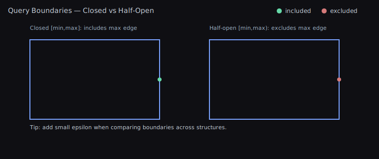

# Spatial Tree Semantics

## TL;DR — Why Semantics Matter

- Different structures make different promises about boundaries and tie‑breaks.
- 2D point trees (QuadTree2D, KdTree2D) agree on results; RTree differs by design (bounds‑based).
- In 3D, KdTree3D vs OctTree3D can diverge at exact boundaries; add small epsilons if edge‑cases matter.

This page explains how the 2D and 3D spatial structures compare in terms of correctness, when to use each structure, and why some 3D variants may produce different results for identical inputs and queries.

## Result Buffers

- Every range/bounds/nearest-neighbor API accepts an output `List<T>` and **clears it before** appending results. Reuse the same buffer between calls to avoid garbage, and do not expect prior contents to survive a query.
- This pattern is consistent across `QuadTree2D`, `KdTree2D/3D`, `OctTree3D`, and the RTree variants, matching the log-friendly “provide your own buffer” approach used throughout the helpers.

## Structures At A Glance

- QuadTree2D — Recursive 4-way partitioning of space. Good general-purpose point queries.
- KDTree2D — Alternating axis splits. Strong for nearest neighbor and range queries on points.
- RTree2D — Groups rectangles (AABBs) by minimum bounding rectangles (MBRs). Best when items have size.

Illustrations:

3D Variants

Diagram notes

- Octree splits are centered along each axis, evenly dividing space into eight octants.
- KDTree3D splits are data‑dependent and may be off‑center; the diagram shows an off‑center y‑split to emphasize this difference.

## 2D: Consistent Results Across QuadTree2D and KdTree2D

- QuadTree2D and KdTree2D (balanced and unbalanced) index points and use equivalent per‑point checks for range and bounds queries. For the same input data and the same queries, they return the same results. Differences are limited to construction/query performance and memory layout.
- RTree2D differs by design: it indexes rectangles (AABBs). If your elements have size, intersection/containment semantics involve those sizes, so results will differ from point‑based trees.

### When To Use (2D)

- QuadTree2D
  - Use for broad-phase neighbor checks, visibility, and general spatial buckets where balanced performance and simplicity help.
  - Pros: Simple mental model, predictable, easy to rebuild or update.
  - Cons: Hotspots can create deeper trees; nearest-neighbor not optimal vs KDTree.

- KDTree2D
  - Use for nearest-neighbor and precise point range queries at scale.
  - Pros: Excellent for NN queries, balanced variant gives consistent query time.
  - Cons: Balanced build costs; dynamic updates more expensive than QuadTree.

- RTree2D
  - Use for geometry with area (AABBs), e.g., sprites, colliders, map tiles.
  - Pros: Querying by bounds is very fast; items with size are first-class.
  - Cons: Overlap between MBRs may increase query visits; tuned for bounds, not points.

## 3D: Why KdTree3D and OctTree3D Can Differ

While KdTree3D and OctTree3D are both point‑based and target equivalent use cases, algorithmic choices can yield different edge‑case behavior for identical inputs/queries.

Key reasons and scenarios:

- Split planes and child assignment
  - KdTree3D splits by alternating axes (x, y, z); balanced builds use median selection, unbalanced builds split at node‑center. Points lying exactly on a split plane are deterministically assigned but may end up in different leaves between balanced vs unbalanced trees.
  - OctTree3D partitions space into eight octants at each node. Points on plane boundaries are classified using octant rules; borderline points may be grouped differently than in KdTree3D.

- Bounds queries: half‑open vs closed edges
  - KdTree3D constructs an inclusive half‑open query box for per‑point checks and uses Unity `Bounds` for traversal. OctTree3D uses `BoundingBox3D` with inclusive‑max conversion and additional node‑level fast paths when a node is fully contained.
  - Minimum node size enforcement keeps node bounds non‑degenerate. Near boundary edges this can expand a node just enough to flip a fully‑contained check, changing whether the algorithm fast‑adds all points in a node or checks them individually.
  - Result impact: points exactly on max edges or at floating‑point limits can be included by one structure and excluded by the other in rare cases.

- Range (sphere) queries
  - Both trees use exact per‑point distance checks. However, their traversal pruning and “node fully contained in sphere” checks differ (sphere vs AABB overlap/containment and different numeric guards). For points close to the query radius, minor numeric differences can alter inclusion.

- Balanced vs unbalanced KdTree3D
  - Balanced uses median selection; unbalanced uses quick splits by node center. Both apply equivalent per‑point checks, but leaf grouping and bounding boxes differ. Near boundary edges, leaf‑level fast paths (e.g., when a node is fully contained) can diverge, leading to differences at exact boundaries.

## 3D: RTree3D Semantics

- RTree3D indexes 3D AABBs and aggregates bounding volumes upward. Queries (box/sphere) operate on those volumes rather than points. Expect results to differ from KdTree3D/OctTree3D in scenes where elements have size.

## Guidance

- Need consistent point semantics in 2D? Use QuadTree2D or KdTree2D interchangeably; choose based on performance.
- In 3D, prefer KdTree3D for nearest‑neighbor point queries and OctTree3D for general‑purpose spatial partitioning. Be mindful of edge cases on query boundaries; add small epsilons if needed.
- Use RTree2D/RTree3D for sized elements where bounds intersection is the primary concern.
- For many moving objects with broad‑phase neighbor checks, prefer SpatialHash3D (stable) or SpatialHash2D.

## Boundary Semantics

Tips

- Normalize to closed or half‑open intervals across your codebase.
- Add a small epsilon where necessary to handle ties at split planes.

## Cheat Sheet

- Many moving points, frequent rebuilds: QuadTree2D
- Nearest neighbors on static points: KDTree2D (Balanced)
- Fast builds with okay query performance: KDTree2D (Unbalanced)
- Objects with size, bounds queries: RTree2D
