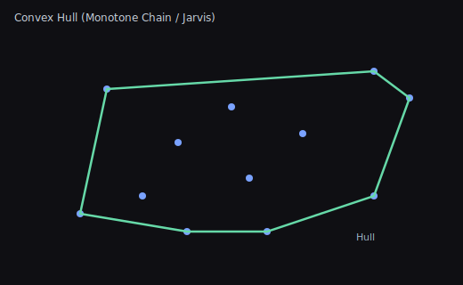
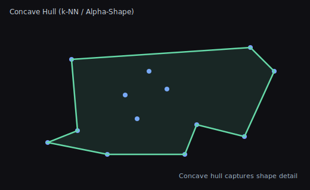

# Hulls (Convex vs Concave)

This guide explains convex and concave hulls, when to use each, and how they differ.

## Convex Hull

- The smallest convex polygon that contains all points.
- Algorithms: Monotone Chain (a.k.a. Andrew’s), Graham Scan, Jarvis March.
- Characteristics
  - Always convex; no inward dents.
  - Stable and deterministic for fixed input.
  - Often used for coarse collision proxies, shape bounds, and visibility.

Illustration:

## Concave Hull

- A polygon that can indent to follow the shape of points more closely.
- Algorithms: k-nearest-neighbor based, alpha-shapes, ball-pivoting variants.
- Characteristics
  - Can capture shape detail; may exclude sparse outliers.
  - Parameterized by k (neighbors) or alpha (radius) controlling “concavity”.
  - May create holes or self-intersections if not constrained; validate output.

Illustration:

## Choosing Between Them

- Use convex hull when you need a fast, safe, and simple bound with predictable performance.
- Use concave hull when shape fidelity matters (e.g., silhouette, path enclosure) and you accept a tunable trade-off between detail and stability.

## Tips

- Preprocess: remove duplicate points and optionally simplify clusters.
- Postprocess: enforce clockwise/CCW winding and run self-intersection checks for concave hulls.
- Numerical stability: add small epsilons for colinear checks; include or exclude boundary points consistently.

