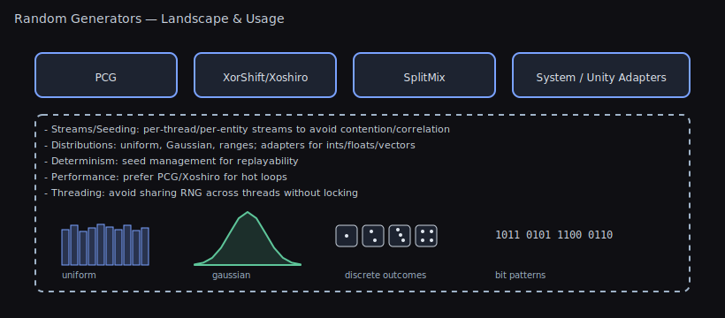

# Random Number Generator Performance Benchmarks

## TL;DR — What To Use

- **⭐ Use `PRNG.Instance` instead of `UnityEngine.Random` — 10-15x faster + seedable for determinism.**
- IllusionFlow (default): Great balance of speed, quality, and thread-safety.
- Need System.Random compatibility? Use `DotNetRandom` wrapper.
- Chasing max speed in hot loops? `LinearCongruentialGenerator`/`RomuDuo` are fastest.

### ⭐ The Speed & Determinism Killer Feature

**The Problem with UnityEngine.Random:**

```csharp
// 🔴 UnityEngine.Random:
// - Slow (~65-85M ops/sec)
// - Not seedable (no replays, no determinism)
// - Not thread-safe (main thread only)

void GenerateLevel()
{
    for (int i = 0; i < 10000; i++)
    {
        float value = Random.value;  // Slow!
        // Can't reproduce this exact level generation
    }
}
```

**The Solution - Unity Helpers Random:**

```csharp
// 🟢 Unity Helpers (PRNG.Instance):
// - Fast (655-885M ops/sec = 10-15x faster)
// - Seedable (perfect replays)
// - Thread-local (safe everywhere)

IRandom rng = new IllusionFlow(seed: 12345);

void GenerateLevel()
{
    for (int i = 0; i < 10000; i++)
    {
        float value = rng.NextFloat();  // Fast + reproducible!
        // Same seed = exact same level every time
    }
}
```

**When It Matters:**

- **Procedural generation**: Thousands of random rolls per level
- **Particle systems**: Hundreds of random values per frame
- **Networked games**: Clients must generate identical results
- **Replay systems**: Must reproduce exact gameplay
- **Performance-critical loops**: Every microsecond counts

**Speed Comparison:**

| Generator                    | NextFloat (ops/sec) | vs UnityEngine.Random |
| ---------------------------- | ------------------- | --------------------- |
| UnityEngine.Random           | 65M                 | 1x (baseline)         |
| PRNG.Instance (IllusionFlow) | 655M                | **10x faster**        |
| LinearCongruentialGenerator  | 829M                | **13x faster**        |
| SplitMix64                   | 739M                | **11x faster**        |

Threading

- Individual RNG instances are not thread‑safe.
- Use `PRNG.Instance` or each generator’s `TypeName.Instance` for thread‑local safety, or create one instance per thread.

Visual



This document contains performance benchmarks for the various random number generators included in Unity Helpers.

## Performance (Operations per Second)

<!-- RANDOM_BENCHMARKS_START -->

| Random                      | NextBool    | Next        | NextUInt      | NextFloat   | NextDouble  | NextUint - Range | NextInt - Range |
| --------------------------- | ----------- | ----------- | ------------- | ----------- | ----------- | ---------------- | --------------- |
| DotNetRandom                | 534,500,000 | 55,300,000  | 57,600,000    | 46,500,000  | 27,400,000  | 53,700,000       | 53,500,000      |
| LinearCongruentialGenerator | 801,300,000 | 876,500,000 | 1,307,000,000 | 188,400,000 | 376,000,000 | 584,200,000      | 501,200,000     |
| IllusionFlow                | 778,600,000 | 631,500,000 | 880,200,000   | 183,400,000 | 324,000,000 | 438,700,000      | 389,100,000     |
| PcgRandom                   | 785,600,000 | 653,100,000 | 909,700,000   | 188,800,000 | 312,600,000 | 450,700,000      | 406,500,000     |
| RomuDuo                     | 778,000,000 | 588,000,000 | 754,900,000   | 170,200,000 | 251,600,000 | 439,200,000      | 391,900,000     |
| SplitMix64                  | 780,500,000 | 750,100,000 | 1,058,400,000 | 191,300,000 | 358,800,000 | 485,500,000      | 441,300,000     |
| SquirrelRandom              | 758,000,000 | 408,100,000 | 413,800,000   | 178,200,000 | 188,100,000 | 367,900,000      | 339,500,000     |
| SystemRandom                | 148,000,000 | 148,900,000 | 64,500,000    | 132,000,000 | 139,200,000 | 59,000,000       | 59,000,000      |
| UnityRandom                 | 657,400,000 | 85,100,000  | 87,800,000    | 63,000,000  | 41,500,000  | 81,100,000       | 82,100,000      |
| WyRandom                    | 759,500,000 | 383,800,000 | 454,200,000   | 171,600,000 | 189,000,000 | 295,600,000      | 280,100,000     |
| XorShiftRandom              | 788,000,000 | 592,100,000 | 603,600,000   | 190,900,000 | 262,100,000 | 479,000,000      | 420,900,000     |
| XoroShiroRandom             | 780,600,000 | 557,000,000 | 754,300,000   | 172,800,000 | 251,700,000 | 421,300,000      | 376,300,000     |

<!-- RANDOM_BENCHMARKS_END -->

## Interpreting the Results

- **NextBool**: Operations per second for generating random boolean values
- **Next**: Operations per second for generating random integers (0 to int.MaxValue)
- **NextUInt**: Operations per second for generating random unsigned integers
- **NextFloat**: Operations per second for generating random floats (0.0f to 1.0f)
- **NextDouble**: Operations per second for generating random doubles (0.0d to 1.0d)
- **NextUint - Range**: Operations per second for generating random unsigned integers within a range
- **NextInt - Range**: Operations per second for generating random integers within a range

## Recommendations

Based on the benchmarks:

- **For general use**: `IllusionFlow` (via `PRNG.Instance`) - Great balance of speed and quality
- **For maximum speed**: `RomuDuo` or `LinearCongruentialGenerator` - Fastest overall
- **For compatibility**: `DotNetRandom` - Uses .NET's built-in Random
- **Avoid for performance**: `UnityRandom` - Significantly slower than alternatives

All benchmarks are run for 1 second per operation type to ensure statistical significance.

---

## 📚 Related Documentation

**Core Guides:**

- [Getting Started](GETTING_STARTED.md) - Your first 5 minutes with Unity Helpers
- [Main README](README.md) - Complete feature overview
- [Feature Index](INDEX.md) - Alphabetical reference

**Random Number Generator Features:**

- [README - Random Generators](README.md#random-number-generators) - Full API reference
- [README - Quick Start](README.md#random-number-generation) - 60-second tutorial

**Related Features:**

- [Math & Extensions](MATH_AND_EXTENSIONS.md) - Vector/color extensions and utilities
- [Data Structures](DATA_STRUCTURES.md) - Heaps, tries, and more

**Need help?** [Open an issue](https://github.com/wallstop/unity-helpers/issues)
