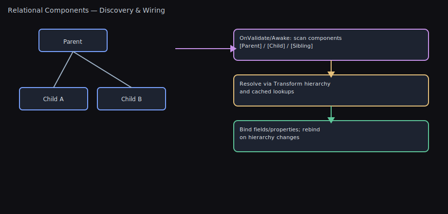

# Relational Component Attributes

Visual



Auto-wire components in your hierarchy without `GetComponent` boilerplate. These attributes make common relationships explicit, robust, and easy to maintain.

- `SiblingComponent` — same GameObject
- `ParentComponent` — up the transform hierarchy
- `ChildComponent` — down the transform hierarchy (breadth-first)

Each works with single fields, arrays, `List<T>`, and `HashSet<T>`, supports optional assignment, filters (tag/name), depth limits, max results, and interface/base-type resolution.

Having issues? Jump to Troubleshooting: see [Troubleshooting](#troubleshooting).

Related systems: For data‑driven gameplay effects (attributes, tags, cosmetics), see [Effects System](EFFECTS_SYSTEM.md) and the README section Effects, Attributes, and Tags (#effects-attributes-and-tags).

## TL;DR — What Problem This Solves

- **⭐ Replace 20+ lines of repetitive GetComponent boilerplate with 3 attributes + 1 method call.**
- Self‑documenting, supports interfaces, filters, and validation.
- **Time saved: 10-20 minutes per script × hundreds of scripts = weeks of development time.**

### The Productivity Advantage

**Before (The Old Way):**
```csharp
void Awake()
{
    sprite = GetComponent<SpriteRenderer>();
    if (sprite == null) Debug.LogError("Missing SpriteRenderer!");

    rigidbody = GetComponentInParent<Rigidbody2D>();
    if (rigidbody == null) Debug.LogError("Missing Rigidbody2D in parent!");

    colliders = GetComponentsInChildren<Collider2D>();
    if (colliders.Length == 0) Debug.LogWarning("No colliders in children!");

    // Repeat for every component...
    // 15-30 lines of boilerplate per script
}
```

**After (Relational Components):**
```csharp
[SiblingComponent] private SpriteRenderer sprite;
[ParentComponent] private Rigidbody2D rigidbody;
[ChildComponent] private Collider2D[] colliders;

void Awake() => this.AssignRelationalComponents();
// That's it. 4 lines total, all wired automatically with validation.
```

Pick the right attribute
- Same GameObject? Use `SiblingComponent`.
- Search up the hierarchy? Use `ParentComponent`.
- Search down the hierarchy? Use `ChildComponent`.

One‑minute setup
```csharp
[SiblingComponent] private SpriteRenderer sprite;
[ParentComponent(OnlyAncestors = true)] private Rigidbody2D rb;
[ChildComponent(OnlyDescendants = true, MaxDepth = 1)] private Collider2D[] childColliders;

void Awake() => this.AssignRelationalComponents();
```

## Why Use These?

- Replace repetitive `GetComponent` and fragile manual wiring
- Make intent clear and local to the field that needs it
- Fail fast with useful errors (or opt-in to optional fields)
- Filter results precisely and control traversal cost
- Support interfaces for clean architecture

## Quick Start

```csharp
using UnityEngine;
using WallstopStudios.UnityHelpers.Core.Attributes;

public class Player : MonoBehaviour
{
    // Same-GameObject
    [SiblingComponent] private SpriteRenderer sprite;

    // First matching ancestor (excluding self)
    [ParentComponent(OnlyAncestors = true)] private Rigidbody2D ancestorRb;

    // Immediate children only, collect many
    [ChildComponent(OnlyDescendants = true, MaxDepth = 1)]
    private Collider2D[] immediateChildColliders;

    private void Awake()
    {
        // Wires up all relational fields on this component
        this.AssignRelationalComponents();
    }
}
```

## How It Works

Decorate private (or public) fields on a `MonoBehaviour` with a relational attribute, then call one of:

- `this.AssignRelationalComponents()` — assign all three categories
- `this.AssignSiblingComponents()` — only siblings
- `this.AssignParentComponents()` — only parents
- `this.AssignChildComponents()` — only children

Assignments happen at runtime (e.g., `Awake`/`OnEnable`), not at edit-time serialization.

### Visual Search Patterns

```
ParentComponent (searches UP the hierarchy):

  Grandparent ←────────── (included unless OnlyAncestors = true)
      ↑
      │
    Parent ←────────────── (always included)
      ↑
      │
   [YOU] ←────────────────  Component with [ParentComponent]
      │
    Child
      │
   Grandchild


ChildComponent (searches DOWN the hierarchy, breadth-first):

  Grandparent
      │
    Parent
      │
   [YOU] ←─────────────────  Component with [ChildComponent]
      ↓
      ├─ Child 1 ←────────── (depth = 1)
      │    ├─ Grandchild 1  (depth = 2)
      │    └─ Grandchild 2  (depth = 2)
      │
      └─ Child 2 ←────────── (depth = 1)
           └─ Grandchild 3  (depth = 2)

  Breadth-first means all Children (depth 1) are checked
  before any Grandchildren (depth 2).


SiblingComponent (searches same GameObject):

  Parent
    │
    └─ [GameObject] ←────── All components on this GameObject
         ├─ [YOU] ←─────── Component with [SiblingComponent]
         ├─ Component A
         ├─ Component B
         └─ Component C
```

### Key Options

**OnlyAncestors / OnlyDescendants:**
- `OnlyAncestors = true` → Excludes self, searches only parents/grandparents
- `OnlyDescendants = true` → Excludes self, searches only children/grandchildren
- Default (false) → Includes self in search

**MaxDepth:**
- Limits how far up/down the hierarchy to search
- `MaxDepth = 1` with `OnlyDescendants = true` → immediate children only
- `MaxDepth = 2` → children + grandchildren (or parents + grandparents)

---

> 💡 **Having Issues?** Components not being assigned? Fields staying null?
> Jump to [Troubleshooting](#troubleshooting) for solutions to common problems.

---

## Attribute Reference

### SiblingComponent

- Scope: Same `GameObject`
- Use for: Standard component composition patterns

Examples:
```csharp
[SiblingComponent] private Animator animator;                 // required by default
[SiblingComponent(Optional = true)] private Rigidbody2D rb;   // optional
[SiblingComponent(TagFilter = "Visual", NameFilter = "Sprite")] private Component[] visuals;
[SiblingComponent(MaxCount = 2)] private List<Collider2D> firstTwo;
```

### ParentComponent

- Scope: Up the transform chain (optionally excluding self)
- Controls: `OnlyAncestors`, `MaxDepth`

Examples:
```csharp
// Immediate parent only
[ParentComponent(OnlyAncestors = true, MaxDepth = 1)] private Transform directParent;

// Up to 3 levels with a tag
[ParentComponent(OnlyAncestors = true, MaxDepth = 3, TagFilter = "Player")] private Collider2D playerAncestor;

// Interface/base-type resolution is supported by default
[ParentComponent] private IHealth healthProvider;
```

### ChildComponent

- Scope: Down the transform chain (breadth-first; optionally excluding self)
- Controls: `OnlyDescendants`, `MaxDepth`

Examples:
```csharp
// Immediate children only
[ChildComponent(OnlyDescendants = true, MaxDepth = 1)] private Transform[] immediateChildren;

// First matching descendant with a tag
[ChildComponent(OnlyDescendants = true, TagFilter = "Weapon")] private Collider2D weaponCollider;

// Gather into a hash set (unique results) and limit count
[ChildComponent(OnlyDescendants = true, MaxCount = 10)] private HashSet<Rigidbody2D> firstTenRigidbodies;
```

## Common Options (All Attributes)

- `Optional` (default: false)
  - If `false`, logs a descriptive error when no match is found
  - If `true`, suppresses the error (field remains null/empty)

- `IncludeInactive` (default: true)
  - If `true`, includes disabled components and inactive GameObjects
  - If `false`, only assigns enabled components on active-in-hierarchy objects

- `SkipIfAssigned` (default: false)
  - If `true`, preserves existing non-null value (single) or non-empty collection

- `MaxCount` (default: 0 = unlimited)
  - Applies to arrays, lists, and hash sets; ignored for single fields

- `TagFilter`
  - Exact tag match using `CompareTag`

- `NameFilter`
  - Case-sensitive substring match on the GameObject name

- `AllowInterfaces` (default: true)
  - If `true`, can assign by interface or base type; set `false` to restrict to concrete types

## Recipes

- UI hierarchy references
  ```csharp
  [ParentComponent(OnlyAncestors = true, MaxDepth = 2)] private Canvas canvas;
  [ChildComponent(OnlyDescendants = true, NameFilter = "Button")] private Button[] buttons;
  ```

- Sensors/components living on children
  ```csharp
  [ChildComponent(OnlyDescendants = true, TagFilter = "Sensor")] private Collider[] sensors;
  ```

- Modular systems via interfaces
  ```csharp
  public interface IInputProvider { Vector2 Move { get; } }
  [ParentComponent] private IInputProvider input; // PlayerInput, AIInput, etc.
  ```

## Best Practices

- Call in `Awake()` or `OnEnable()` so references exist early
- Prefer selective calls (`AssignSibling/Parent/Child`) when you only use one category
- Use `MaxDepth` to cap traversal cost in deep trees
- Use `MaxCount` to reduce allocations when you only need a subset
- Mark non-critical references `Optional = true` to avoid noise

## Explicit Initialization (Prewarm)

Relational components build high‑performance reflection helpers on first use. To eliminate this lazy cost and avoid first‑frame stalls on large projects or IL2CPP builds, explicitly pre‑initialize caches at startup:

```csharp
// Call during bootstrap/loading
using WallstopStudios.UnityHelpers.Core.Attributes;

void Start()
{
    RelationalComponentInitializer.Initialize();
}
```

Notes:
- Uses AttributeMetadataCache when available, with reflection fallback per type if not cached.
- Logs warnings for missing fields/types and logs errors for unexpected exceptions; processing continues.
- Scope the work by providing specific types: `RelationalComponentInitializer.Initialize(new[]{ typeof(MyComponent) });`
- To auto‑prewarm on app load, enable the toggle on the AttributeMetadataCache asset: “Prewarm Relational On Load”.

## Dependency Injection Integrations

Unity Helpers provides optional integration assemblies that only compile when Zenject or VContainer is present in your project. Install the corresponding DI package via the Unity Package Manager and the helpers become available automatically (no additional scripting defines required).

Supported package IDs (auto-detected)
- Zenject/Extenject: `com.extenject.zenject`, `com.modesttree.zenject`, `com.svermeulen.extenject`
- VContainer: `jp.cysharp.vcontainer`, `jp.hadashikick.vcontainer`

Manual or source imports (no UPM)
- If you import Zenject/VContainer as source, a .unitypackage, or a plain DLL, Unity cannot infer package IDs and the `versionDefines` in the asmdefs won’t trigger.
- Add scripting defines in Project Settings to enable the integrations:
  - `Project Settings > Player > Other Settings > Scripting Define Symbols`
  - Add `ZENJECT_PRESENT` when Zenject/Extenject is present and/or `VCONTAINER_PRESENT` when VContainer is present.
  - Set defines per target platform (Standalone, Android, iOS, etc.).
  - After adding, Unity recompiles and the optional assemblies under `Runtime/Integrations/*` compile automatically.

### Zenject
- Add `RelationalComponentsInstaller` to your `SceneContext` to register the shared `IRelationalComponentAssigner` service and run `RelationalComponentSceneInitializer` right after container construction.
- The installer exposes toggles to control whether the active scene is scanned automatically and whether inactive GameObjects are included in the pass.
- Use the extension helpers in `DiContainerRelationalExtensions` when instantiating prefabs or building up existing hierarchies (e.g. `container.InstantiateComponentWithRelations(prefab)` or `container.AssignRelationalHierarchy(root)`).

### VContainer
- Call `builder.RegisterRelationalComponents()` inside your `LifetimeScope.Configure` method to register the assigner as a singleton and queue the `RelationalComponentEntryPoint` for scene-wide initialization.
- Use `resolver.AssignRelationalComponents(component)` / `resolver.AssignRelationalHierarchy(root)` after calling `Inject` to ensure relational fields are hydrated for scene references and runtime instantiations.

Both integrations fall back to the built-in `component.AssignRelationalComponents()` call path if the DI container does not expose the assigner binding, so you can adopt them incrementally without breaking existing behaviour.

---

## Troubleshooting

- Fields remain null in the Inspector
  - Expected in Edit Mode. These attributes assign at runtime only and are not serialized. Check at runtime or log values.

- Nothing assigned at runtime
  - Ensure you call `AssignRelationalComponents()` or the specific `Assign*Components()` in `Awake()` or `OnEnable()`.
  - Verify filters: `TagFilter` must match an existing tag; `NameFilter` is case-sensitive.
  - Check depth limits: `OnlyAncestors`/`OnlyDescendants` may exclude self; `MaxDepth` may be too small.
  - For interface/base type fields, confirm `AllowInterfaces = true` (default) or use a concrete type.

- Inactive or disabled components unexpectedly included
  - These are included by default. Set `IncludeInactive = false` to restrict to enabled components on active GameObjects.

- Too many results or large allocations
  - Cap with `MaxCount` and/or `MaxDepth`. Prefer `List<T>` or `HashSet<T>` when you plan to mutate the collection after assignment.

- Child search doesn’t find the nearest match you expect
  - Children are traversed breadth-first. If you want the nearest by hierarchy level, this is correct; if you need a custom order, gather a collection and sort manually.

- I only need one category (e.g., parents)
  - Call the specific helper (`AssignParentComponents` / `AssignChildComponents` / `AssignSiblingComponents`) instead of the all-in-one method for clarity and potentially less work.

## FAQ

Q: Does this run in Edit Mode or serialize values?
- No. Assignment occurs at runtime only; values are not serialized by Unity.

Q: Are interfaces supported?
- Yes, when `AllowInterfaces = true` (default). Set it to `false` to restrict to concrete types.

Q: What about performance?
- Work scales with the number of attributed fields and the search space. Use `MaxDepth`, `TagFilter`, `NameFilter`, and `MaxCount` to limit work. Sibling lookups are O(1) when no filters are applied.

---

For quick examples in context, see the README’s “Auto Component Discovery” section. For API docs, hover the attributes in your IDE for XML summaries and examples.

## DI Integrations: Testing and Edge Cases

Beginner-friendly overview
- Optional DI integrations compile only when symbols are present (`ZENJECT_PRESENT`, `VCONTAINER_PRESENT`). With UPM, these are added via asmdef `versionDefines`. Without UPM (manual import), add them in Project Settings → Player → Scripting Define Symbols.
- Both integrations register an assigner (`IRelationalComponentAssigner`) and provide a scene initializer/entry point to hydrate relational fields once the container is ready.

VContainer (1.16.x)
- Runtime usage (LifetimeScope): Call `builder.RegisterRelationalComponents()` in `LifetimeScope.Configure`. The entry point runs automatically after the container builds.
- Tests without LifetimeScope: Construct the entry point and call `Initialize()` yourself, and register your `AttributeMetadataCache` instance so the assigner uses it:
  ```csharp
  var cache = ScriptableObject.CreateInstance<AttributeMetadataCache>();
  // populate cache._relationalTypeMetadata with your test component types
  cache.ForceRebuildForTests(); // rebuild lookups so the initializer can discover your types
  var builder = new ContainerBuilder();
  builder.RegisterInstance(cache).AsSelf();
  builder.Register<RelationalComponentAssigner>(Lifetime.Singleton)
         .As<IRelationalComponentAssigner>()
         .AsSelf();
  var resolver = builder.Build();
  var entry = new RelationalComponentEntryPoint(
      resolver.Resolve<IRelationalComponentAssigner>(),
      cache,
      RelationalSceneAssignmentOptions.Default
  );
  entry.Initialize();
  ```
- Inject vs BuildUp: Use `resolver.Inject(component)` before calling `resolver.AssignRelationalComponents(component)`.
- EditMode reliability: In EditMode tests, prefer `[UnityTest]` and `yield return null` after creating objects and after initializing the entry point so Unity has a frame to register new objects before `FindObjectsOfType` runs and to allow assignments to complete.
- Active scene filter: Entry points operate on the active scene only. In EditMode, create a new scene with `SceneManager.CreateScene`, set it active, and move your test hierarchy into it before calling `Initialize()`.
- IncludeInactive: Control with `RelationalSceneAssignmentOptions(includeInactive: bool)`.

 Zenject/Extenject
- Runtime usage: Add `RelationalComponentsInstaller` to your `SceneContext`. It binds `IRelationalComponentAssigner` and runs `RelationalComponentSceneInitializer` once the container is ready.
- Tests: Bind a concrete `AttributeMetadataCache` instance and construct the assigner with that cache. Then resolve `IInitializable` and call `Initialize()`.
 - EditMode reliability: As with VContainer, consider `[UnityTest]` with a `yield return null` after creating objects and after calling `Initialize()` to allow Unity to register objects and complete assignments.
 - Active scene filter: The initializer operates on the active scene only. Create and set an active scene and move your test hierarchy into it before calling `Initialize()`.

Common pitfalls and how to avoid them
- “No such registration … RelationalComponentEntryPoint”: You’re resolving in a plain container without `LifetimeScope`. Construct the entry point manually as shown above.
- Optional integrations don’t compile: Ensure the scripting define symbols are present. UPM adds them automatically via `versionDefines`; manual imports require adding them in Player Settings.
- Fields remain null in tests: Ensure your test `AttributeMetadataCache` has the relational metadata for your test component types and that the DI container uses the same cache instance (register it and prefer constructors that accept the cache).
