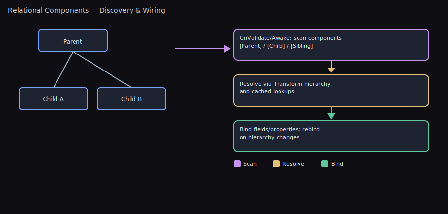

# Relational Component Attributes

Visual



Auto-wire components in your hierarchy without `GetComponent` boilerplate. These attributes make common relationships explicit, robust, and easy to maintain.

- `SiblingComponent` — same GameObject
- `ParentComponent` — up the transform hierarchy
- `ChildComponent` — down the transform hierarchy (breadth-first)

Each works with single fields, arrays, `List<T>`, and `HashSet<T>`, supports optional assignment, filters (tag/name), depth limits, max results, and interface/base-type resolution.

Having issues? Jump to Troubleshooting: see [Troubleshooting](#troubleshooting).

Related systems: For data‑driven gameplay effects (attributes, tags, cosmetics), see [Effects System](EFFECTS_SYSTEM.md) and the README section Effects, Attributes, and Tags (#effects-attributes-and-tags).

## TL;DR — What Problem This Solves

- Replace manual `GetComponent` calls with small, self‑documenting attributes on fields.
- One method call wires everything at runtime; supports single or many (arrays/lists/sets), filters, and interfaces.

Pick the right attribute
- Same GameObject? Use `SiblingComponent`.
- Search up the hierarchy? Use `ParentComponent`.
- Search down the hierarchy? Use `ChildComponent`.

One‑minute setup
```csharp
[SiblingComponent] private SpriteRenderer sprite;
[ParentComponent(OnlyAncestors = true)] private Rigidbody2D rb;
[ChildComponent(OnlyDescendants = true, MaxDepth = 1)] private Collider2D[] childColliders;

void Awake() => this.AssignRelationalComponents();
```

## Why Use These?

- Replace repetitive `GetComponent` and fragile manual wiring
- Make intent clear and local to the field that needs it
- Fail fast with useful errors (or opt-in to optional fields)
- Filter results precisely and control traversal cost
- Support interfaces for clean architecture

## Quick Start

```csharp
using UnityEngine;
using WallstopStudios.UnityHelpers.Core.Attributes;

public class Player : MonoBehaviour
{
    // Same-GameObject
    [SiblingComponent] private SpriteRenderer sprite;

    // First matching ancestor (excluding self)
    [ParentComponent(OnlyAncestors = true)] private Rigidbody2D ancestorRb;

    // Immediate children only, collect many
    [ChildComponent(OnlyDescendants = true, MaxDepth = 1)]
    private Collider2D[] immediateChildColliders;

    private void Awake()
    {
        // Wires up all relational fields on this component
        this.AssignRelationalComponents();
    }
}
```

## How It Works

Decorate private (or public) fields on a `MonoBehaviour` with a relational attribute, then call one of:

- `this.AssignRelationalComponents()` — assign all three categories
- `this.AssignSiblingComponents()` — only siblings
- `this.AssignParentComponents()` — only parents
- `this.AssignChildComponents()` — only children

Assignments happen at runtime (e.g., `Awake`/`OnEnable`), not at edit-time serialization.

### Visual Search Patterns

```
ParentComponent (searches UP the hierarchy):

  Grandparent ←────────── (included unless OnlyAncestors = true)
      ↑
      │
    Parent ←────────────── (always included)
      ↑
      │
   [YOU] ←────────────────  Component with [ParentComponent]
      │
    Child
      │
   Grandchild


ChildComponent (searches DOWN the hierarchy, breadth-first):

  Grandparent
      │
    Parent
      │
   [YOU] ←─────────────────  Component with [ChildComponent]
      ↓
      ├─ Child 1 ←────────── (depth = 1)
      │    ├─ Grandchild 1  (depth = 2)
      │    └─ Grandchild 2  (depth = 2)
      │
      └─ Child 2 ←────────── (depth = 1)
           └─ Grandchild 3  (depth = 2)

  Breadth-first means all Children (depth 1) are checked
  before any Grandchildren (depth 2).


SiblingComponent (searches same GameObject):

  Parent
    │
    └─ [GameObject] ←────── All components on this GameObject
         ├─ [YOU] ←─────── Component with [SiblingComponent]
         ├─ Component A
         ├─ Component B
         └─ Component C
```

### Key Options

**OnlyAncestors / OnlyDescendants:**
- `OnlyAncestors = true` → Excludes self, searches only parents/grandparents
- `OnlyDescendants = true` → Excludes self, searches only children/grandchildren
- Default (false) → Includes self in search

**MaxDepth:**
- Limits how far up/down the hierarchy to search
- `MaxDepth = 1` with `OnlyDescendants = true` → immediate children only
- `MaxDepth = 2` → children + grandchildren (or parents + grandparents)

---

> 💡 **Having Issues?** Components not being assigned? Fields staying null?
> Jump to [Troubleshooting](#troubleshooting) for solutions to common problems.

---

## Attribute Reference

### SiblingComponent

- Scope: Same `GameObject`
- Use for: Standard component composition patterns

Examples:
```csharp
[SiblingComponent] private Animator animator;                 // required by default
[SiblingComponent(Optional = true)] private Rigidbody2D rb;   // optional
[SiblingComponent(TagFilter = "Visual", NameFilter = "Sprite")] private Component[] visuals;
[SiblingComponent(MaxCount = 2)] private List<Collider2D> firstTwo;
```

### ParentComponent

- Scope: Up the transform chain (optionally excluding self)
- Controls: `OnlyAncestors`, `MaxDepth`

Examples:
```csharp
// Immediate parent only
[ParentComponent(OnlyAncestors = true, MaxDepth = 1)] private Transform directParent;

// Up to 3 levels with a tag
[ParentComponent(OnlyAncestors = true, MaxDepth = 3, TagFilter = "Player")] private Collider2D playerAncestor;

// Interface/base-type resolution is supported by default
[ParentComponent] private IHealth healthProvider;
```

### ChildComponent

- Scope: Down the transform chain (breadth-first; optionally excluding self)
- Controls: `OnlyDescendants`, `MaxDepth`

Examples:
```csharp
// Immediate children only
[ChildComponent(OnlyDescendants = true, MaxDepth = 1)] private Transform[] immediateChildren;

// First matching descendant with a tag
[ChildComponent(OnlyDescendants = true, TagFilter = "Weapon")] private Collider2D weaponCollider;

// Gather into a hash set (unique results) and limit count
[ChildComponent(OnlyDescendants = true, MaxCount = 10)] private HashSet<Rigidbody2D> firstTenRigidbodies;
```

## Common Options (All Attributes)

- `Optional` (default: false)
  - If `false`, logs a descriptive error when no match is found
  - If `true`, suppresses the error (field remains null/empty)

- `IncludeInactive` (default: true)
  - If `true`, includes disabled components and inactive GameObjects
  - If `false`, only assigns enabled components on active-in-hierarchy objects

- `SkipIfAssigned` (default: false)
  - If `true`, preserves existing non-null value (single) or non-empty collection

- `MaxCount` (default: 0 = unlimited)
  - Applies to arrays, lists, and hash sets; ignored for single fields

- `TagFilter`
  - Exact tag match using `CompareTag`

- `NameFilter`
  - Case-sensitive substring match on the GameObject name

- `AllowInterfaces` (default: true)
  - If `true`, can assign by interface or base type; set `false` to restrict to concrete types

## Recipes

- UI hierarchy references
  ```csharp
  [ParentComponent(OnlyAncestors = true, MaxDepth = 2)] private Canvas canvas;
  [ChildComponent(OnlyDescendants = true, NameFilter = "Button")] private Button[] buttons;
  ```

- Sensors/components living on children
  ```csharp
  [ChildComponent(OnlyDescendants = true, TagFilter = "Sensor")] private Collider[] sensors;
  ```

- Modular systems via interfaces
  ```csharp
  public interface IInputProvider { Vector2 Move { get; } }
  [ParentComponent] private IInputProvider input; // PlayerInput, AIInput, etc.
  ```

## Best Practices

- Call in `Awake()` or `OnEnable()` so references exist early
- Prefer selective calls (`AssignSibling/Parent/Child`) when you only use one category
- Use `MaxDepth` to cap traversal cost in deep trees
- Use `MaxCount` to reduce allocations when you only need a subset
- Mark non-critical references `Optional = true` to avoid noise

## Troubleshooting

- Fields remain null in the Inspector
  - Expected in Edit Mode. These attributes assign at runtime only and are not serialized. Check at runtime or log values.

- Nothing assigned at runtime
  - Ensure you call `AssignRelationalComponents()` or the specific `Assign*Components()` in `Awake()` or `OnEnable()`.
  - Verify filters: `TagFilter` must match an existing tag; `NameFilter` is case-sensitive.
  - Check depth limits: `OnlyAncestors`/`OnlyDescendants` may exclude self; `MaxDepth` may be too small.
  - For interface/base type fields, confirm `AllowInterfaces = true` (default) or use a concrete type.

- Inactive or disabled components unexpectedly included
  - These are included by default. Set `IncludeInactive = false` to restrict to enabled components on active GameObjects.

- Too many results or large allocations
  - Cap with `MaxCount` and/or `MaxDepth`. Prefer `List<T>` or `HashSet<T>` when you plan to mutate the collection after assignment.

- Child search doesn’t find the nearest match you expect
  - Children are traversed breadth-first. If you want the nearest by hierarchy level, this is correct; if you need a custom order, gather a collection and sort manually.

- I only need one category (e.g., parents)
  - Call the specific helper (`AssignParentComponents` / `AssignChildComponents` / `AssignSiblingComponents`) instead of the all-in-one method for clarity and potentially less work.

## FAQ

Q: Does this run in Edit Mode or serialize values?
- No. Assignment occurs at runtime only; values are not serialized by Unity.

Q: Are interfaces supported?
- Yes, when `AllowInterfaces = true` (default). Set it to `false` to restrict to concrete types.

Q: What about performance?
- Work scales with the number of attributed fields and the search space. Use `MaxDepth`, `TagFilter`, `NameFilter`, and `MaxCount` to limit work. Sibling lookups are O(1) when no filters are applied.

---

For quick examples in context, see the README’s “Auto Component Discovery” section. For API docs, hover the attributes in your IDE for XML summaries and examples.
