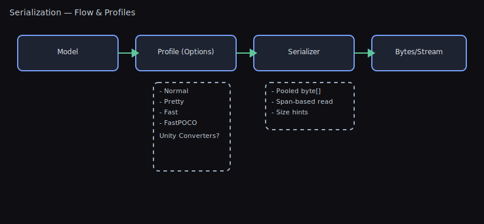

# Serialization Guide

## TL;DR — What Problem This Solves

- Save/load data and configs reliably with JSON or Protobuf using one unified API.
- Unity‑aware converters handle common engine types; pooled buffers keep GC low.
- Pick Pretty/Normal for human‑readable; Fast/FastPOCO for hot paths.

Visuals



This package provides fast, compact serialization for save systems, configuration, and networking with a unified API.

- Json — System.Text.Json with Unity-aware converters
- Protobuf — protobuf-net for compact, schema-evolvable binary
- SystemBinary — .NET BinaryFormatter for legacy/trusted-only scenarios

All formats are exposed via `WallstopStudios.UnityHelpers.Core.Serialization.Serializer` and selected with `SerializationType`.

## Formats Provided

- Json
  - Human-readable; ideal for settings, debug, modding, and Git diffs.
  - Includes converters for Unity types (ignores cycles, includes fields by default, case-insensitive by default; enums as strings in Normal/Pretty):
    - Vector2, Vector3, Vector4, Vector2Int, Vector3Int
    - Color, Color32, ColorBlock
    - Quaternion, Matrix4x4, Pose, Plane, SphericalHarmonicsL2
    - Bounds, BoundsInt, Rect, RectInt, RectOffset, RangeInt
    - Ray, Ray2D, RaycastHit, BoundingSphere
    - Resolution, RenderTextureDescriptor, LayerMask, Hash128, Scene
    - AnimationCurve, Gradient, Touch, GameObject
    - ParticleSystem.MinMaxCurve, ParticleSystem.MinMaxGradient
    - System.Type (type metadata)
  - Profiles: Normal, Pretty, Fast, FastPOCO (see below)
- Protobuf (protobuf-net)
  - **⭐ Killer Feature: Schema Evolution** — Players can load saves from older game versions without breaking! Add new fields, remove old ones, rename types—all while maintaining compatibility.
  - Small and fast; best for networking and large save payloads.
  - Forward/backward compatible message evolution (see the Schema Evolution guide below).
- SystemBinary (BinaryFormatter)
  - Only for legacy or trusted, same-version, local data. Avoid for long-term persistence or untrusted input.
  - ⚠️ **Cannot handle version changes** - a single field addition breaks all existing saves.

## When To Use What

Use this decision flowchart to pick the right serialization format:

```text
START: What are you serializing?
  │
  ├─ Game settings / Config files
  │   │
  │   ├─ Need human-readable / Git-friendly?
  │   │   → JSON (Normal or Pretty) ✓
  │   │
  │   └─ Performance critical (large files)?
  │       → JSON (Fast or FastPOCO) ✓
  │
  ├─ Save game data
  │   │
  │   ├─ First save system / Need debugging?
  │   │   → JSON (Pretty) ✓
  │   │
  │   ├─ Mobile / Size matters?
  │   │   → Protobuf ✓
  │   │
  │   └─ Need cross-version compatibility?
  │       → Protobuf ✓
  │
  ├─ Network messages (multiplayer)
  │   │
  │   └─ Bandwidth is critical
  │       → Protobuf ✓
  │
  ├─ Editor-only / Temporary cache (trusted environment)
  │   │
  │   └─ Same Unity version, local only
  │       → SystemBinary (⚠️ legacy, consider JSON Fast)
  │
  └─ Hot path / Per-frame serialization
      │
      ├─ Pure C# objects (no Unity types)?
      │   → JSON (FastPOCO) ✓
      │
      └─ Mixed with Unity types?
          → JSON (Fast) ✓
```

### Quick Reference

- **Use JSON for:**
  - Player/tool settings, human-readable saves, serverless workflows, text diffs
  - Quick iteration and debugging
  - First-time save system implementation

- **Use Protobuf for:**
  - Network payloads and large, bandwidth-sensitive saves
  - Cases where schema evolves across versions
  - Mobile games where save file size matters

- **Use SystemBinary only for:**
  - Transient caches in trusted environments with exact version match
  - ⚠️ Consider JSON Fast instead - SystemBinary is legacy

## JSON Examples (Unity-aware)

- Serialize/deserialize and write/read files

```csharp
using System.Collections.Generic;
using UnityEngine;
using WallstopStudios.UnityHelpers.Core.Serialization;

public class SaveData
{
    public Vector3 position;
    public Color playerColor;
    public List<GameObject> inventory;
}

var data = new SaveData
{
    position = new Vector3(1, 2, 3),
    playerColor = Color.cyan,
    inventory = new List<GameObject>()
};

// Serialize to UTF-8 JSON bytes (Unity types supported)
byte[] jsonBytes = Serializer.JsonSerialize(data);

// Pretty stringify and parse from string
string jsonText = Serializer.JsonStringify(data, pretty: true);
SaveData fromText = Serializer.JsonDeserialize<SaveData>(jsonText);

// File helpers
Serializer.WriteToJsonFile(data, path: "save.json", pretty: true);
SaveData fromFile = Serializer.ReadFromJsonFile<SaveData>("save.json");

// Generic entry points (choose format at runtime)
byte[] bytes = Serializer.Serialize(data, SerializationType.Json);
SaveData loaded = Serializer.Deserialize<SaveData>(bytes, SerializationType.Json);
```

## Protobuf Examples (Compact + Evolvable)

- Basic usage

```csharp
using ProtoBuf; // protobuf-net
using WallstopStudios.UnityHelpers.Core.Serialization;

[ProtoContract]
public class PlayerInfo
{
    [ProtoMember(1)] public int id;
    [ProtoMember(2)] public string name;
}

var info = new PlayerInfo { id = 1, name = "Hero" };
byte[] buf = Serializer.ProtoSerialize(info);
PlayerInfo again = Serializer.ProtoDeserialize<PlayerInfo>(buf);

// Generic entry points
byte[] buf2 = Serializer.Serialize(info, SerializationType.Protobuf);
PlayerInfo again2 = Serializer.Deserialize<PlayerInfo>(buf2, SerializationType.Protobuf);

// Buffer reuse (reduce GC in hot paths)
byte[] buffer = null;
int len = Serializer.Serialize(info, SerializationType.Protobuf, ref buffer);
PlayerInfo sliced = Serializer.Deserialize<PlayerInfo>(buffer.AsSpan(0, len).ToArray(), SerializationType.Protobuf);
```

- Unity types with Protobuf: built-in surrogates

```csharp
// This package registers protobuf-net surrogates at startup so Unity structs just work in protobuf models.
// The following Unity types are protobuf-compatible out of the box:
// - Vector2, Vector3, Vector2Int, Vector3Int
// - Quaternion
// - Color, Color32
// - Rect, RectInt
// - Bounds, BoundsInt
// - Resolution
// Example: use Vector3 directly in a protobuf-annotated model
using ProtoBuf;              // protobuf-net
using UnityEngine;           // Unity types
using WallstopStudios.UnityHelpers.Core.Serialization;

[ProtoContract]
public class NetworkMessage
{
    [ProtoMember(1)] public int playerId;
    [ProtoMember(2)] public Vector3 position;   // Works via registered surrogates
    [ProtoMember(3)] public Quaternion facing;  // Works via registered surrogates
}

// Serialize/deserialize as usual
var msg = new NetworkMessage { playerId = 7, position = new Vector3(1,2,3), facing = Quaternion.identity };
byte[] bytes = Serializer.ProtoSerialize(msg);
NetworkMessage again = Serializer.ProtoDeserialize<NetworkMessage>(bytes);
```

Notes

- Surrogates are registered in the Serializer static initializer; you don't need to call anything.
- If you define your own DTOs, they will continue to work; surrogates simply make Unity structs first-class.
- Keep using [ProtoContract]/[ProtoMember] and stable field numbers for your own types.

### ⚠️ IL2CPP and Code Stripping Warning

**Critical for IL2CPP builds (WebGL, iOS, Android, Consoles):**

Protobuf uses reflection internally to serialize/deserialize types. Unity's IL2CPP managed code stripping may remove types or fields that are only accessed via reflection, causing **silent data loss or runtime crashes** in release builds.

**Common symptoms:**

- `NullReferenceException` or `TypeLoadException` during Protobuf deserialization
- Fields mysteriously have default values after loading (data appears to be lost)
- Works perfectly in Editor/Development builds, fails in Release/IL2CPP builds
- "Type not found" or "Method not found" errors at runtime

#### Solution: Create a link.xml file

In your `Assets` folder (or any subfolder), create `link.xml` to preserve your Protobuf types:

```xml
<linker>
  <!-- Preserve all your Protobuf-serialized types -->
  <assembly fullname="Assembly-CSharp">
    <!-- Preserve specific types -->
    <type fullname="MyGame.PlayerSave" preserve="all"/>
    <type fullname="MyGame.InventoryData" preserve="all"/>
    <type fullname="MyGame.NetworkMessage" preserve="all"/>

    <!-- Or preserve entire namespace -->
    <namespace fullname="MyGame.SaveData" preserve="all"/>
  </assembly>

  <!-- If using Protobuf types across assemblies -->
  <assembly fullname="MyGame.Shared">
    <namespace fullname="MyGame.Shared.Protocol" preserve="all"/>
  </assembly>

  <!-- Preserve Unity Helpers if needed -->
  <assembly fullname="WallstopStudios.UnityHelpers.Runtime">
    <!-- Usually not needed, but if you see errors: -->
    <type fullname="WallstopStudios.UnityHelpers.Core.Serialization.Serializer" preserve="all"/>
  </assembly>
</linker>
```

**Testing checklist (CRITICAL):**

- ✅ **Test every IL2CPP build** - Development builds don't strip code, so issues only appear in Release
- ✅ **Test on actual devices** - WebGL/Mobile stripping can differ from standalone builds
- ✅ **Test full save/load cycle** - Save in one session, load in another to verify persistence
- ✅ **Update link.xml when adding new types** - Every `[ProtoContract]` type needs preservation
- ✅ **Check build logs for stripping warnings** - Unity logs which types/methods are stripped
- ✅ **Test after Unity upgrades** - Stripping behavior can change between Unity versions

**When you might not need link.xml:**

- Only using JSON serialization (source-generated, no reflection)
- Already preserving entire assembly with `preserve="all"`
- Using a custom IL2CPP link file that preserves everything

#### Advanced: Preserve only what's needed

Instead of `preserve="all"`, you can be more selective:

```xml
<type fullname="MyGame.PlayerSave">
  <method signature="System.Void .ctor()" preserve="all"/>
  <field name="playerId" />
  <field name="level" />
  <field name="inventory" />
</type>
```

However, this is error-prone. **Start with `preserve="all"` and optimize later if build size is critical.**

**Related documentation:**

- [Unity Manual: Managed Code Stripping](https://docs.unity3d.com/Manual/ManagedCodeStripping.html)
- [Protobuf-net IL2CPP Guide](https://github.com/protobuf-net/protobuf-net#il2cpp)
- [Unity Forum: link.xml best practices](https://forum.unity.com/)

````text

<a id="protobuf-schema-evolution-the-killer-feature"></a>
## Protobuf Schema Evolution: The Killer Feature

**The Problem Protobuf Solves:**

You ship your game with this save format:
```csharp
[ProtoContract]
public class PlayerSave
{
    [ProtoMember(1)] public int level;
    [ProtoMember(2)] public string name;
}
````

A month later, you want to add a new feature and change the format:

```csharp
[ProtoContract]
public class PlayerSave
{
    [ProtoMember(1)] public int level;
    [ProtoMember(2)] public string name;
    [ProtoMember(3)] public int gold;        // NEW FIELD
    [ProtoMember(4)] public bool isPremium;  // NEW FIELD
}
```

**With JSON or BinaryFormatter:** Players' existing saves break. You must write migration code or wipe their progress.

**With Protobuf:** It just works! Old saves load perfectly with `gold = 0` and `isPremium = false` defaults.

### Real-World Save Game Evolution Example 🟡 Intermediate

**Version 1.0 (Launch):**

```csharp
[ProtoContract]
public class PlayerSave
{
    [ProtoMember(1)] public string playerId;
    [ProtoMember(2)] public int level;
    [ProtoMember(3)] public Vector3DTO position;
}
```

**Version 1.5 (Inventory System Added):**

```csharp
[ProtoContract]
public class PlayerSave
{
    [ProtoMember(1)] public string playerId;
    [ProtoMember(2)] public int level;
    [ProtoMember(3)] public Vector3DTO position;
    [ProtoMember(4)] public List<string> inventory = new();  // NEW: defaults to empty
}
```

**Version 2.0 (Stats Overhaul - level renamed to xp):**

```csharp
[ProtoContract]
public class PlayerSave
{
    [ProtoMember(1)] public string playerId;
    // [ProtoMember(2)] int level - REMOVED, but tag 2 is NEVER reused
    [ProtoMember(3)] public Vector3DTO position;
    [ProtoMember(4)] public List<string> inventory = new();
    [ProtoMember(5)] public int xp;              // NEW: experience points
    [ProtoMember(6)] public int skillPoints;     // NEW: unspent skill points
}
```

**Result:** Players who saved in v1.0 can load their save in v2.0:

- Old `level` value (tag 2) is ignored
- New `xp` and `skillPoints` default to 0
- All existing data (`playerId`, `position`, `inventory`) loads correctly
- **Zero migration code required!**

### Schema Evolution Rules

**✅ Safe Changes (Always Compatible):**

- Add new fields with new tag numbers
- Remove fields (but never reuse their tag numbers)
- Change field names (tags are what matter, not names)
- Add new message types
- Change default values (only affects new saves)

**⚠️ Requires Care:**

- Changing field types (e.g., `int` → `long` works, `int` → `string` doesn't)
- Changing `repeated` to singular or vice versa (usually breaks)
- Renumbering existing tags (breaks everything!)

**❌ Never Do This:**

- Reuse deleted field tag numbers
- Change the meaning of an existing tag
- Remove required fields (avoid `required` entirely - use validation instead)

### Multi-Version Compatibility Pattern 🔴 Advanced

Handle breaking changes across major versions gracefully:

```csharp
[ProtoContract]
public class SaveFile
{
    [ProtoMember(1)] public int version = 3;  // Track your save version

    // Version 1-3 fields
    [ProtoMember(2)] public string playerId;
    [ProtoMember(3)] public Vector3DTO position;

    // Version 2+ fields
    [ProtoMember(10)] public List<string> inventory;

    // Version 3+ fields
    [ProtoMember(20)] public PlayerStats stats;

    public void PostDeserialize()
    {
        if (version < 2)
        {
            // Migrate v1 saves: initialize empty inventory
            inventory ??= new List<string>();
        }

        if (version < 3)
        {
            // Migrate v2 saves: create default stats
            stats ??= new PlayerStats { xp = 0, level = 1 };
        }

        version = 3; // Update to current version
    }
}
```

> ⚠️ **Common Mistake:** Don't put migration logic in the constructor. Use `PostDeserialize()`
> or a dedicated method called after loading. Constructors don't run during deserialization.

### Testing Schema Evolution 🟢 Beginner

**Recommended Testing Pattern:**

```csharp
// 1. Save a file with version N:
var oldSave = new PlayerSave { level = 10, name = "Hero" };
byte[] bytes = Serializer.ProtoSerialize(oldSave);
File.WriteAllBytes("test_v1.save", bytes);

// 2. Update your schema (add new fields)

// 3. Load the old file with new schema:
byte[] oldBytes = File.ReadAllBytes("test_v1.save");
var loaded = Serializer.ProtoDeserialize<PlayerSave>(oldBytes);

// New fields have defaults, old fields are preserved
Assert.AreEqual(10, loaded.level);
Assert.AreEqual("Hero", loaded.name);
Assert.AreEqual(0, loaded.gold);  // New field defaults to 0
```

**Best Practice:** Keep regression test files — Store save files from each version in your test suite.

### Common Save System Patterns

**Pattern 1: Version-Aware Loading** 🟡 Intermediate

```csharp
public SaveFile LoadSave(string path)
{
    byte[] bytes = File.ReadAllBytes(path);
    SaveFile save = Serializer.ProtoDeserialize<SaveFile>(bytes);

    // Perform any version-specific migrations
    save.PostDeserialize();

    return save;
}
```

**Pattern 2: Gradual Migration (preserve old format for rollback)** 🔴 Advanced

```csharp
public class SaveManager
{
    public void SaveGame(PlayerData data)
    {
        var protobuf = ConvertToProtobuf(data);
        byte[] bytes = Serializer.ProtoSerialize(protobuf);

        // Write both formats during transition period
        File.WriteAllBytes("save.dat", bytes);
        Serializer.WriteToJsonFile(data, "save.json.backup");
    }
}
```

**Pattern 3: Automatic Backup Before Save** 🟡 Intermediate

```csharp
public void SaveGame(SaveFile save)
{
    string path = "player.save";
    string backup = $"player.save.backup_{DateTime.Now:yyyyMMdd_HHmmss}";

    // Backup existing save before overwriting
    if (File.Exists(path))
    {
        File.Copy(path, backup);
    }

    byte[] bytes = Serializer.ProtoSerialize(save);
    File.WriteAllBytes(path, bytes);

    // Keep only last 3 backups
    CleanupOldBackups("player.save.backup_*", keepCount: 3);
}
```

### Why This Matters for Live Games

**Without schema evolution (JSON/BinaryFormatter):**

- ❌ Every update risks breaking player saves
- ❌ Must write complex migration code for every version
- ❌ Players lose progress if migration fails
- ❌ Can't roll back broken updates (saves are corrupted)
- ❌ Hotfixes that change save format are terrifying

**With Protobuf schema evolution:**

- ✅ Add features freely without breaking existing saves
- ✅ Graceful degradation (old clients ignore new fields)
- ✅ Can roll back game versions without data loss
- ✅ Hotfixes are safe (just add new optional fields)
- ✅ Reduces QA burden (less migration testing needed)

### Protobuf Compatibility Tips

- Add fields with new numbers; old clients ignore unknown fields; new clients default missing fields.
- Never reuse or renumber existing field tags; reserve removed numbers if needed.
- Avoid changing scalar types on the same number.
- Prefer optional/repeated instead of required.
- Use sensible defaults to minimize payloads.
- **Group field numbers by version** (e.g., v1: 1-10, v2: 11-20, v3: 21-30) for clarity.

---

## Protobuf Polymorphism (Inheritance + Interfaces)

- Abstract base with [ProtoInclude] (recommended)
  - Protobuf-net does not infer subtype graphs unless you tell it. The recommended pattern is to put `[ProtoContract]` on an abstract base and list all concrete subtypes with `[ProtoInclude(tag, typeof(Subtype))]`.
  - Declare your fields/properties as the abstract base so protobuf can deserialize to the correct subtype.

```csharp
using ProtoBuf;

[ProtoContract]
public abstract class Message { }

[ProtoContract]
public sealed class Ping : Message { [ProtoMember(1)] public int id; }

[ProtoContract]
[ProtoInclude(100, typeof(Ping))]
public abstract class MessageBase : Message { }

[ProtoContract]
public sealed class Envelope { [ProtoMember(1)] public MessageBase payload; }

// round-trip works: Envelope.payload will be Ping at runtime
byte[] bytes = Serializer.ProtoSerialize(new Envelope { payload = new Ping { id = 7 } });
Envelope again = Serializer.ProtoDeserialize<Envelope>(bytes);
```

- Interfaces require a root mapping
  - Protobuf cannot deserialize directly to an interface because it needs a concrete root. You have three options:
    - Use an abstract base with `[ProtoInclude]` and declare fields as that base (preferred).
    - Register a mapping from the interface to a concrete root type at startup:

```csharp
Serializer.RegisterProtobufRoot<IMsg, Ping>();
IMsg msg = Serializer.ProtoDeserialize<IMsg>(bytes);
```

- Or specify the concrete type with the overload:

```csharp
IMsg msg = Serializer.ProtoDeserialize<IMsg>(bytes, typeof(Ping));
```

- Random system example
  - All PRNGs derive from `AbstractRandom`, which is `[ProtoContract]` and declares each implementation via `[ProtoInclude]`.
  - Do this in your models:

```csharp
[ProtoContract]
public class RNGHolder { [ProtoMember(1)] public AbstractRandom rng; }

// Serialize any implementation without surprises
RNGHolder holder = new RNGHolder { rng = new PcgRandom(seed: 123) };
byte[] buf = Serializer.ProtoSerialize(holder);
RNGHolder rt = Serializer.ProtoDeserialize<RNGHolder>(buf);
```

- If you truly need an `IRandom` field, register a root or pass the concrete type when deserializing:

```csharp
Serializer.RegisterProtobufRoot<IRandom, PcgRandom>();
IRandom r = Serializer.ProtoDeserialize<IRandom>(bytes);
// or
IRandom r2 = Serializer.ProtoDeserialize<IRandom>(bytes, typeof(PcgRandom));
```

- Tag numbers are API surface
  - Tags in `[ProtoInclude(tag, ...)]` and `[ProtoMember(tag)]` are part of your schema. Add new numbers for new types/fields; never reuse or renumber existing tags once shipped.

## SystemBinary Examples (Legacy/Trusted Only)

```csharp
using WallstopStudios.UnityHelpers.Core.Serialization;

var obj = new SomeSerializableType();
byte[] bin = Serializer.BinarySerialize(obj);
SomeSerializableType roundtrip = Serializer.BinaryDeserialize<SomeSerializableType>(bin);

// Generic
byte[] bin2 = Serializer.Serialize(obj, SerializationType.SystemBinary);
var round2 = Serializer.Deserialize<SomeSerializableType>(bin2, SerializationType.SystemBinary);
```

Watch-outs

- BinaryFormatter is obsolete for modern .NET and unsafe for untrusted input.
- Version changes often break BinaryFormatter payloads; restrict to same-version caches.

Features

- Unity converters for JSON: Vector2/3/4, Color, Matrix4x4, GameObject, Type
- Protobuf (protobuf-net) integration
- LZMA compression utilities (`Runtime/Utils/LZMA.cs`)
- Pooled buffers/writers to reduce allocations

References

- API: `Runtime/Core/Serialization/Serializer.cs:1`
- LZMA: `Runtime/Utils/LZMA.cs:1`

## Migration

- Replace direct `System.Text.Json.JsonSerializer` calls in app code with `Serializer.JsonSerialize/JsonDeserialize/JsonStringify`, or with `Serializer.Serialize/Deserialize` + `SerializationType.Json` to centralize options and Unity converters.
- Replace any custom protobuf helpers with `Serializer.ProtoSerialize/ProtoDeserialize` or the generic `Serializer.Serialize/Deserialize` APIs. Ensure models are annotated with `[ProtoContract]` and stable `[ProtoMember(n)]` tags.
- For existing binary saves using BinaryFormatter, prefer migrating to Json or Protobuf. If you must keep BinaryFormatter, scope it to trusted, same-version caches only.
