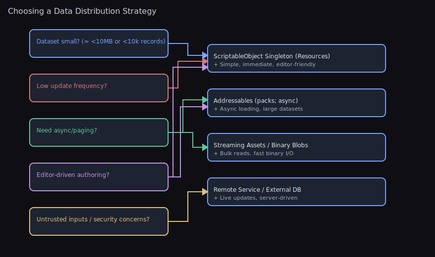

# Singleton Utilities (Runtime + ScriptableObject)

Visual


This package includes two lightweight, production‑ready singleton helpers that make global access patterns safe, consistent, and testable:

- `RuntimeSingleton<T>` — a component singleton that ensures one instance exists in play mode, optionally persists across scenes, and self‑initializes when first accessed.
- `ScriptableObjectSingleton<T>` — a configuration/data singleton backed by a single asset under `Resources/`, with an editor auto‑creator to keep assets present and correctly placed.

> ODIN compatibility: When Odin Inspector is present (`ODIN_INSPECTOR` defined), these types derive from `SerializedMonoBehaviour` / `SerializedScriptableObject` for richer serialization. Without Odin, they fall back to Unity base types. No code changes required.

Contents
- ODIN Compatibility
- When To Use / Not To Use
- RuntimeSingleton<T>
  - Lifecycle diagram, examples, pitfalls
- ScriptableObjectSingleton<T>
  - Lookup + auto‑creator diagrams, examples, tips
- Scenarios & Guidance
- Troubleshooting

<a id="odin-compatibility"></a>
## ODIN Compatibility

- With Odin installed (symbol `ODIN_INSPECTOR`), base classes inherit from `SerializedMonoBehaviour` and `SerializedScriptableObject` to enable serialization of complex types (dictionaries, polymorphic fields) with Odin drawers.
- Without Odin, bases inherit from Unity’s `MonoBehaviour`/`ScriptableObject` with no behavior change.

<a id="when-to-use"></a>
## When To Use

- `RuntimeSingleton<T>`
  - Cross‑scene services (thread dispatcher, audio router, global managers).
  - Utility components that should always be available via `T.Instance`.
  - Creating the instance on demand when not found in the scene.

- `ScriptableObjectSingleton<T>`
  - Global settings/configuration (graphics, audio, feature flags).
  - Data that should be edited as an asset and loaded via `Resources`.
  - Consistent project setup for teams (auto‑created asset on editor load).

<a id="when-not-to-use"></a>
## When Not To Use

- Prefer DI/service locators for heavily decoupled architectures requiring multiple implementations per environment, or for test seams where global state is undesirable.
- Avoid `RuntimeSingleton<T>` for ephemeral, per‑scene logic or objects that should be duplicated in additive scenes.
- Avoid `ScriptableObjectSingleton<T>` for save data or level‑specific data that should not live in Resources or should have multiple instances.

<a id="runtime-singleton"></a>
## `RuntimeSingleton<T>` Overview

- Access via `T.Instance` (creates a new `GameObject` named `"<Type>-Singleton"` and adds `T` if none exists; otherwise finds an existing active instance).
- `HasInstance` lets you check for an existing instance without creating one.
- `Preserve` (virtual, default `true`) controls `DontDestroyOnLoad`.
- Handles duplicate detection and cleans up instance reference on destroy. Instance is cleared on domain reload before scene load.

Example: Simple service

```csharp
using UnityEngine;
using WallstopStudios.UnityHelpers.Utils;

public sealed class GameServices : RuntimeSingleton<GameServices>
{
    // Disable cross‑scene persistence if desired
    protected override bool Preserve => false;

    public void Log(string message)
    {
        Debug.Log($"[GameServices] {message}");
    }
}

// Usage from anywhere
GameServices.Instance.Log("Hello world");
```

ODIN note: With Odin installed, the class inherits `SerializedMonoBehaviour`, enabling dictionaries and other complex serialized types.

Common pitfalls:
- If an inactive instance exists in the scene, `Instance` won’t find it (search excludes inactive objects) and will create a new one.
- If two active instances exist, the newer one logs an error and destroys itself.
- If `Preserve` is `true`, the instance is detached and marked `DontDestroyOnLoad`.

Lifecycle diagram:
```
T.Instance ─┬─ Has _instance? ──▶ return
            │
            ├─ Find active T in scene? ──▶ set _instance, return
            │
            └─ Create GameObject("T-Singleton") + Add T
                 └─ Awake(): assign _instance, if Preserve: DontDestroyOnLoad
                         └─ Start(): if duplicate, log + destroy self
```

Notes:
- To avoid creation during a sensitive frame, place a pre‑made instance in your bootstrap scene.
- For scene‑local managers, override `Preserve => false`.

<a id="scriptableobject-singleton"></a>
## `ScriptableObjectSingleton<T>` Overview

- Access via `T.Instance` (lazy‑loads from `Resources/` using either a custom path or the type name; warns if multiple assets found and chooses the first by name).
- `HasInstance` indicates whether the lazy value exists and is not null.
- Optional `[ScriptableSingletonPath("Sub/Folder")]` to control the `Resources` subfolder.
- Editor utility auto‑creates and relocates assets: see the “ScriptableObject Singleton Creator” in the Editor Tools Guide.

Example: Settings asset

```csharp
using WallstopStudios.UnityHelpers.Utils;
using WallstopStudios.UnityHelpers.Core.Attributes;

[ScriptableSingletonPath("Settings/Audio")]
public sealed class AudioSettings : ScriptableObjectSingleton<AudioSettings>
{
    public float musicVolume = 0.8f;
    public bool enableSpatialAudio = true;
}

// Usage at runtime
float vol = AudioSettings.Instance.musicVolume;
```

ODIN note: With Odin installed, the class inherits `SerializedScriptableObject`, so you can safely serialize complex collections without custom drawers.

Asset management tips:
- Place the asset under `Assets/Resources/` (or under the path from `[ScriptableSingletonPath]`).
- The Editor’s “ScriptableObject Singleton Creator” runs on load to create missing assets and move misplaced ones. It also supports a test‑assembly toggle used by our test suite.

Lookup order diagram:
```
Instance access:
  [1] Resources.LoadAll<T>(custom path from [ScriptableSingletonPath])
  [2] if none: Resources.Load<T>(type name)
  [3] if none: Resources.LoadAll<T>(root)
  [4] if multiple: warn + pick first by name (sorted)
```

Auto‑creator flow (Editor):
```
On editor load:
  - Scan all ScriptableObjectSingleton<T> types
  - For each non-abstract type:
      - Determine Resources path (attribute or type name)
      - Ensure folder under Assets/Resources
      - If asset exists elsewhere: move to target path
      - Else: create new asset at target path
  - Save & Refresh if changes
```

Asset structure diagram:
```
Default (no attribute):
Assets/
  Resources/
    AudioSettings.asset         // type name

With [ScriptableSingletonPath("Settings/Audio")]:
Assets/
  Resources/
    Settings/
      Audio/
        AudioSettings.asset
```

<a id="scenarios"></a>
## Scenarios & Guidance

- Global dispatcher: See `UnityMainThreadDispatcher` which derives from `RuntimeSingleton<UnityMainThreadDispatcher>`.
- Global data caches or registries: Use `ScriptableObjectSingleton<T>` so data lives in a single editable asset and loads fast.
- Cross‑scene managers: Keep `Preserve = true` to avoid duplicates across scene loads.

### Data Registries & Lookups (Single Source of Truth)

ScriptableObject singletons excel as in‑project “databases” for content/config:

- Centralize definitions (items, abilities, buffs, NPCs, localization) in one asset.
- Build fast lookup indices (by ID/tag/category) at load or validation time.
- Keep workflows simple: edit in Inspector, no runtime bootstrapping needed.

Example: Items DB with indices

```csharp
using System.Collections.Generic;
using UnityEngine;
using WallstopStudios.UnityHelpers.Utils;

[CreateAssetMenu(menuName = "Game/Items DB")]
[ScriptableSingletonPath("DB")] // Assets/Resources/DB/ItemsDb.asset
public sealed class ItemsDb : ScriptableObjectSingleton<ItemsDb>
{
    [System.Serializable]
    public sealed class ItemDef { public int id; public string name; public Sprite icon; }

    public List<ItemDef> items = new();

    // Non-serialized runtime indices
    private readonly Dictionary<int, ItemDef> _byId = new();
    private readonly Dictionary<string, List<ItemDef>> _byName = new();

    private void OnEnable() => RebuildIndices();
    private void OnValidate() => RebuildIndices();

    private void RebuildIndices()
    {
        _byId.Clear();
        _byName.Clear();
        foreach (var it in items)
        {
            if (it == null) continue;
            _byId[it.id] = it;
            (_byName.TryGetValue(it.name, out var list) ? list : (_byName[it.name] = new())).Add(it);
        }
    }

    public static bool TryGetById(int id, out ItemDef def) => Instance._byId.TryGetValue(id, out def);
}

// Usage
if (ItemsDb.TryGetById(42, out var sword)) { /* equip sword */ }
```

Tips
- Keep serialized lists as your source of truth; build dictionaries at load/validate.
- Use `[ScriptableSingletonPath]` to place the asset predictably under `Resources/`.
- Split huge DBs into themed sub‑assets and cross‑reference via indices.
- Consider GUIDs or string IDs for modding; validate uniqueness in `OnValidate`.

#### Example: Content DB with tags, categories, GUIDs (Addressables)

```csharp
using System.Collections.Generic;
using UnityEngine;
using WallstopStudios.UnityHelpers.Utils;
#if UNITY_EDITOR
using UnityEditor;
using UnityEditor.AddressableAssets;
using UnityEditor.AddressableAssets.Settings;
#endif
using UnityEngine.AddressableAssets;

public enum ContentCategory { Weapon, Armor, Consumable, Quest }

[CreateAssetMenu(menuName = "Game/Content DB")]
[ScriptableSingletonPath("DB")] // Assets/Resources/DB/ContentDb.asset
public sealed class ContentDb : ScriptableObjectSingleton<ContentDb>
{
    [System.Serializable]
    public sealed class ContentDef
    {
        public string guid;                 // stable ID for saves/mods
        public string displayName;
        public ContentCategory category;
        public string[] tags;               // e.g., "fire", "ranged"
        public AssetReferenceGameObject prefab; // addressable ref (optional)
    }

    public List<ContentDef> entries = new();

    // Indices (runtime only)
    private readonly Dictionary<string, ContentDef> _byGuid = new();
    private readonly Dictionary<ContentCategory, List<ContentDef>> _byCategory = new();
    private readonly Dictionary<string, List<ContentDef>> _byTag = new();

    private void OnEnable() => RebuildIndices();
    private void OnValidate() { RebuildIndices(); ValidateEditor(); }

    private void RebuildIndices()
    {
        _byGuid.Clear(); _byCategory.Clear(); _byTag.Clear();
        foreach (var e in entries)
        {
            if (e == null || string.IsNullOrEmpty(e.guid)) continue;
            _byGuid[e.guid] = e;
            (_byCategory.TryGetValue(e.category, out var listCat) ? listCat : (_byCategory[e.category] = new())).Add(e);
            if (e.tags != null)
                foreach (var t in e.tags)
                    if (!string.IsNullOrEmpty(t))
                        (_byTag.TryGetValue(t, out var listTag) ? listTag : (_byTag[t] = new())).Add(e);
        }
    }

    public static bool TryGetByGuid(string guid, out ContentDef def) => Instance._byGuid.TryGetValue(guid, out def);
    public static IReadOnlyList<ContentDef> GetByCategory(ContentCategory cat) =>
        Instance._byCategory.TryGetValue(cat, out var list) ? list : (IReadOnlyList<ContentDef>)System.Array.Empty<ContentDef>();
    public static IReadOnlyList<ContentDef> GetByTag(string tag) =>
        Instance._byTag.TryGetValue(tag, out var list) ? list : (IReadOnlyList<ContentDef>)System.Array.Empty<ContentDef>();

#if UNITY_EDITOR
    private void ValidateEditor()
    {
        // Validate GUID uniqueness
        var seen = new HashSet<string>();
        foreach (var e in entries)
        {
            if (e == null) continue;
            if (string.IsNullOrEmpty(e.guid))
                Debug.LogWarning($"[ContentDb] Entry '{e?.displayName}' has empty GUID", this);
            else if (!seen.Add(e.guid))
                Debug.LogError($"[ContentDb] Duplicate GUID '{e.guid}' detected", this);
        }

        // Validate Addressables (if package installed and editor context)
        var settings = AddressableAssetSettingsDefaultObject.Settings;
        if (settings != null)
        {
            foreach (var e in entries)
            {
                if (e?.prefab == null) continue;
                var guid = e.prefab.AssetGUID;
                if (string.IsNullOrEmpty(guid) || settings.FindAssetEntry(guid) == null)
                    Debug.LogWarning($"[ContentDb] Prefab for '{e.displayName}' is not marked Addressable", this);
            }
        }
    }
#endif
}
```

Why this works well
- One authoritative asset; code reads through stable APIs.
- Deterministic load path via Resources; Addressables used only for content references.
- Indices rebuilt automatically to keep lookups fast and in sync while editing.

### When Not To Use ScriptableObject Singletons as DBs

Use alternatives when one or more of these apply:

- Very large datasets (tens of thousands of records or >10–20 MB serialized)
  - Prefer Addressables catalogs, binary blobs, streaming assets, or an external store; load by page or on demand.
- Frequent live updates/patches without app updates
  - External data sources (remote JSON/Protobuf), Addressables content updates, or platform DBs are better suited.
- Strong need for async/background loading or partial paging
  - Addressables + async APIs give finer loading control versus a monolithic Resources asset.
- Cross‑team/content pipelines that generate data at build time
  - Import raw data into Addressables or assets at build; consider codegen for IDs and indices.
- Complex versioning/migrations of data formats
  - Store version tags and migrate on load, or keep data outside Resources where migrations are simpler to stage.
- Sensitive/untrusted inputs
  - Don’t deserialize untrusted data into SOs; use validated formats and sandboxed loaders.
- Save data
  - Keep save/progression separate from the content DB; reference content by GUID/ID in saves.

### Choosing a Data Distribution Strategy

Use this chart to pick an approach based on constraints:




<a id="troubleshooting"></a>
## Troubleshooting

## Best Practices

- Prefer placing a pre-made runtime singleton in a bootstrap scene when construction order matters; avoid first-access implicit creation during critical frames.
- For scene-local managers, override `Preserve => false` to prevent cross-scene persistence.
- Keep exactly one singleton asset under `Resources/` for each `ScriptableObjectSingleton<T>`; let the auto-creator relocate any strays.
- Use `[ScriptableSingletonPath]` to group related settings; avoid deep nesting that hurts discoverability.
- With ODIN installed, take advantage of `Serialized*` bases for complex serialized fields; without Odin, keep fields Unity-serializable.

- Multiple ScriptableObject assets found: a warning is logged and the first by name is used. Resolve by keeping only one asset in Resources or by letting the auto‑creator relocate the correct one.
- `Instance` returns null for ScriptableObject: Ensure the asset exists under `Resources/` and the type name or custom path matches.
- Domain reloads: Both singletons clear cached instances before scene load.

## Related Docs

- Editor tool: [ScriptableObject Singleton Creator](EDITOR_TOOLS_GUIDE.md#scriptableobject-singleton-creator).
- Tests: `Tests/Runtime/Utils/RuntimeSingletonTests.cs` and `Tests/Editor/Utils/ScriptableObjectSingletonTests.cs`.
