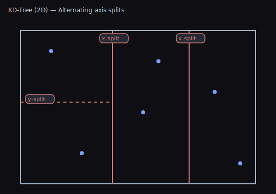

# 2D Spatial Trees — Concepts and Usage

This practical guide complements performance and semantics pages with diagrams and actionable selection advice.

## TL;DR — What Problem This Solves

- You often need to answer: “What’s near X?” or “What’s inside this area?”
- A naive loop checks every object every time. Spatial trees organize your points/bounds so queries only touch nearby data.
- Result: Far fewer checks, big speedups for range/bounds/nearest‑neighbor queries.

Quick picks
- Many moving points, frequent rebuilds, broad searches: QuadTree2D
- Static points, nearest‑neighbor/k‑NN: KDTree2D (Balanced)
- Fast builds with good‑enough queries on points: KDTree2D (Unbalanced)
- Objects with size (bounds), intersect/contain queries: RTree2D

## Quick Start (Code)

Points (QuadTree2D / KdTree2D)
```csharp
using WallstopStudios.UnityHelpers.Core.DataStructure;
using UnityEngine;
using System.Collections.Generic;

// Example element with a position
struct Enemy { public Vector2 pos; public int id; }

var enemies = new List<Enemy>(/* fill with positions */);

// Build a tree from points
var quad = new QuadTree2D<Enemy>(enemies, e => e.pos);
var kd   = new KdTree2D<Enemy>(enemies, e => e.pos); // balanced by default

// Range query (circle)
var inRange = new List<Enemy>();
quad.GetElementsInRange(playerPos, 10f, inRange);

// Bounds (box) query
var inBox = new List<Enemy>();
kd.GetElementsInBounds(new Bounds(center, size), inBox);

// Approximate nearest neighbors
var neighbors = new List<Enemy>();
kd.GetApproximateNearestNeighbors(playerPos, count: 10, neighbors);
```

Sized objects (RTree2D)
```csharp
using WallstopStudios.UnityHelpers.Core.DataStructure;
using UnityEngine;
using System.Collections.Generic;

struct Tile { public Bounds bounds; public int kind; }

var tiles = new List<Tile>(/* fill with bounds */);

// Build from bounds (AABBs)
var rtree = new RTree2D<Tile>(tiles, t => t.bounds);

// Bounds query (fast for large areas)
var hits = new List<Tile>();
rtree.GetElementsInBounds(worldBounds, hits);

// Range query (treats items by their bounds)
var near = new List<Tile>();
rtree.GetElementsInRange(center, radius, near);
```

Notes
- These trees are immutable: rebuild when positions/bounds change significantly.
- For lots of moving points, consider `SpatialHash2D` for broad‑phase.
- See [Spatial Tree Semantics](SPATIAL_TREE_SEMANTICS.md) for boundary behavior and edge cases.

## Structures

### QuadTree2D

- Partition: Recursively splits space into four quadrants.
- Use for: Broad-phase proximity, view culling, general spatial bucketing.
- Pros: Simple structure; predictable performance; incremental updates straightforward.
- Cons: Data hotspots deepen local trees; nearest neighbors slower than KDTree.

Diagram: 

### KDTree2D

- Partition: Alternating axis-aligned splits (x/y), often median-balanced.
- Use for: Nearest neighbor, k-NN, range queries on points.
- Pros: Strong NN performance; balanced variant gives consistent query time.
- Cons: Costly to maintain under heavy churn; unbalanced variant can degrade.

Diagram: 

### RTree2D

- Partition: Groups items by minimum bounding rectangles (MBRs) with hierarchical MBRs.
- Use for: Items with size (AABBs): sprites, tiles, colliders; bounds intersection.
- Pros: Great for large bounds queries; matches bounds semantics.
- Cons: Overlapping MBRs can increase node visits; not optimal for point NN.

Diagram: 

## Choosing a Structure

Use this decision flowchart to pick the right spatial tree:

```
START: Do your objects move frequently?
  │
  ├─ YES → Consider SpatialHash2D instead (see README)
  │         (Spatial trees require rebuild on movement)
  │
  └─ NO → Continue to next question
      │
      └─ What type of queries do you need?
          │
          ├─ Primarily nearest neighbor (k-NN)
          │   │
          │   ├─ Static data, want consistent performance
          │   │   → KDTree2D (Balanced) ✓
          │   │
          │   └─ Data changes occasionally, need fast rebuilds
          │       → KDTree2D (Unbalanced) ✓
          │
          ├─ Do objects have size/bounds (not just points)?
          │   │
          │   ├─ YES → Need bounds intersection queries
          │   │   → RTree2D ✓
          │   │
          │   └─ NO → Continue
          │
          └─ General range/circular queries, broad-phase
              → QuadTree2D ✓ (best all-around choice)
```

### Quick Reference

- **Many moving points, rebuild or frequent updates:** QuadTree2D
- **Nearest neighbors on static points:** KDTree2D (Balanced)
- **Fast builds with good-enough queries:** KDTree2D (Unbalanced)
- **Objects with area; bounds queries primary:** RTree2D
- **Very frequent movement (every frame):** SpatialHash2D (see [README](README.md#choosing-spatial-structures))

## Query Semantics

- Points vs Bounds: QuadTree2D and KDTree2D are point-based; RTree2D is bounds-based.
- Boundary inclusion: normalize half-open vs closed intervals. Add epsilons for edge cases.
- Numeric stability: prefer consistent ordering for colinear and boundary points.

For deeper details, performance data, and diagrams, see:
- [2D Performance Benchmarks](SPATIAL_TREE_2D_PERFORMANCE.md)
- [Spatial Tree Semantics](SPATIAL_TREE_SEMANTICS.md)
