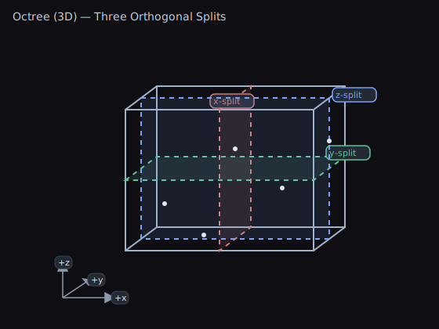
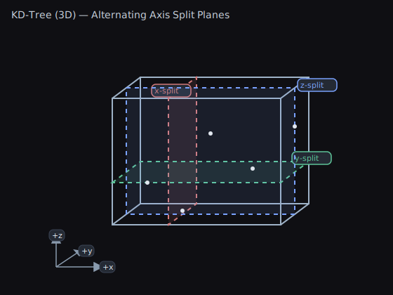
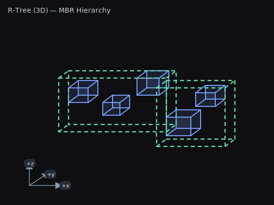

# 3D Spatial Trees — Concepts and Usage

This approachable guide shows when to use OctTree3D, KdTree3D, and RTree3D, with quick code you can copy.

## TL;DR — What Problem This Solves

- Answer “What’s near X?” or “What’s inside this volume?” in 3D without scanning everything.
- Organize your data so queries touch only relevant spatial buckets.
- Big speedups for range, bounds, and nearest‑neighbor queries.

Quick picks
- General 3D queries (broad‑phase, good locality): OctTree3D
- Nearest neighbors on static points: KDTree3D (Balanced)
- Fast builds with good‑enough point queries: KDTree3D (Unbalanced)
- Objects with size (3D bounds), intersect/contain queries: RTree3D

## Quick Start (Code)

Points (OctTree3D / KdTree3D)
```csharp
using WallstopStudios.UnityHelpers.Core.DataStructure;
using UnityEngine;
using System.Collections.Generic;

struct VfxPoint { public Vector3 pos; public int id; }

var points = new List<VfxPoint>(/* fill with positions */);

// Build trees from points
var oct = new OctTree3D<VfxPoint>(points, p => p.pos);
var kd  = new KDTree3D<VfxPoint>(points, p => p.pos); // balanced by default

// Range query (sphere)
var inRange = new List<VfxPoint>();
oct.GetElementsInRange(playerPos, 12f, inRange);

// Bounds (box) query
var inBox = new List<VfxPoint>();
kd.GetElementsInBounds(new Bounds(center, size), inBox);

// Approximate nearest neighbors
var neighbors = new List<VfxPoint>();
kd.GetApproximateNearestNeighbors(playerPos, count: 12, neighbors);
```

Sized objects (RTree3D)
```csharp
using WallstopStudios.UnityHelpers.Core.DataStructure;
using UnityEngine;
using System.Collections.Generic;

struct Volume { public Bounds bounds; public int kind; }

var volumes = new List<Volume>(/* fill with bounds */);

// Build from 3D bounds (AABBs)
var rtree = new RTree3D<Volume>(volumes, v => v.bounds);

// Bounds query (fast for large volumes)
var hits = new List<Volume>();
rtree.GetElementsInBounds(worldBounds, hits);

// Range query (treats items by their bounds)
var near = new List<Volume>();
rtree.GetElementsInRange(center, radius, near);
```

Notes
- These trees are immutable: rebuild when positions/bounds change significantly.
- For lots of moving points, consider `SpatialHash3D` for broad‑phase neighborhood queries.
- See [Spatial Tree Semantics](SPATIAL_TREE_SEMANTICS.md) for boundary behavior and edge cases.

---

## ⭐ Zero-Allocation Queries: The Performance Killer Feature

**The Problem - GC Spikes Every Frame:**

```csharp
void Update()
{
    // 🔴 BAD: Allocates new List every frame
    List<VfxPoint> nearby = tree.GetElementsInRange(playerPos, 15f);

    foreach (VfxPoint p in nearby)
    {
        p.UpdateEffect();
    }
    // Result: GC runs frequently = frame drops
}
```

**The Solution - Buffering Pattern:**

```csharp
// Reusable buffer (declare once)
private List<VfxPoint> nearbyBuffer = new(128);

void Update()
{
    nearbyBuffer.Clear();

    // 🟢 GOOD: Reuses same List = zero allocations
    tree.GetElementsInRange(playerPos, 15f, nearbyBuffer);

    foreach (VfxPoint p in nearbyBuffer)
    {
        p.UpdateEffect();
    }
    // Result: No GC, stable 60fps
}
```

**Impact:**
- **Before:** GC spikes every 2-3 seconds, frame drops to 40fps
- **After:** Zero GC from queries, stable 60fps even with 1000s of queries/second

**All spatial trees support this pattern:**
- `OctTree3D.GetElementsInRange(pos, radius, buffer)`
- `KdTree3D.GetElementsInBounds(bounds, buffer)`
- `RTree3D.GetElementsInRange(pos, radius, buffer)`

> 💡 **Pro Tip:** Pre-size your buffers based on expected max results.
> `new List<VfxPoint>(128)` avoids internal resizing for results up to 128 items.

**Maximum Ergonomics:**

These APIs return the buffer you pass in, so you can use them directly in `foreach` loops:

```csharp
private List<VfxPoint> nearbyBuffer = new(128);

void Update()
{
    // Returns the same buffer - use it directly in foreach!
    foreach (VfxPoint p in tree.GetElementsInRange(playerPos, 15f, nearbyBuffer))
    {
        p.UpdateEffect();
    }
}
```

**Using Pooled Buffers:**

Don't want to manage buffers yourself? Use the built-in pooling utilities:

```csharp
using WallstopStudios.UnityHelpers.Utils;

void Update()
{
    // Get pooled buffer - automatically returned when scope exits
    using var lease = Buffers<VfxPoint>.List.Get(out List<VfxPoint> buffer);

    // Use it directly in foreach - combines zero-alloc query + pooled buffer!
    foreach (VfxPoint p in tree.GetElementsInRange(playerPos, 15f, buffer))
    {
        p.UpdateEffect();
    }
    // buffer automatically returned to pool here
}
```

See [Buffering Pattern](README.md#buffering-pattern) for the complete guide and [Pooling Utilities](README.md#pooling-utilities) for more pooling options.

## Structures

### OctTree3D

- Partition: Recursively splits space into eight octants.
- Use for: General 3D partitioning, broad‑phase, visibility culling, spatial audio.
- Pros: Good spatial locality; intuitive partitioning; balanced performance.
- Cons: Nearest neighbors slower than KDTree on pure point data.



### KDTree3D

- Partition: Alternating axis‑aligned splits (x/y/z), often median‑balanced.
- Use for: Nearest neighbor, k‑NN, range queries on points.
- Pros: Strong NN performance; balanced variant gives consistent query time.
- Cons: Costly to maintain under heavy churn; unbalanced variant can degrade.



### RTree3D

- Partition: Groups items by minimum bounding boxes with hierarchical bounding.
- Use for: Items with size (3D AABBs): volumes, colliders; bounds intersection.
- Pros: Great for large bounds queries; matches volumetric semantics.
- Cons: Overlapping boxes can increase node visits; not optimal for point NN.



## Choosing a Structure

- Many moving points, frequent rebuilds: OctTree3D or SpatialHash3D
- Nearest neighbors on static points: KDTree3D (Balanced)
- Fast builds with good‑enough point queries: KDTree3D (Unbalanced)
- Objects with volume; bounds queries primary: RTree3D

## Query Semantics

- Points vs Bounds: KDTree3D/OctTree3D are point‑based; RTree3D is bounds‑based.
- Boundary inclusion: 3D variants can differ at exact boundaries. Normalize to half‑open or add small epsilons.
- For details and performance data, see:
  - [3D Performance Benchmarks](SPATIAL_TREE_3D_PERFORMANCE.md)
  - [Spatial Tree Semantics](SPATIAL_TREE_SEMANTICS.md)

