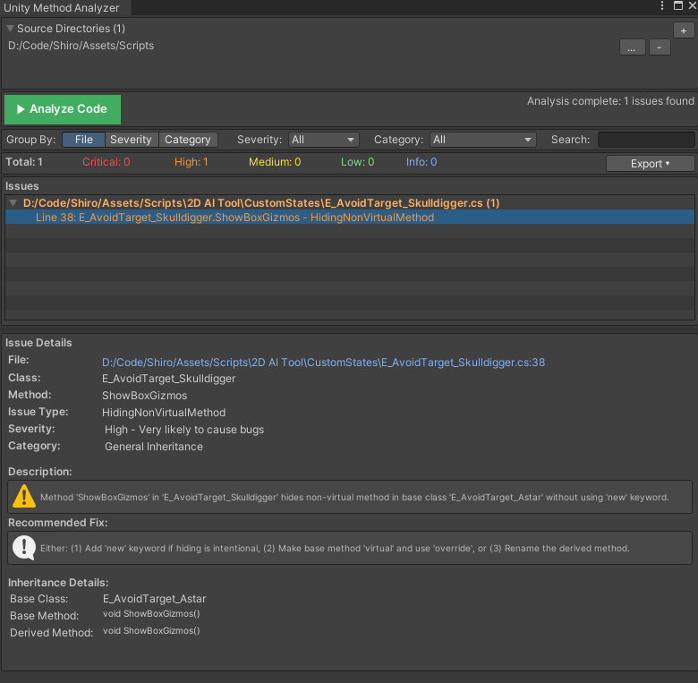
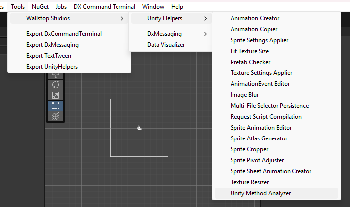
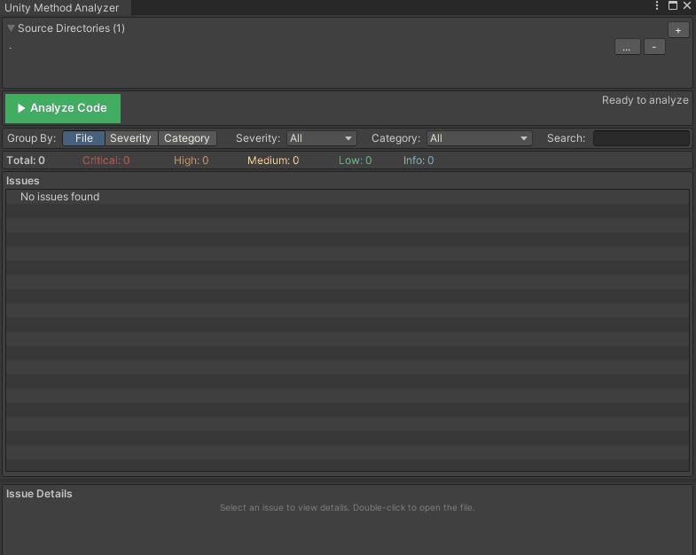
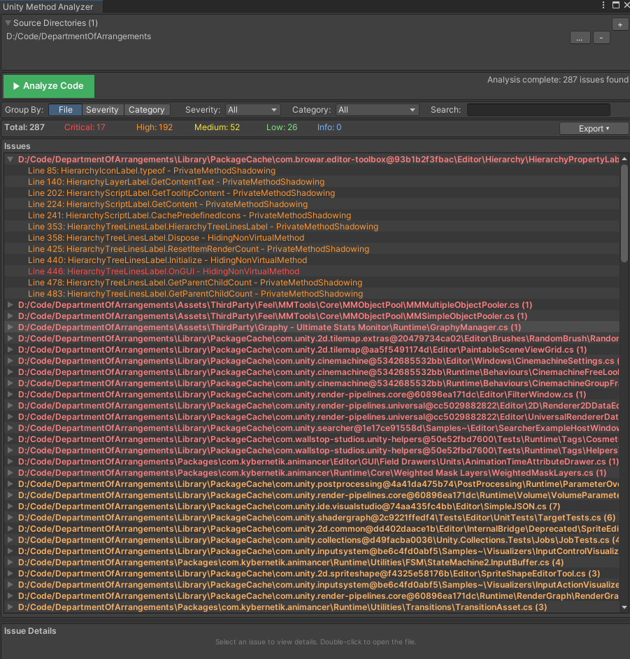
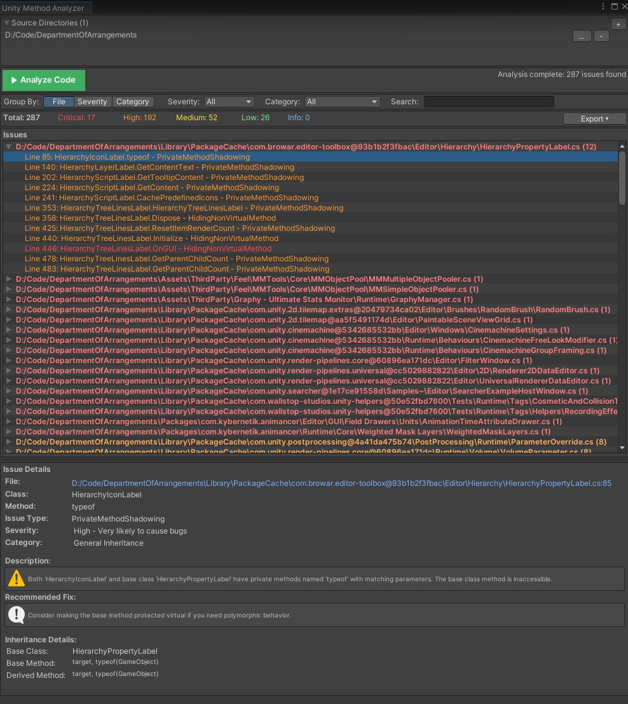
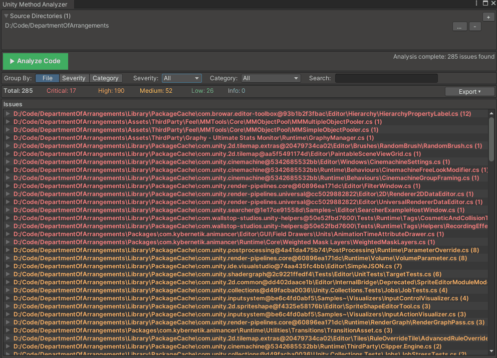
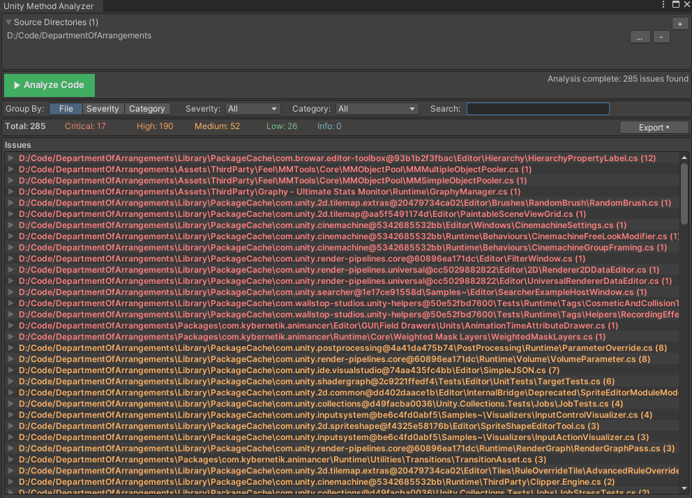
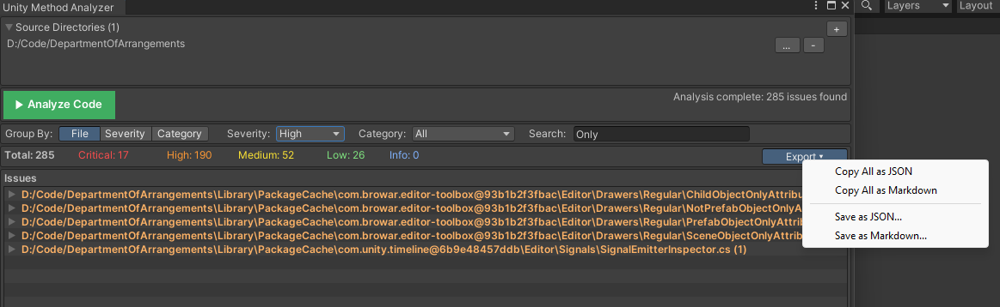

---
---

# Unity Method Analyzer

**Detect C# inheritance issues and Unity lifecycle errors across your entire codebase.**

The Unity Method Analyzer scans your project's C# files and identifies common mistakes in method overrides, Unity lifecycle methods, and inheritance patterns—before they cause runtime bugs. Use it during development to catch silent failures, missing base calls, and signature mismatches.

---

## Table of Contents

- [Overview](#overview)
- [Getting Started](#getting-started)
- [What It Detects](#what-it-detects)
- [Using the Analyzer](#using-the-analyzer)
- [Filtering Results](#filtering-results)
- [Exporting Reports](#exporting-reports)
- [Suppressing Warnings](#suppressing-warnings)
- [Best Practices](#best-practices)

---

## Overview



The Unity Method Analyzer provides:

- **Static code analysis** without needing Roslyn or external tools
- **Parallel scanning** of thousands of files in seconds
- **Issue categorization** by severity and type
- **One-click navigation** to problematic code
- **Export capabilities** for CI/CD integration or team review
- **Flexible filtering** to focus on what matters

**Common issues detected:**

| Issue Type                 | Example                                                                   |
| -------------------------- | ------------------------------------------------------------------------- |
| Missing `override` keyword | Hiding base method instead of overriding                                  |
| Wrong method signature     | `OnCollisionEnter(Collider c)` instead of `OnCollisionEnter(Collision c)` |
| Shadowed lifecycle methods | Both base and derived class have `private void Start()`                   |
| Return type mismatches     | `void Start()` vs `IEnumerator Start()` in inheritance chain              |
| Static lifecycle methods   | `static void Awake()` won't be called by Unity                            |

---

## Getting Started

### Opening the Analyzer

**Menu:** `Tools > Wallstop Studios > Unity Helpers > Unity Method Analyzer`



### Your First Scan

1. **Open the analyzer** from the menu
2. **Add source directories** — By default, scans from the project root
3. **Click "Analyze Code"** — Wait for the progress bar to complete
4. **Review results** — Issues appear grouped by file, severity, or category



---

## What It Detects

### Issue Categories

The analyzer groups issues into three categories:

#### Unity Lifecycle Issues

Problems with Unity's magic methods (`Start`, `Update`, `OnCollisionEnter`, etc.):

```csharp
// ❌ WRONG: Unexpected parameters - Unity won't call this
void Update(float deltaTime)  // Update takes no parameters
{
    Move(deltaTime);
}

// ✅ CORRECT: Proper signature
void Update()
{
    Move(Time.deltaTime);
}
```

```csharp
// ❌ WRONG: Static lifecycle method - Unity won't call it
static void Awake()
{
    Initialize();
}

// ✅ CORRECT: Instance method
void Awake()
{
    Initialize();
}
```

```csharp
// ⚠️ SHADOWING: Both base and derived have private Start()
public class BaseEnemy : MonoBehaviour
{
    private void Start() { BaseInit(); }  // Called for BaseEnemy instances
}

public class Boss : BaseEnemy
{
    private void Start() { BossInit(); }  // Only this is called for Boss instances
}

// ✅ BETTER: Use virtual/override pattern
public class BaseEnemy : MonoBehaviour
{
    protected virtual void Start() { BaseInit(); }
}

public class Boss : BaseEnemy
{
    protected override void Start()
    {
        base.Start();  // Calls BaseInit()
        BossInit();
    }
}
```

#### Unity Inheritance Issues

Problems when extending Unity base classes:

```csharp
public class GameManager : MonoBehaviour
{
    // ❌ WRONG: Using 'new' hides the base method
    public new void Awake()
    {
        Initialize();
    }

    // ✅ CORRECT: Use virtual/override pattern if base is virtual
    // Or just declare normally for MonoBehaviour lifecycle
    private void Awake()
    {
        Initialize();
    }
}
```

#### General Inheritance Issues

Problems in your own class hierarchies:

```csharp
public class BaseEnemy : MonoBehaviour
{
    public virtual void TakeDamage(int amount) { }
}

public class Boss : BaseEnemy
{
    // ❌ WRONG: Missing 'override' keyword - hides base method
    public void TakeDamage(int amount)
    {
        // This won't be called polymorphically!
    }

    // ✅ CORRECT: Properly override
    public override void TakeDamage(int amount)
    {
        base.TakeDamage(amount);
        // Boss-specific logic
    }
}
```

### Severity Levels

| Severity     | Description                                | Example                                |
| ------------ | ------------------------------------------ | -------------------------------------- |
| **Critical** | Will cause runtime failures or silent bugs | Missing override hiding virtual method |
| **High**     | Likely unintended behavior                 | Wrong Unity lifecycle signature        |
| **Medium**   | Potential issues worth reviewing           | Suspicious method hiding               |
| **Low**      | Style or minor concerns                    | Non-standard access modifiers          |
| **Info**     | Informational notes                        | Detected patterns for review           |

---

## Using the Analyzer

### Managing Source Directories

Configure which directories to scan:


- **Click "+"** to add a new directory
- **Click "..."** to browse for a different path
- **Click "-"** to remove a directory
- **Red paths** indicate directories that don't exist

**Tip:** Add only relevant directories (e.g., `Assets/Scripts`) to speed up analysis.

### Understanding the Results Tree

The results are displayed in a hierarchical tree view:



- **Expand/collapse** groups with the arrow
- **Single-click** an issue to see details in the panel below
- **Double-click** to open the file at the exact line number
- **Right-click** for context menu options

### Issue Detail Panel

When you select an issue, the detail panel shows:



- **File path** and line number
- **Class and method** names
- **Issue type** and severity
- **Detailed description** of the problem
- **Recommended fix** with specific guidance
- **Base class information** when relevant

---

## Filtering Results

### Group By Options

Organize results by:

- **File** — Group issues by source file (default)
- **Severity** — Group by Critical/High/Medium/Low/Info
- **Category** — Group by Unity Lifecycle/Unity Inheritance/General


### Severity Filter

Focus on specific severity levels:



### Category Filter

Focus on specific issue categories:

- **All** — Show everything
- **Unity Lifecycle** — Only lifecycle method issues
- **Unity Inheritance** — Only Unity class inheritance issues
- **General Inheritance** — Only custom class inheritance issues

### Search Filter

Free-text search across all issue fields:



Search matches against:

- File paths
- Class names
- Method names
- Issue descriptions

---

## Exporting Reports

### Export Menu

Click **"Export ▾"** to access export options:



#### Copy Options

- **Copy Selected as JSON** — Copy the selected issue
- **Copy Selected as Markdown** — Copy the selected issue as readable text
- **Copy All as JSON** — Copy all filtered issues
- **Copy All as Markdown** — Copy all filtered issues as readable text

#### Save Options

- **Save as JSON...** — Export to a JSON file for CI/CD integration
- **Save as Markdown...** — Export to a Markdown file for documentation or review

### JSON Export Format

```json
{
  "analysisDate": "2024-01-15T10:30:00Z",
  "totalIssues": 12,
  "issues": [
    {
      "filePath": "Assets/Scripts/Player/PlayerController.cs",
      "className": "PlayerController",
      "methodName": "OnCollisionEnter",
      "issueType": "Unity Lifecycle Signature Mismatch",
      "description": "Method 'OnCollisionEnter' has wrong parameter type",
      "severity": "High",
      "recommendedFix": "Change parameter from 'Collider' to 'Collision'",
      "lineNumber": 42,
      "category": "UnityLifecycle"
    }
  ]
}
```

### Markdown Export Format

```markdown
# Unity Method Analyzer Report

Generated: 2024-01-15 10:30:00
Total Issues: 12

## Critical (2)

### PlayerController.cs:42

**Class:** PlayerController  
**Method:** OnCollisionEnter  
**Issue:** Unity Lifecycle Signature Mismatch  
**Fix:** Change parameter from 'Collider' to 'Collision'
```

---

## Suppressing Warnings

For test code or intentional patterns, use `[SuppressAnalyzer]`:

```csharp
using WallstopStudios.UnityHelpers.Tests.Core;

// Suppress entire class
[SuppressAnalyzer("Test fixture for analyzer validation")]
public class TestClassWithIntentionalIssues : BaseClass
{
    public void HiddenMethod() { }  // Won't trigger warning
}

// Or suppress specific methods
public class TestClass : BaseClass
{
    [SuppressAnalyzer("Testing method hiding detection")]
    public new void VirtualMethod() { }  // Won't trigger warning
}
```

**Note:** `[SuppressAnalyzer]` is only available in test assemblies. Production code should fix issues rather than suppress them.

---

## Best Practices

### When to Run

- **Before committing** — Catch issues early
- **During code review** — Export reports for team review
- **In CI/CD** — Use JSON export for automated checks
- **After refactoring** — Verify inheritance chains remain correct

### Recommended Workflow

1. **Run full scan** on your `Assets/Scripts` folder
2. **Filter by Critical/High** severity first
3. **Fix issues** starting with Critical
4. **Re-scan** to verify fixes
5. **Export report** for documentation

### Performance Tips

- **Scan specific directories** rather than the entire project
- **Use filters** to focus on relevant issues
- **Close other editor windows** during large scans
- **Exclude generated code** directories

### Integrating with CI/CD

Export JSON reports and parse them in your build pipeline:

```bash
# Example: Fail build if critical issues exist
unity -batchmode -projectPath . -executeMethod AnalyzerRunner.RunAndExport
cat analyzer-report.json | jq '.issues | map(select(.severity == "Critical")) | length'
```

---

## Summary

| Feature              | Description                                                        |
| -------------------- | ------------------------------------------------------------------ |
| **Menu Location**    | `Tools > Wallstop Studios > Unity Helpers > Unity Method Analyzer` |
| **Issue Categories** | Unity Lifecycle, Unity Inheritance, General Inheritance            |
| **Severity Levels**  | Critical, High, Medium, Low, Info                                  |
| **Export Formats**   | JSON, Markdown                                                     |
| **Suppression**      | `[SuppressAnalyzer]` attribute (test assemblies only)              |
