# Inspector Buttons (WButton)

**Execute methods from the inspector with one click.**

The `[WButton]` attribute exposes methods as clickable buttons in the Unity inspector, complete with result history, async support, cancellation, custom styling, and automatic grouping. Test gameplay features, debug systems, and prototype rapidly without writing custom editors.

---

## Table of Contents

- [Basic Usage](#basic-usage)
- [Parameters](#parameters)
  - [colorKey](#colorkey-string-optional)
  - [groupPriority](#grouppriority-int-optional)
  - [groupPlacement](#groupplacement-wbuttongroupplacement-optional)
- [Execution Types](#execution-types)
- [Result History](#result-history)
- [Draw Order & Positioning](#draw-order--positioning)
- [Grouping](#grouping)
- [Color Theming](#color-theming)
- [Configuration](#configuration)
- [Best Practices](#best-practices)
- [Examples](#examples)
- [Using WButton with Custom Editors](#using-wbutton-with-custom-editors)
- [Troubleshooting](#troubleshooting)

---

## Basic Usage

```csharp
using UnityEngine;
using WallstopStudios.UnityHelpers.Core.Attributes;

public class PlayerController : MonoBehaviour
{
    public int health = 100;

    [WButton("Heal Player")]
    private void Heal()
    {
        health = 100;
        Debug.Log("Player healed!");
    }

    [WButton("Take Damage")]
    private void TakeDamage()
    {
        health -= 10;
        Debug.Log($"Player took damage! Health: {health}");
    }
}
```

---

## Parameters

The `[WButton]` attribute accepts several optional parameters to customize button appearance, behavior, and organization.

### Parameter Overview

```csharp
[WButton(
    string displayName = null,
    int drawOrder = 0,
    int historyCapacity = WButtonAttribute.UseGlobalHistory,
    string colorKey = null,
    string groupName = null,
    int groupPriority = WButtonAttribute.NoGroupPriority,
    WButtonGroupPlacement groupPlacement = WButtonGroupPlacement.UseGlobalSetting
)]
```

---

### displayName (string, optional)

**Controls the text shown on the button in the inspector.**

- **Default:** Uses the method name (e.g., `"RollDice"` for `RollDice()`)
- **When to use:** Make buttons more readable or add context

```csharp
// Without displayName - shows "SpawnEnemy"
[WButton]
private void SpawnEnemy() { }

// With displayName - shows "🔫 Spawn Enemy"
[WButton("🔫 Spawn Enemy")]
private void SpawnEnemy1() { }

// More descriptive labels
[WButton("Reset Player to Checkpoint")]
private void ResetPlayer() { }

[WButton("Clear All Save Data")]
private void ClearSaveData() { }
```

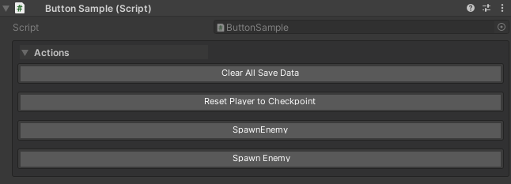

---

### drawOrder (int, optional)

**Controls the sort order of buttons within their placement section (top or bottom).**

- **Lower values render first** within the same placement section
- **Buttons are sorted by drawOrder**, then by declaration order for buttons with the same drawOrder
- **Does NOT control placement** — use `groupPlacement` to control whether buttons appear above or below properties

```csharp
public class PlayerController1 : MonoBehaviour
{
    public int health = 100;
    public float speed = 5f;

    // These buttons render in order: Initialize, Validate, Debug Info
    // Placement (above/below properties) is controlled by groupPlacement or global settings
    [WButton("Initialize", drawOrder: -1)]
    private void Initialize() { }

    [WButton("Validate", drawOrder: 0)]
    private void Validate() { }

    [WButton("Debug Info", drawOrder: 1)]
    private void ShowDebugInfo() { }
}
```

**Visual layout:**

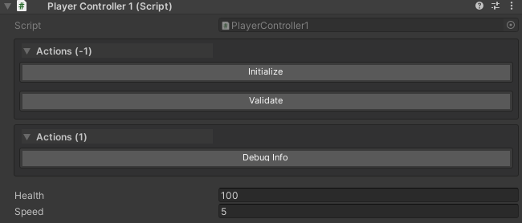

---

### historyCapacity (int, optional)

**Controls how many previous results are stored for methods that return values.**

- **Default:** `WButtonAttribute.UseGlobalHistory` (uses project setting, typically 5)
- **Range:** `1` to `10` results, or `-1` for global default
- **Applies to:** Methods returning values, async tasks, or coroutines
- **Does not affect:** `void` methods (no history stored)

```csharp
// Use global setting (default: 5 results)
[WButton("Roll Dice")]
private int RollDice() => Random.Range(1, 7);

// Store only last result
[WButton("Get Timestamp", historyCapacity: 1)]
private string GetTimestamp() => DateTime.Now.ToString();

// Store up to 10 results for detailed history
[WButton("Measure Frame Time", historyCapacity: 10)]
private float MeasureFrameTime() => Time.deltaTime * 1000f;

// Disable history completely (1 = minimum)
[WButton("Ping Server", historyCapacity: 1)]
private async Task<string> PingServerAsync(CancellationToken ct)
{
    // ... ping logic
    return "Pong!";
}
```

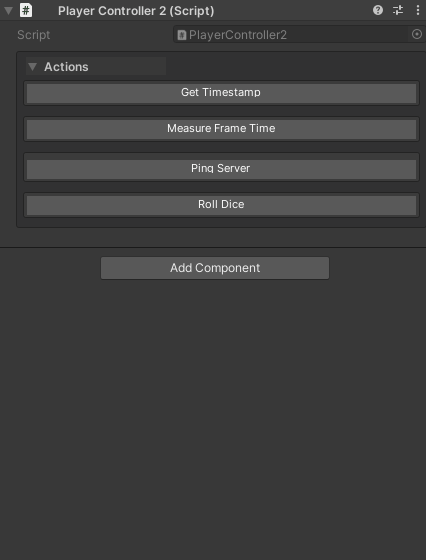

**Performance tip:** Use lower values (`1-3`) for methods called frequently to reduce memory usage.

---

### colorKey (string, optional)

**Applies custom color themes to buttons using predefined color keys.**

- **Default:** `null` (uses default button color)
- **Common values:** `"Default"`, `"Default-Light"`, `"Default-Dark"`, or custom keys
- **Configure in:** Edit → Project Settings → Unity Helpers → WButton Color Palettes

```csharp
// Default blue button
[WButton("Standard Action")]
private void StandardAction() { }

// Custom themed button (requires setup in project settings)
[WButton("Dangerous Action", colorKey: "Danger")]
private void DangerousAction() { }

[WButton("Success Action", colorKey: "Success")]
private void SuccessAction() { }

[WButton("Warning Action", colorKey: "Warning")]
private void WarningAction() { }
```


**Setting up custom colors:**

1. Open Edit → Project Settings → Unity Helpers
2. Navigate to WButton Color Palettes
3. Add a new color key (e.g., `"Danger"`)
4. Set background/text colors
5. Use the key in your `[WButton]` attribute


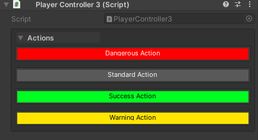

---

### groupName (string, optional)

**Organizes buttons under labeled group headers.**

- **Default:** `null` (no group header)
- **Behavior:** All buttons with the same `groupName` are merged into a single group
- **Best practice:** Use with `groupPlacement` and `groupPriority` to control where groups appear

```csharp
public class GameManager : MonoBehaviour
{
    // "Debug Tools" group - will appear based on groupPlacement or global settings
    [WButton("Log State", groupName: "Debug Tools", groupPlacement: WButtonGroupPlacement.Top)]
    private void LogState() { }

    [WButton("Clear Console", groupName: "Debug Tools")]
    private void ClearConsole() { }

    // Inspector properties here
    public int currentLevel = 1;
    public bool debugMode = false;

    // "Save System" group - explicitly placed at bottom
    [WButton("Save Game", groupName: "Save System", groupPlacement: WButtonGroupPlacement.Bottom)]
    private void SaveGame() { }

    [WButton("Load Game", groupName: "Save System")]
    private void LoadGame() { }

    [WButton("Delete Save", groupName: "Save System")]
    private void DeleteSave() { }
}
```

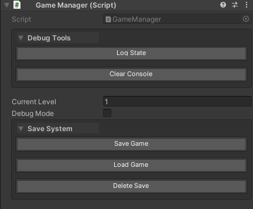

**Notes:**

- Group headers are collapsible (click the arrow to expand/collapse)
- Groups can be configured to start expanded or collapsed in project settings
- The first button in a group determines the group's canonical properties (groupPlacement, groupPriority, drawOrder)

---

### groupPriority (int, optional)

**Controls the render order of button groups within a placement section.**

- **Default:** `WButtonAttribute.NoGroupPriority` (renders after groups with explicit priorities)
- **Lower values render first** within the same placement (top or bottom)
- **Only applies** to buttons with a `groupName`; ungrouped buttons ignore this value

```csharp
public class ActionPanel : MonoBehaviour
{
    // This group renders FIRST (priority 0)
    [WButton("Quick Save", groupName: "Primary", groupPriority: 0)]
    private void QuickSave() { }

    [WButton("Quick Load", groupName: "Primary", groupPriority: 0)]
    private void QuickLoad() { }

    // This group renders SECOND (priority 10)
    [WButton("Debug Info", groupName: "Debug", groupPriority: 10)]
    private void ShowDebugInfo() { }

    // This group renders LAST (no explicit priority)
    [WButton("Reset", groupName: "Misc")]
    private void Reset() { }
}
```

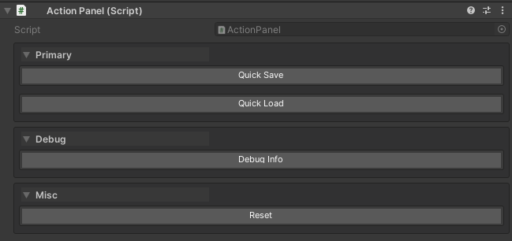

**Important:** The first declared button in a group sets the canonical priority for the entire group. If other buttons in the same group specify different priorities, they are ignored and a warning is displayed in the inspector.

```csharp
// ⚠️ WARNING: Conflicting priorities in the same group
[WButton("Action A", groupName: "Tools", groupPriority: 0)]  // This priority is used
private void ActionA() { }

[WButton("Action B", groupName: "Tools", groupPriority: 10)] // Ignored! Warning shown
private void ActionB() { }
```

---

### groupPlacement (WButtonGroupPlacement, optional)

**Controls where a button group renders, overriding the global Unity Helpers setting.**

- **Default:** `WButtonGroupPlacement.UseGlobalSetting`
- **Options:**
  - `UseGlobalSetting` — Respects the global setting in Project Settings
  - `Top` — Always render above inspector properties
  - `Bottom` — Always render below inspector properties
- **Only applies** to buttons with a `groupName`; ungrouped buttons ignore this value

```csharp
public class MixedPlacementExample : MonoBehaviour
{
    public int health = 100;
    public float speed = 5f;

    // This group ALWAYS renders at the top, regardless of global setting
    [WButton("Initialize", groupName: "Setup", groupPlacement: WButtonGroupPlacement.Top)]
    private void Initialize() { }

    [WButton("Validate", groupName: "Setup", groupPlacement: WButtonGroupPlacement.Top)]
    private void Validate() { }

    // Properties appear here (health, speed)

    // This group ALWAYS renders at the bottom, regardless of global setting
    [WButton("Cleanup", groupName: "Maintenance", groupPlacement: WButtonGroupPlacement.Bottom)]
    private void Cleanup() { }

    [WButton("Reset All", groupName: "Maintenance", groupPlacement: WButtonGroupPlacement.Bottom)]
    private void ResetAll() { }
}
```

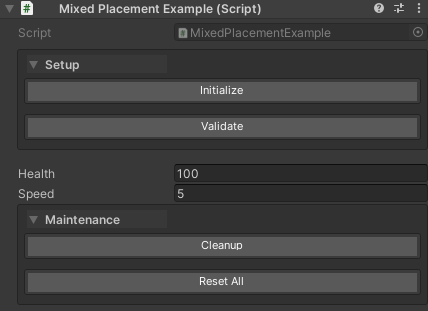

**Important:** Like `groupPriority`, the first declared button in a group sets the canonical placement for the entire group. Conflicting values from other buttons in the same group are ignored with a warning.

---

### Combining groupPriority and groupPlacement

Use both parameters together for fine-grained control:

```csharp
using UnityEngine;
using WallstopStudios.UnityHelpers.Core.Attributes;

[CreateAssetMenu(
    fileName = "AdvancedButtonLayout",
    menuName = "Wallstop Studios/Advanced Button Layout"
)]
public class AdvancedButtonLayout : ScriptableObject
{
    // TOP SECTION - ordered by priority
    [WButton(
        "Validate Data",
        groupName: "Validation",
        groupPriority: 1,
        groupPlacement: WButtonGroupPlacement.Top
    )]
    private void ValidateData() { }

    [WButton(
        "Generate IDs",
        groupName: "Authoring",
        groupPriority: 0,
        groupPlacement: WButtonGroupPlacement.Top
    )]
    private void GenerateIds() { }

    // Properties appear here

    public int property1;
    public string property2;

    // BOTTOM SECTION - ordered by priority

    [WButton(
        "Submit to Server",
        groupName: "Network",
        groupPriority: 10,
        groupPlacement: WButtonGroupPlacement.Bottom
    )]
    private void Submit() { }

    [WButton(
        "Export",
        groupName: "IO",
        groupPriority: 0,
        groupPlacement: WButtonGroupPlacement.Bottom
    )]
    private void Export() { }

    [WButton(
        "Import",
        groupName: "IO",
        groupPriority: 0,
        groupPlacement: WButtonGroupPlacement.Bottom
    )]
    private void Import() { }
}
```


**Rendering Order:**

1. **Top Section** (sorted by `groupPriority`):
   - Authoring (priority 0)
   - Validation (priority 1)
2. **Default Inspector Properties**
3. **Bottom Section** (sorted by `groupPriority`):
   - IO (priority 0)
   - Network (priority 10)

---

### Complete Example

```csharp
using UnityEngine;
using WallstopStudios.UnityHelpers.Core.Attributes;

public class LevelManager : MonoBehaviour
{
    public int currentLevel = 1;
    public bool debugMode = false;

    // Setup group - explicitly placed at top, renders first due to groupPriority: 0
    [WButton("Initialize Level", groupName: "Setup", groupPriority: 0, groupPlacement: WButtonGroupPlacement.Top)]
    private void Initialize()
    {
        Debug.Log("Level initialized!");
    }

    [WButton("✓ Validate Configuration", groupName: "Setup")]
    private void ValidateConfig()
    {
        Debug.Log("Configuration valid!");
    }

    // Debug group - explicitly placed at top, renders second due to groupPriority: 1
    [WButton("Roll Dice", historyCapacity: 10, groupName: "Debug", groupPriority: 1, groupPlacement: WButtonGroupPlacement.Top)]
    private int RollDice() => Random.Range(1, 7);

    [WButton("🎯 Spawn Test Enemy", colorKey: "Warning", groupName: "Debug")]
    private void SpawnTestEnemy()
    {
        // Spawn logic here
    }

    // Properties appear here in the inspector

    // Actions group - explicitly placed at bottom, renders first in bottom section due to groupPriority: 0
    [WButton("▶ Start Level", colorKey: "Success", groupName: "Actions", groupPriority: 0, groupPlacement: WButtonGroupPlacement.Bottom)]
    private void StartLevel()
    {
        Debug.Log($"Starting level {currentLevel}...");
    }

    [WButton("⏸ Pause Game", groupName: "Actions")]
    private void PauseGame()
    {
        Time.timeScale = 0f;
    }

    [WButton("🔄 Restart Level", colorKey: "Danger", groupName: "Actions")]
    private void RestartLevel()
    {
        // Restart logic here
    }

    // Maintenance group - explicitly placed at bottom, renders last in bottom section due to groupPriority: 10
    [WButton("Clear Cache", historyCapacity: 1, groupName: "Maintenance", groupPriority: 10, groupPlacement: WButtonGroupPlacement.Bottom)]
    private string ClearCache()
    {
        return $"Cache cleared at {System.DateTime.Now:HH:mm:ss}";
    }
}
```

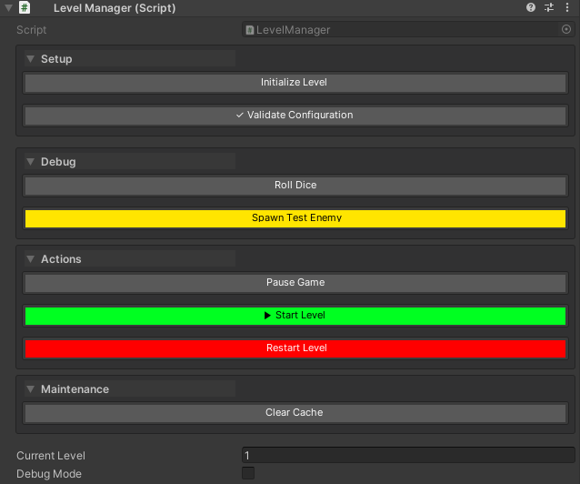

---

## Execution Types

WButton supports four method signatures:

### 1. Void Methods (Immediate)

```csharp
[WButton("Log Message")]
private void LogMessage()
{
    Debug.Log("Button clicked!");
}
```

**Behavior:** Executes immediately, no return value shown

---

### 2. Returning Values (With History)

```csharp
[WButton("Roll Dice", historyCapacity: 10, groupName: "Debug")]
private int RollDice()
{
    return Random.Range(1, 7);
}

[WButton("Get Position")]
private Vector3 GetPlayerPosition()
{
    return transform.position;
}
```

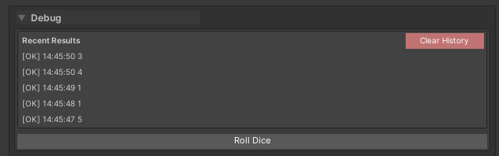


**Behavior:** Shows return value in a collapsible history panel

---

### 3. Coroutines (IEnumerator)

```csharp
[WButton("Fade Out")]
private IEnumerator FadeOut()
{
    SpriteRenderer sprite = GetComponent<SpriteRenderer>();
    Color color = sprite.color;

    for (float t = 1f; t >= 0f; t -= Time.deltaTime)
    {
        color.a = t;
        sprite.color = color;
        yield return null;
    }

    Debug.Log("Fade complete!");
}
```


**Behavior:**

- Shows "Running..." status
- Spinner animation during execution
- "Complete" message when finished

---

### 4. Async Methods (Task / ValueTask)

```csharp
using System.Threading;
using System.Threading.Tasks;

[WButton("Load Data")]
private async Task<string> LoadDataAsync(CancellationToken ct)
{
    Debug.Log("Loading...");
    await Task.Delay(2000, ct);  // Simulate async work
    return "Data loaded successfully!";
}

[WButton("Download Asset")]
private async ValueTask<Texture2D> DownloadAssetAsync(CancellationToken ct)
{
    Debug.Log("Downloading...");
    await Task.Delay(1000, ct);
    // Simulate download
    return new Texture2D(256, 256);
}
```


**Behavior:**

- Automatic `CancellationToken` injection (optional parameter)
- "Cancel" button appears during execution
- Result shown in history when complete
- Exceptions logged to console

**Cancellation Example:**

```csharp
[WButton("Long Operation")]
private async Task LongOperationAsync(CancellationToken ct)
{
    for (int i = 0; i < 10; i++)
    {
        ct.ThrowIfCancellationRequested();  // Check cancellation
        Debug.Log($"Step {i + 1}/10");
        await Task.Delay(500, ct);
    }
    return Task.CompletedTask;
}
```

**Supported Signatures:**

- `Task` (void async)
- `Task<T>` (async with a result)
- `ValueTask` (void async, no heap allocation)
- `ValueTask<T>` (async with a result, no heap allocation)

---

## Result History

### Automatic History

```csharp
[WButton("Generate ID", historyCapacity: 10)]
private string GenerateId()
{
    return System.Guid.NewGuid().ToString().Substring(0, 8);
}
```

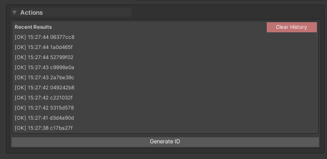

**Features:**

- Per-method, per-target buffering (history survives inspector refresh)
- Collapsible foldout for each method
- Chronological order (newest first)
- Pagination when history exceeds the display threshold

---

### History Capacity Options

```csharp
// Use global setting (default: 5, configurable in UnityHelpersSettings)
[WButton("Use Global")]
private int UseGlobal() => Random.Range(1, 100);

// Custom capacity per method
[WButton("Keep 20 Results", historyCapacity: 20)]
private float KeepMany() => Random.value;

// Disable history (0 capacity)
[WButton("No History", historyCapacity: 0)]
private void NoHistory() => Debug.Log("No history stored");
```

**Global Setting:** `UnityHelpersSettings.WButtonHistorySize` (default: 5, range: 1-10)

---

## Draw Order & Positioning

Control the sort order of buttons within their placement section:

```csharp
public class ButtonPositioning : MonoBehaviour
{
    // Buttons are sorted by drawOrder (lower values first)
    [WButton("Top Button", drawOrder: -1)]
    private void TopButton() => Debug.Log("Renders first (lowest drawOrder)");

    [WButton("Middle Button", drawOrder: 0)]
    private void MiddleButton() => Debug.Log("Renders second");

    [WButton("Bottom Button", drawOrder: 1)]
    private void BottomButton() => Debug.Log("Renders last (highest drawOrder)");

    // Inspector fields - buttons appear above or below based on groupPlacement/global settings
    public int someField = 10;
}
```

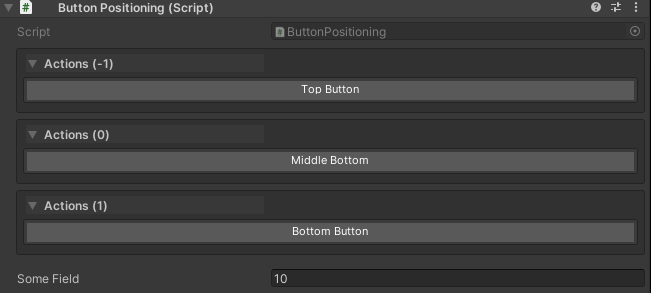

**Positioning Rules:**

- **Lower `drawOrder` values render first** within a placement section
- **Placement (above/below properties)** is controlled by `groupPlacement` or the global `WButtonPlacement` setting, not by `drawOrder`
- **Within the same `drawOrder`**, buttons render in declaration order (source code order)

---

### Pagination by Draw Order

```csharp
[WButton(drawOrder: 0)]
private void Action1() {}

[WButton( drawOrder: 0)]
private void Action2() {}

// ... 10 more buttons with drawOrder: 0 ...

[WButton(drawOrder: 0)]
private void Action12() {}
```

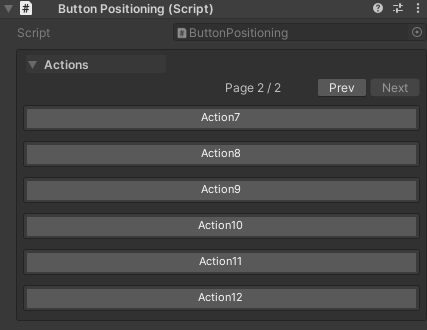

**Pagination Settings:**

- Page size controlled by `UnityHelpersSettings.WButtonPageSize` (default: 6)
- Pagination only applies within each draw order group
- Navigation: First, Previous, Next, Last buttons

---

## Grouping

Organize buttons into named sections:

```csharp
[WButton("Spawn Enemy", groupName: "Combat")]
private void SpawnEnemy() => Debug.Log("Enemy spawned");

[WButton("Clear Enemies", groupName: "Combat")]
private void ClearEnemies() => Debug.Log("Enemies cleared");

[WButton("Save Game", groupName: "Persistence")]
private void SaveGame() => Debug.Log("Game saved");

[WButton("Load Game", groupName: "Persistence")]
private void LoadGame() => Debug.Log("Game loaded");
```

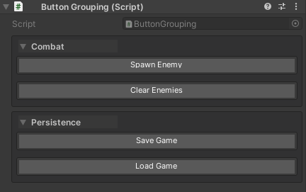

**Grouping Behavior:**

- Groups are created automatically based on `groupName`
- Buttons within a group are organized by `drawOrder`
- Groups can be collapsible (controlled by `UnityHelpersSettings.WButtonFoldoutBehavior`)

---

### Foldout Behavior

**Global Setting:** `UnityHelpersSettings.WButtonFoldoutBehavior`

**Options:**

- `Always` - Always show group foldout triangles
- `StartExpanded` - Collapsible, starts open
- `StartCollapsed` - Collapsible, starts closed

**Animation:**

- Enable/disable via `UnityHelpersSettings.WButtonFoldoutTweenEnabled`
- Speed controlled by `UnityHelpersSettings.WButtonFoldoutSpeed` (default: 2.0, range: 2-12)


---

## Color Theming

```csharp
[WButton("Dangerous Action", colorKey: "Default-Dark")]
private void DangerousAction() => Debug.LogWarning("Dangerous!");

[WButton("Safe Action", colorKey: "Default-Light")]
private void SafeAction() => Debug.Log("Safe operation");
```


**Built-in Priorities (Color Keys):**

- `"Default"` - Theme-aware (adapts to Unity theme)
- `"Default-Dark"` - Dark theme colors
- `"Default-Light"` - Light theme colors
- `"WDefault"` - Legacy vibrant blue
- Custom keys defined in `UnityHelpersSettings.WButtonCustomColors`

**Define Custom Colors:**

1. Open `ProjectSettings/UnityHelpersSettings.asset`
2. Add entry to `WButtonCustomColors` dictionary
3. Set a button background, text color, border


---

## Configuration

### Global Settings

All buttons respect project-wide settings defined in `UnityHelpersSettings`:

**Location:** `ProjectSettings/UnityHelpersSettings.asset`

**Settings:**

- `WButtonHistorySize` (default: 5, range: 1-10) - Results to keep per method
- `WButtonPlacement` (Top or Bottom) - Default button position
- `WButtonFoldoutBehavior` (Always, StartExpanded, StartCollapsed) - Group collapsibility
- `WButtonFoldoutTweenEnabled` (bool) - Enable group animations
- `WButtonFoldoutSpeed` (default: 2.0, range: 2-12) - Animation speed
- `WButtonPageSize` (default: 6) - Buttons per page for pagination
- `WButtonCustomColors` - Custom color palette dictionary


---

## Best Practices

### 1. Clear Button Names

```csharp
// ✅ GOOD: Action-oriented, descriptive
[WButton("Heal to Full")]
private void HealToFull() { ... }

[WButton("Spawn 10 Enemies")]
private void SpawnEnemies() { ... }

// ❌ BAD: Vague or technical
[WButton("DoStuff")]
private void DoStuff() { ... }

[WButton]  // Defaults to method name "HandlePlayerDeath"
private void HandlePlayerDeath() { ... }
```

---

### 2. Group Related Actions

```csharp
// ✅ GOOD: Grouped by feature
[WButton("Spawn Enemy", groupName: "Combat Testing")]
private void SpawnEnemy() { ... }

[WButton("Kill All Enemies", groupName: "Combat Testing")]
private void KillAll() { ... }

[WButton("Save Progress", groupName: "Persistence")]
private void Save() { ... }

// ❌ BAD: No grouping, cluttered inspector
[WButton("Spawn Enemy")]
private void SpawnEnemy() { ... }

[WButton("Save Progress")]
private void Save() { ... }

[WButton("Kill All Enemies")]
private void KillAll() { ... }
```

---

### 3. Use History for Random/Variable Results

```csharp
// ✅ GOOD: History helps track random values
[WButton("Roll Loot", historyCapacity: 10)]
private string RollLoot()
{
    return lootTable[PRNG.Instance.Next(0, lootTable.Length)];
}

// ✅ GOOD: No history needed for fixed actions
[WButton("Reset Position", historyCapacity: 0)]
private void ResetPosition()
{
    transform.position = Vector3.zero;
}
```

---

### 4. Async Best Practices

```csharp
// ✅ GOOD: Accept CancellationToken, check it
[WButton("Long Task")]
private async Task LongTaskAsync(CancellationToken ct)
{
    for (int i = 0; i < 100; i++)
    {
        ct.ThrowIfCancellationRequested();
        await Task.Delay(100, ct);
    }
}

// ✅ GOOD: Handle exceptions gracefully
[WButton("Risky Operation")]
private async Task RiskyOperationAsync()
{
    try
    {
        await SomeRiskyApiCall();
    }
    catch (Exception ex)
    {
        Debug.LogError($"Operation failed: {ex.Message}");
    }
}

// ❌ BAD: Long operation with no cancellation support
[WButton("Infinite Loop")]
private async Task InfiniteLoopAsync()
{
    while (true)  // No way to stop this!
    {
        await Task.Delay(1000);
    }
}
```

---

### 5. Color Usage

```csharp
// ✅ GOOD: Use colors to indicate risk/importance
[WButton("Delete All Data", colorKey: "Default-Dark")]  // Dark = danger
private void DeleteAllData() { ... }

[WButton("Quick Save", colorKey: "Default-Light")]  // Light = safe
private void QuickSave() { ... }

// ❌ BAD: Random colors without meaning
[WButton("Log Message", colorKey: "CustomPurple")]  // Why purple?
private void LogMessage() { ... }
```

---

## Examples

### Example 1: Gameplay Testing

```csharp
using UnityEngine;
using WallstopStudios.UnityHelpers.Core.Attributes;

public class PlayerDebug : MonoBehaviour
{
    public int health = 100;
    public int gold = 0;

    [WButton("Heal", groupName: "Health", colorKey: "Default-Light")]
    private void Heal()
    {
        health = 100;
        Debug.Log("Player healed!");
    }

    [WButton("Take Damage", groupName: "Health")]
    private void TakeDamage()
    {
        health -= 25;
        Debug.Log($"Took damage! Health: {health}");
    }

    [WButton("Kill Player", groupName: "Health", colorKey: "Default-Dark")]
    private void Kill()
    {
        health = 0;
        Debug.LogWarning("Player died!");
    }

    [WButton("Add Gold", groupName: "Economy")]
    private void AddGold()
    {
        gold += 100;
        Debug.Log($"Gold: {gold}");
    }

    [WButton("Roll Reward", groupName: "Economy", historyCapacity: 10)]
    private int RollReward()
    {
        int amount = PRNG.Instance.Next(10, 100);
        gold += amount;
        return amount;
    }
}
```


---

### Example 2: Async Data Loading

```csharp
using UnityEngine;
using System.Threading;
using System.Threading.Tasks;
using WallstopStudios.UnityHelpers.Core.Attributes;

public class DataManager : MonoBehaviour
{
    [WButton("Load Player Data")]
    private async Task<string> LoadPlayerDataAsync(CancellationToken ct)
    {
        Debug.Log("Loading player data...");

        // Simulate network request
        await Task.Delay(2000, ct);

        string playerName = "TestPlayer_" + Random.Range(1000, 9999);
        Debug.Log($"Loaded: {playerName}");

        return playerName;
    }

    [WButton("Batch Load", historyCapacity: 5)]
    private async Task<int> BatchLoadAsync(CancellationToken ct)
    {
        int count = 0;
        for (int i = 0; i < 10; i++)
        {
            ct.ThrowIfCancellationRequested();
            await Task.Delay(200, ct);
            count++;
            Debug.Log($"Loaded item {count}/10");
        }
        return count;
    }
}
```

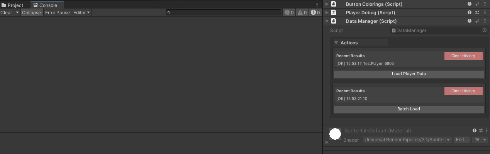

---

### Example 3: Procedural Generation Testing

```csharp
using UnityEngine;
using WallstopStudios.UnityHelpers.Core.Attributes;

public class LevelGenerator : MonoBehaviour
{
    [WButton("Generate Seed", historyCapacity: 20)]
    private int GenerateSeed()
    {
        return Random.Range(1000, 9999);
    }

    [WButton("Generate Level")]
    private void GenerateLevel()
    {
        int seed = Random.Range(1000, 9999);
        Random.InitState(seed);
        Debug.Log($"Generating level with seed: {seed}");
        // ... generation logic ...
    }

    [WButton("Clear Level", colorKey: "Default-Dark")]
    private void ClearLevel()
    {
        // ... cleanup logic ...
        Debug.Log("Level cleared");
    }

    [WButton("Generate with Seed")]
    private void GenerateWithSeed(int seed)
    {
        Random.InitState(seed);
        Debug.Log($"Generating with seed: {seed}");
        // ... generation logic ...
    }
}
```

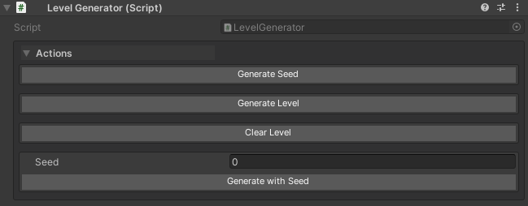

---

### Example 4: Coroutine Animation Testing

```csharp
using System.Collections;
using UnityEngine;
using WallstopStudios.UnityHelpers.Core.Attributes;

public class AnimationTester : MonoBehaviour
{
    public SpriteRenderer spriteRenderer;

    private void Awake()
    {
        spriteRenderer = GetComponent<SpriteRenderer>();
    }

    [WButton("Fade Out", groupName: "Animations")]
    private IEnumerator FadeOutCoroutine()
    {
        Color color = spriteRenderer.color;
        while (color.a > 0f)
        {
            color.a -= Time.deltaTime;
            spriteRenderer.color = color;
            yield return null;
        }
        Debug.Log("Fade out complete");
    }

    [WButton("Fade In", groupName: "Animations")]
    private IEnumerator FadeInCoroutine()
    {
        Color color = spriteRenderer.color;
        while (color.a < 1f)
        {
            color.a += Time.deltaTime;
            spriteRenderer.color = color;
            yield return null;
        }
        Debug.Log("Fade in complete");
    }

    [WButton("Pulse", groupName: "Animations")]
    private IEnumerator PulseCoroutine()
    {
        Vector3 originalScale = transform.localScale;
        for (int i = 0; i < 3; i++)
        {
            transform.localScale = originalScale * 1.2f;
            yield return new WaitForSeconds(0.2f);
            transform.localScale = originalScale;
            yield return new WaitForSeconds(0.2f);
        }
        Debug.Log("Pulse complete");
    }
}
```

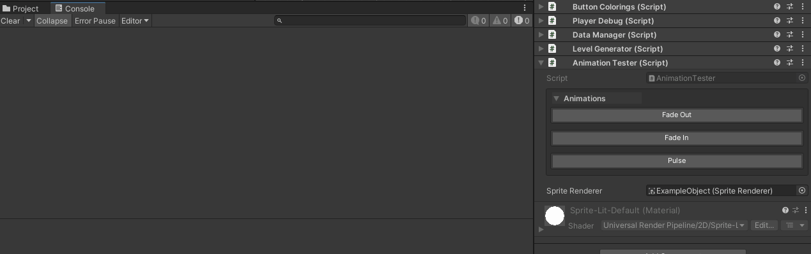

---

## Using WButton with Custom Editors

### Overview

WButton works automatically with:

- All Unity Objects (`MonoBehaviour`, `ScriptableObject`, etc.)
- **Odin Inspector's `SerializedMonoBehaviour` and `SerializedScriptableObject`** (when `ODIN_INSPECTOR` is defined)

**When do you need `WButtonEditorHelper`?**

Only when you create **custom Odin editors** that override the default behavior. For example, if you create a `CustomEditor` that inherits from `OdinEditor` for a specific type, you'll need to integrate WButton manually.

---

### Automatic Integration with Odin Inspector

**No setup required!** WButton automatically works with Odin's base types:

```csharp
#if ODIN_INSPECTOR
using Sirenix.OdinInspector;
#endif
using UnityEngine;
using WallstopStudios.UnityHelpers.Core.Attributes;

#if ODIN_INSPECTOR
public class MyComponent : SerializedMonoBehaviour
#else
public class MyComponent : MonoBehaviour
#endif
{
    [WButton("Test Button")]
    private void TestMethod()
    {
        Debug.Log("Button clicked!");
    }
}
```

WButton will appear automatically in the inspector - no additional code needed!

---

### Integration with Custom Odin Editors

If you create a **custom Odin editor** for your type, you need to manually integrate WButton using `WButtonEditorHelper`:

```csharp
#if UNITY_EDITOR && ODIN_INSPECTOR
using Sirenix.OdinInspector.Editor;
using UnityEditor;
using WallstopStudios.UnityHelpers.Editor.Utils.WButton;

// Custom editor for a specific type
[CustomEditor(typeof(MyComponent))]
public class MyComponentEditor : OdinEditor
{
    private WButtonEditorHelper _wButtonHelper;

    protected override void OnEnable()
    {
        base.OnEnable();
        _wButtonHelper = new WButtonEditorHelper();
    }

    public override void OnInspectorGUI()
    {
        // Draw WButtons at top (optional - based on your settings)
        _wButtonHelper.DrawButtonsAtTop(this);

        // Draw Odin inspector
        base.OnInspectorGUI();

        // Draw WButtons at bottom and process any invocations
        _wButtonHelper.DrawButtonsAtBottomAndProcessInvocations(this);
    }
}
#endif
```

---

### Integration with Standard Custom Editors

For standard Unity custom editors:

```csharp
#if UNITY_EDITOR
using UnityEditor;
using UnityEngine;
using WallstopStudios.UnityHelpers.Editor.Utils.WButton;

[CustomEditor(typeof(MyComponent))]
public class MyComponentEditor : Editor
{
    private WButtonEditorHelper _wButtonHelper;

    private void OnEnable()
    {
        _wButtonHelper = new WButtonEditorHelper();
    }

    public override void OnInspectorGUI()
    {
        serializedObject.Update();

        // Draw WButtons at top
        _wButtonHelper.DrawButtonsAtTop(this);

        // Draw your custom inspector
        DrawDefaultInspector();

        serializedObject.ApplyModifiedProperties();

        // Draw WButtons at bottom and process invocations
        _wButtonHelper.DrawButtonsAtBottomAndProcessInvocations(this);
    }
}
#endif
```

---

### WButtonEditorHelper API

The `WButtonEditorHelper` class provides several methods for different use cases:

| Method                                             | Description                                                            |
| -------------------------------------------------- | ---------------------------------------------------------------------- |
| `DrawButtonsAtTop(Editor)`                         | Draws buttons configured for top placement                             |
| `DrawButtonsAtBottom(Editor)`                      | Draws buttons configured for bottom placement                          |
| `ProcessInvocations()`                             | Processes any triggered button invocations                             |
| `DrawButtonsAtBottomAndProcessInvocations(Editor)` | Convenience method combining bottom drawing + processing (most common) |
| `DrawAllButtonsAndProcessInvocations(Editor)`      | Draws all buttons in one location regardless of placement settings     |

**Key Points:**

1. Create one `WButtonEditorHelper` instance per editor (typically in `OnEnable`)
2. Call `DrawButtonsAtTop` before your inspector content
3. Call `DrawButtonsAtBottomAndProcessInvocations` after your inspector content
4. Always call `ProcessInvocations()` after all button drawing is complete

---

### Single Location Button Drawing

If you prefer all buttons in one location regardless of placement settings:

```csharp
public override void OnInspectorGUI()
{
    // Your inspector code here
    DrawDefaultInspector();

    // Draw all buttons at the end
    _wButtonHelper.DrawAllButtonsAndProcessInvocations(this);
}
```

---

## Troubleshooting

### Button Not Appearing

**Problem:** Method has `[WButton]` but button doesn't show

**Solutions:**

1. Ensure method is `private` or `protected` (public methods may conflict)
2. Verify the component is enabled and active

---

### History Not Showing

**Problem:** Method returns a value but no history appears

**Solutions:**

1. Check `historyCapacity` - make sure it's > 0
2. Verify that the return type is serializable
3. Check `UnityHelpersSettings.WButtonHistorySize` if using global setting

---

### Async Method Not Cancelling

**Problem:** Cancel button doesn't stop an async method

**Solutions:**

1. Ensure method accepts `CancellationToken` parameter
2. Check token periodically: `ct.ThrowIfCancellationRequested()`
3. Pass token to async operations: `await Task.Delay(1000, ct)`

```csharp
// ✅ CORRECT: Cancellable
[WButton("Long Task")]
private async Task LongTaskAsync(CancellationToken ct)
{
    for (int i = 0; i < 100; i++)
    {
        ct.ThrowIfCancellationRequested();  // Check token
        await Task.Delay(100, ct);  // Pass token
    }
}
```

---

## See Also

- **[Inspector Overview](./inspector-overview.md)** - Complete inspector features overview
- **[Inspector Grouping Attributes](./inspector-grouping-attributes.md)** - WGroup layouts
- **[Inspector Settings](./inspector-settings.md)** - Configuration reference
- **[Editor Tools Guide](../editor-tools/editor-tools-guide.md)** - Other editor utilities

---

**Next Steps:**

- Add buttons to your components for quick testing
- Experiment with `groupName` to organize buttons
- Try async methods with `CancellationToken` support
- Customize colors in `UnityHelpersSettings.asset`
