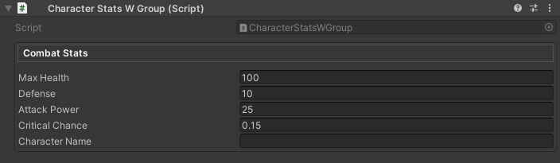
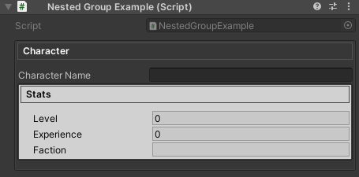
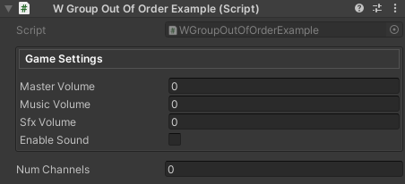
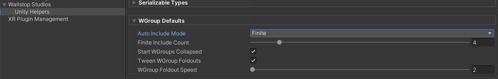
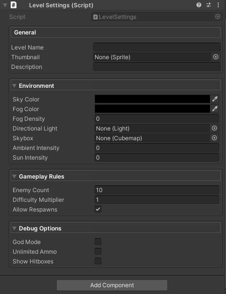
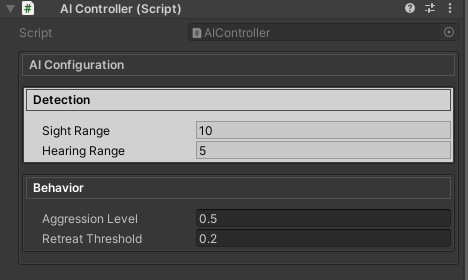

---
---

# Inspector Grouping Attributes

**Organize your inspector without writing custom editors.**

Unity Helpers provides powerful grouping attributes that create boxed sections and collapsible foldouts with zero boilerplate. These attributes rival commercial tools like Odin Inspector while offering unique features like auto-inclusion.

---

## Table of Contents

- [WGroup & WGroupEnd](#wgroup--wgroupend)
- [Common Features](#common-features)
- [Configuration](#configuration)
- [Best Practices](#best-practices)
- [Examples](#examples)

---

<a id="wgroup--wgroupend"></a>
<a id="wgroup-wgroupend"></a>

## WGroup & WGroupEnd

Creates boxed inspector sections with optional collapsible headers and automatic field inclusion.

> ⚠️ **Important:** `[WGroupEnd]` must be placed on the **last field you want included** in the group. The field with `[WGroupEnd]` IS included in the group, and then the group closes for subsequent fields.

### Basic Usage

```csharp
using UnityEngine;
using WallstopStudios.UnityHelpers.Core.Attributes;

public class CharacterStatsWGroup : MonoBehaviour
{
    // Simple box with 4 fields
    [WGroup("combat", "Combat Stats")]
    public float maxHealth = 100f;
    public float defense = 10f;
    public float attackPower = 25f;
    [WGroupEnd("combat")]  // criticalChance IS included, then group closes
    public float criticalChance = 0.15f;

    public string characterName; // Not in group (comes after WGroupEnd)
}
```



### Parameters

```csharp
[WGroup(
    string groupName,                    // Required: Unique identifier
    string displayName = null,           // Optional: Header text (defaults to groupName)
    int autoIncludeCount = UseGlobalAutoInclude,  // Auto-include N fields (or use global setting)
    bool collapsible = false,            // Enable foldout behavior
    bool startCollapsed = false,         // Initial collapsed state
    bool hideHeader = false,             // Draw body without header bar
    string parentGroup = null            // Optional: Nest inside another group
)]
```

> 💡 Use the optional `CollapseBehavior` named argument (or `startCollapsed: true`) to override the project-wide default configured under **Project Settings ▸ Wallstop Studios ▸ Unity Helpers ▸ Start WGroups Collapsed**. Example:
>
> ```csharp
> [WGroup(
>     "advanced",
>     collapsible: true,
>     CollapseBehavior = WGroupAttribute.WGroupCollapseBehavior.ForceExpanded
> )]
> ```

`CollapseBehavior` options:

- `UseProjectSetting` (default) – defers to the Unity Helpers project setting.
- `ForceExpanded` – always starts expanded.
- `ForceCollapsed` – always starts collapsed (equivalent to `startCollapsed: true`).

---

### Auto-Inclusion Modes

#### 1. Explicit Count

```csharp
[WGroup("items", "Inventory", autoIncludeCount: 3)]
public GameObject weapon;     // Field 1: in group
public GameObject armor;      // Field 2: in group (auto-included)
[WGroupEnd("items")]          // accessory IS included (field 3), then group closes
public GameObject accessory;  // Field 3: in group (last field)

public int gold;  // NOT in group (comes after WGroupEnd)
```

#### 2. Infinite Auto-Include

```csharp
[WGroup("settings", "Settings", autoIncludeCount: WGroupAttribute.InfiniteAutoInclude)]
public bool enableSound;   // In group
public bool enableMusic;   // In group (auto-included)
public float volume;       // In group (auto-included)
// ... 20 more fields ...  // All auto-included
[WGroupEnd("settings")]    // lastField IS included, then group closes
public bool lastField;     // In group (last field)

public int outsideGroup;   // NOT in group (comes after WGroupEnd)
```

#### 3. Global Default

```csharp
// Uses WGroupAutoIncludeRowCount from ProjectSettings/UnityHelpersSettings.asset (default: 4)
[WGroup("stats", "Stats")]  // autoIncludeCount defaults to UseGlobalAutoInclude
public int strength;        // Field 1: in group
public int intelligence;    // Field 2: in group (auto-included)
public int agility;         // Field 3: in group (auto-included)
[WGroupEnd("stats")]        // luck IS included (field 4), then group closes
public int luck;            // Field 4: in group (last field)
```

---

### Collapsible Groups

```csharp
using UnityEngine;
using WallstopStudios.UnityHelpers.Core.Attributes;

public class WGroupEndExample : MonoBehaviour
{
    [WGroup("advanced", "Advanced Options", collapsible: true, startCollapsed: true)]
    public float raycastDistance = 100f;  // In group
    public LayerMask collisionMask;       // In group (auto-included)

    [WGroupEnd("advanced")]               // debugDraw IS included, then group closes
    public bool debugDraw;                // In group (last field)

    public bool someOtherField;           // NOT in group (comes after WGroupEnd)
}
```


**Animation Settings:**

- Speed controlled by `UnityHelpersSettings.WGroupFoldoutSpeed` (default: 2.0, range: 2.0-12.0)
- Enable/disable via `UnityHelpersSettings.WGroupFoldoutTweenEnabled` (default: enabled)

Configure in **Project Settings → Unity Helpers** or see [Inspector Settings](./inspector-settings.md#wgroup-settings) for details.

---

### Hiding Headers

```csharp
using UnityEngine;
using WallstopStudios.UnityHelpers.Core.Attributes;

public class HealthExample : MonoBehaviour
{
    [WGroup("stealth", "", hideHeader: true)]
    public float opacity = 1f;       // In group

    [WGroupEnd("stealth")]           // isVisible IS included, then group closes
    public bool isVisible = true;    // In group (last field)
}
```


**Use Cases:**

- Visual separation without labels
- Nested grouping styles
- Minimalist inspector layouts

---

### Nested Groups

Use the `parentGroup` parameter to nest one group inside another. Nested groups render visually inside their parent's box, with accumulated indentation and padding.

```csharp
using UnityEngine;
using WallstopStudios.UnityHelpers.Core.Attributes;

public class NestedGroupExample : MonoBehaviour
{
    [WGroup("outer", "Character")]
    public string characterName;      // In outer group

    [WGroup("inner", "Stats", parentGroup: "outer")]
    public int level;                 // In inner group (nested in outer)
    public int experience;            // In inner group (auto-included)

    [WGroupEnd("inner")]              // faction IS included in BOTH groups
    [WGroupEnd("outer")]              // Then both groups close
    public string faction;            // In inner AND outer groups (last field)
}
```



**How Nesting Works:**

1. Declare the parent group first with `[WGroup("outer", ...)]`
2. Declare child group with `parentGroup: "outer"` parameter
3. Child groups are rendered recursively inside parent content areas
4. Indentation and padding accumulate for each nesting level
5. Each group maintains its own foldout state when collapsible

**Multiple Nesting Levels:**

```csharp
[WGroup("level1", "Level 1")]
public string field1;           // In level1 only

[WGroup("level2", "Level 2", parentGroup: "level1")]
public string field2;           // In level2 (nested in level1)

[WGroup("level3", "Level 3", parentGroup: "level2")]
public string field3;           // In level3 (nested in level2 → level1)
[WGroupEnd("level3")]           // field4 IS included in all three groups
[WGroupEnd("level2")]           // Then all groups close in order
[WGroupEnd("level1")]
public string field4;           // In level3, level2, AND level1 (last field)
```

**Sibling Nested Groups:**

```csharp
[WGroup("parent", "Parent")]
public string parentField;      // In parent group

[WGroup("child1", "Child 1", parentGroup: "parent")]
public string child1Field;      // In child1 (nested in parent)

[WGroupEnd("child1")]           // child2Field starts NEW group, so closes child1 first
[WGroup("child2", "Child 2", parentGroup: "parent")]
public string child2Field;      // In child2 (nested in parent)

[WGroupEnd("child2")]           // afterParent IS included in child2 AND parent
[WGroupEnd("parent")]           // Then both groups close
public string afterParent;      // In child2 AND parent groups (last field)
```

**Important Notes:**

- Parent group must be declared before or on the same property as the child
- Circular references are detected and logged as warnings; affected groups are treated as top-level
- If `parentGroup` references a non-existent group, the child is rendered as a top-level group

---

### WGroupEnd Variants

> ⚠️ **Key Point:** `[WGroupEnd]` must always be attached to a field. The field with `[WGroupEnd]` IS included in the group (via auto-include), and then the group closes.

#### 1. End Specific Group

```csharp
[WGroup("combat", "Combat Stats")]
public int health;              // In group
public int defense;             // In group (auto-included)
[WGroupEnd("combat")]           // stamina IS included, then "combat" closes
public int stamina;             // In group (last field)

public int unrelatedField;      // NOT in group
```

#### 2. End Multiple Groups

When closing nested groups, stack multiple `[WGroupEnd]` attributes on the last field:

```csharp
[WGroup("outer", "Outer")]
public int outerField;          // In outer

[WGroup("inner", "Inner", parentGroup: "outer")]
public int innerField;          // In inner (nested in outer)

[WGroupEnd("inner")]            // lastField IS included in both groups
[WGroupEnd("outer")]            // Then both groups close
public int lastField;           // In inner AND outer (last field)
```

#### 3. Close All Active Groups

Omit the group name to close all currently active auto-include groups:

```csharp
[WGroup("settings", autoIncludeCount: WGroupAttribute.InfiniteAutoInclude)]
public bool enableSound;        // In group
public float volume;            // In group (auto-included)
[WGroupEnd]                     // lastSetting IS included, then ALL groups close
public bool lastSetting;        // In group (last field)

public int outsideAllGroups;    // NOT in any group
```

---

## Common Features

### Auto-Include Constants

```csharp
public class WGroupAttribute
{
    public const int InfiniteAutoInclude = -1;    // Include until WGroupEnd
    public const int UseGlobalAutoInclude = -2;   // Default: use project setting
}
```

### Shared Group Names

```csharp
using UnityEngine;
using WallstopStudios.UnityHelpers.Core.Attributes;

public class WGroupOutOfOrderExample : MonoBehaviour
{
    [WGroup("settings", "Game Settings", autoIncludeCount: 1)]
    public float masterVolume;
    public float musicVolume;

    public int numChannels;

    // Later in the same script...
    [WGroup("settings", autoIncludeCount: 1)] // Reuses "Game Settings" header, included in original group
    public float sfxVolume;

    [WGroupEnd("settings")]
    public bool enableSound;
}
```



**Note:** Multiple `[WGroup]` attributes with the same `groupName` merge into a single group instance. This allows for logical grouping of related fields that may not be contiguous in code.

---

## Configuration

### Global Settings

All grouping attributes respect project-wide settings defined in `UnityHelpersSettings`:

**Location:** `ProjectSettings/UnityHelpersSettings.asset`

**Settings:**

- `WGroupAutoIncludeRowCount` (default: 4) - Default fields to auto-include
- `WGroupStartCollapsed` (default: true) - Whether collapsible groups start collapsed
- `WGroupFoldoutTweenEnabled` (default: true) - Enable expand/collapse animations
- `WGroupFoldoutSpeed` (default: 2.0, range: 2-12) - Animation speed



---

## Best Practices

### 1. Consistent Naming

```csharp
// ✅ GOOD: Clear, descriptive group names
[WGroup("combat", "Combat Stats")]
[WGroup("movement", "Movement Settings")]
[WGroup("visuals", "Visual Effects")]

// ❌ BAD: Vague or inconsistent
[WGroup("group1", "Stuff")]
[WGroup("misc", "Things")]
```

### 2. Auto-Inclusion Strategy

```csharp
// ✅ GOOD: Explicit count for small groups
[WGroup("position", "Position", autoIncludeCount: 3)]
public Vector3 position;        // Field 1: in group
public Quaternion rotation;     // Field 2: in group (auto-included)
[WGroupEnd("position")]         // scale IS included (field 3), then group closes
public Vector3 scale;           // Field 3: in group (last field)

// ✅ GOOD: Infinite for dynamic/long lists
[WGroup("inventory", "Items", autoIncludeCount: WGroupAttribute.InfiniteAutoInclude)]
public List<GameObject> weapons;      // In group
public List<GameObject> consumables;  // In group (auto-included)
// ... many more fields ...           // All auto-included
[WGroupEnd("inventory")]              // lastItem IS included, then group closes
public int lastItem;                  // In group (last field)

// ❌ BAD: Infinite without WGroupEnd (includes everything below!)
[WGroup("bad", autoIncludeCount: WGroupAttribute.InfiniteAutoInclude)]
public int field1;
public int field2;
// Oops, forgot [WGroupEnd]!
public string unrelatedField;  // Also included!
```

### 3. Collapsible vs. Always-Open

```csharp
// ✅ GOOD: Always-visible for frequently accessed data
[WGroup("core", "Core Stats", collapsible: false)]
public float health;          // In group
[WGroupEnd("core")]           // energy IS included, then group closes
public float energy;          // In group (last field)

// ✅ GOOD: Collapsible for optional/advanced features
[WGroup("advanced", "Advanced", collapsible: true, startCollapsed: true)]
public float debugParameter;       // In group
[WGroupEnd("advanced")]            // experimentalFeature IS included, then closes
public bool experimentalFeature;   // In group (last field)

// ❌ BAD: Everything collapsible (hides important data)
[WGroup("important", "Critical Settings", collapsible: true, startCollapsed: true, autoIncludeCount: 0)]
public float maxHealth;  // Why hide this?
```

---

## Examples

### Example 1: RPG Character Stats

```csharp
using System.Collections.Generic;
using UnityEngine;
using WallstopStudios.UnityHelpers.Core.Attributes;

public class RPGCharacter : MonoBehaviour
{
    [WGroup("identity", "Identity")]
    public string characterName;           // In identity group
    public Sprite portrait;                // In identity group (auto-included)
    public string className;               // In identity group (auto-included)

    [WGroupEnd("identity")]                // strength IS included, then identity closes
    [WGroup("attributes", "Base Attributes", collapsible: true)]
    public int strength = 10;              // In identity (last) AND starts attributes
    public int agility = 10;               // In attributes (auto-included)
    public int intelligence = 10;          // In attributes (auto-included)
    public int vitality = 10;              // In attributes (auto-included)

    [WGroupEnd("attributes")]              // maxHealth IS included, then attributes closes
    [WGroup("combat", "Combat Stats")]
    public float maxHealth = 100f;         // In attributes (last) AND starts combat
    public float attackPower = 25f;        // In combat (auto-included)
    public float defense = 15f;            // In combat (auto-included)

    [WGroupEnd("combat")]                  // learnedSkills IS included, then combat closes
    [WGroup("skills", "Skills", collapsible: true, startCollapsed: true)]
    public List<string> learnedSkills = new(); // In combat (last) AND starts skills

    [WGroupEnd("skills")]                  // skillPoints IS included, then skills closes
    public int skillPoints = 0;            // In skills (last field)
}
```


---

### Example 2: Weapon Configuration

```csharp
using UnityEngine;
using WallstopStudios.UnityHelpers.Core.Attributes;

public enum DamageType
{
    Physical,
    Magic,
}

public class WeaponConfig2 : MonoBehaviour
{
    [WGroup("basic", "Basic Info", autoIncludeCount: 2)]
    public string weaponName;              // Field 1: in basic group

    [WGroupEnd("basic")]                   // icon IS included (field 2), then closes
    public Sprite icon;                    // Field 2: in basic (last field)

    [WGroup("damage", "Damage", collapsible: true)]
    public float baseDamage = 10f;         // In damage group
    public float criticalMultiplier = 2f; // In damage (auto-included)

    [WGroupEnd("damage")]                  // damageType IS included, then closes
    public DamageType damageType;          // In damage (last field)

    [WGroup("effects", "Special Effects", collapsible: true, startCollapsed: true)]
    public ParticleSystem hitEffect;       // In effects group
    public AudioClip hitSound;             // In effects (auto-included)

    [WGroupEnd("effects")]                 // effectDuration IS included, then closes
    public float effectDuration = 1f;      // In effects (last field)

    [WGroup("advanced", "Advanced Settings", collapsible: true, startCollapsed: true)]
    public float projectileSpeed = 20f;    // In advanced group
    public LayerMask targetLayers;         // In advanced (auto-included)

    [WGroupEnd("advanced")]                // debugMode IS included, then closes
    public bool debugMode = false;         // In advanced (last field)
}
```


---

### Example 3: Dynamic Form with Many Fields

```csharp
using UnityEngine;
using WallstopStudios.UnityHelpers.Core.Attributes;

public class LevelSettings : MonoBehaviour
{
    [WGroup("general", "General", autoIncludeCount: 3)]
    public string levelName;               // Field 1: in general group
    public Sprite thumbnail;               // Field 2: in general (auto-included)

    [WGroupEnd("general")]                 // description IS included (field 3), then closes
    public string description;             // Field 3: in general (last field)

    [WGroup(
        "environment",
        "Environment",
        collapsible: true,
        startCollapsed: true,
        autoIncludeCount: WGroupAttribute.InfiniteAutoInclude
    )]
    public Color skyColor;                 // In environment group
    public Color fogColor;                 // In environment (auto-included)
    public float fogDensity;               // In environment (auto-included)
    public Light directionalLight;         // In environment (auto-included)
    public Cubemap skybox;                 // In environment (auto-included)
    public float ambientIntensity;         // In environment (auto-included)

    [WGroupEnd("environment")]             // sunIntensity IS included, then closes
    public float sunIntensity;             // In environment (last field)

    [WGroup("gameplay", "Gameplay Rules", collapsible: true, startCollapsed: false)]
    public int enemyCount = 10;            // In gameplay group
    public float difficultyMultiplier = 1f; // In gameplay (auto-included)

    [WGroupEnd("gameplay")]                // allowRespawns IS included, then closes
    public bool allowRespawns = true;      // In gameplay (last field)

    [WGroup("debug", "Debug Options", collapsible: true, startCollapsed: true)]
    public bool godMode = false;           // In debug group
    public bool unlimitedAmmo = false;     // In debug (auto-included)

    [WGroupEnd("debug")]                   // showHitboxes IS included, then closes
    public bool showHitboxes = false;      // In debug (last field)
}
```



---

### Example 4: Nested Configuration

```csharp
using UnityEngine;
using WallstopStudios.UnityHelpers.Core.Attributes;

public class AIController : MonoBehaviour
{
    [WGroup("outer", "AI Configuration")]
    [WGroup("detection", "Detection", parentGroup: "outer")]
    public float sightRange = 10f;         // In detection (nested in outer)

    [WGroupEnd("detection")]               // hearingRange IS included, then detection closes
    public float hearingRange = 5f;        // In detection (last) AND outer (auto-included)

    [WGroup("behavior", "Behavior", parentGroup: "outer")]
    public float aggressionLevel = 0.5f;   // In behavior (nested in outer)

    [WGroupEnd("behavior")]                // retreatThreshold IS included in both
    [WGroupEnd("outer")]                   // Then both groups close
    public float retreatThreshold = 0.2f;  // In behavior (last) AND outer (last)
}
```



---

## Troubleshooting

### Group Not Appearing

**Problem:** Fields not showing in a group

**Solutions:**

1. Check `autoIncludeCount` - make sure it includes all desired fields
2. Verify `WGroupEnd` placement - the field WITH `WGroupEnd` IS included, fields AFTER are excluded
3. Ensure group names match between `WGroup` and `WGroupEnd`

```csharp
// ❌ WRONG: Count too low (only 2 fields included, but intelligence has WGroupEnd)
[WGroup("stats", autoIncludeCount: 2)]
public int strength;      // Field 1: in group
public int agility;       // Field 2: in group (auto-included)
[WGroupEnd("stats")]      // intelligence would be field 3, but count is only 2!
public int intelligence;  // NOT included - auto-include budget exhausted before WGroupEnd


// ✅ CORRECT: Increase count to include the WGroupEnd field
[WGroup("stats", autoIncludeCount: 3)]
public int strength;      // Field 1: in group
public int agility;       // Field 2: in group (auto-included)
[WGroupEnd("stats")]      // intelligence IS included (field 3), then group closes
public int intelligence;  // Field 3: in group (last field)
```

---

### Animation Not Working

**Problem:** Groups don't animate when collapsed/expanded

**Solutions:**

1. Check `UnityHelpersSettings.WGroupFoldoutTweenEnabled` is `true`
2. Ensure `collapsible: true` is set for WGroup
3. Verify `WGroupFoldoutSpeed` isn't set too low (minimum is 2.0)
4. Open **Project Settings → Unity Helpers** to review settings

---

## Compatibility

WGroup operates at the inspector level, so existing property drawers and custom inspectors continue to work. Groups appear in the order of their first declaration, and multi-object editing remains fully supported.

---

## See Also

- **[Inspector Overview](./inspector-overview.md)** - Complete inspector features overview
- **[Inspector Buttons](./inspector-button.md)** - WButton for method invocation
- **[Inspector Settings](./inspector-settings.md)** - Configuration reference
- **[Editor Tools Guide](../editor-tools/editor-tools-guide.md)** - Other editor utilities

---

**Next Steps:**

- Try grouping your existing scripts with `[WGroup]`
- Explore `[WButton]` to add method buttons to your groups
