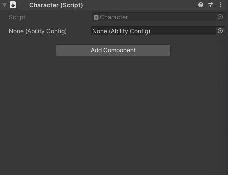
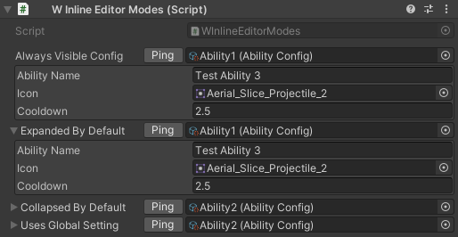
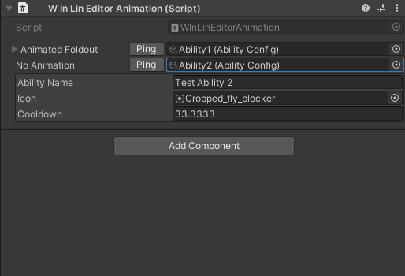

# Inspector Inline Editor (WInLineEditor)

**Edit nested objects without losing context.**

The `[WInLineEditor]` attribute embeds the inspector for object references (ScriptableObjects, Materials, Components, Textures, etc.) directly below the field. No more clicking through to edit configuration — everything stays in view.

---

## Table of Contents

- [Basic Usage](#basic-usage)
- [Display Modes](#display-modes)
- [Configuration Options](#configuration-options)
- [Animation Settings](#animation-settings)
- [Best Practices](#best-practices)
- [Examples](#examples)

---

## Basic Usage

```csharp
using UnityEngine;
using WallstopStudios.UnityHelpers.Core.Attributes;

public class AbilityConfig : ScriptableObject
{
    public string displayName;
    public float cooldown;
    public Sprite icon;
}

public class Character : MonoBehaviour
{
    [WInLineEditor]
    public AbilityConfig primaryAbility;  // Editable inline!
}
```

> **Visual Reference**
>
> 
>
> _WInLineEditor with embedded inspector for a ScriptableObject reference_

---

## Display Modes

Control how the inline editor appears using `WInLineEditorMode`:

| Mode               | Behavior                                        |
| ------------------ | ----------------------------------------------- |
| `AlwaysExpanded`   | Always shows the inline inspector (no foldout)  |
| `FoldoutExpanded`  | Shows a foldout that starts expanded            |
| `FoldoutCollapsed` | Shows a foldout that starts collapsed (default) |

```csharp
using UnityEngine;
using WallstopStudios.UnityHelpers.Core.Attributes;

public class WInlineEditorModes : MonoBehaviour
{
    // Always visible
    [WInLineEditor(WInLineEditorMode.AlwaysExpanded)]
    public AbilityConfig alwaysVisibleConfig;

    // Foldout, starts open
    [WInLineEditor(WInLineEditorMode.FoldoutExpanded)]
    public AbilityConfig expandedByDefault;

    // Foldout, starts closed (default behavior)
    [WInLineEditor(WInLineEditorMode.FoldoutCollapsed)]
    public AbilityConfig collapsedByDefault;

    // Uses global setting from Unity Helpers Settings
    [WInLineEditor]
    public AbilityConfig usesGlobalSetting;
}
```

> **Visual Reference**
>
> 
>
> _Comparison of AlwaysExpanded, FoldoutExpanded, and FoldoutCollapsed modes_

---

## Configuration Options

Fine-tune the presentation with constructor parameters:

```csharp
[WInLineEditor(
    WInLineEditorMode.FoldoutCollapsed,  // Display mode
    inspectorHeight: 200f,                // Vertical space (min 160)
    drawObjectField: true,                // Show object picker
    drawHeader: true,                     // Show bold header with ping button
    drawPreview: false,                   // Render preview area
    previewHeight: 64f,                   // Preview area height
    enableScrolling: true,                // Wrap in scroll view
    minInspectorWidth: 520f               // Horizontal scroll threshold (0 = disabled)
)]
public AbilityConfig detailedConfig;
```

### Parameter Reference

| Parameter           | Default | Description                                             |
| ------------------- | ------- | ------------------------------------------------------- |
| `inspectorHeight`   | 200     | Vertical space for inspector body (minimum 160)         |
| `drawObjectField`   | true    | Show the object picker field next to label              |
| `drawHeader`        | true    | Show bold header with ping button                       |
| `drawPreview`       | false   | Render preview area (if target editor supports it)      |
| `previewHeight`     | 64      | Height of preview area when enabled                     |
| `enableScrolling`   | true    | Wrap inspector body in scroll view                      |
| `minInspectorWidth` | 520     | Width threshold for horizontal scrollbar (0 = disabled) |

### Examples with Options

```csharp
using UnityEngine;
using WallstopStudios.UnityHelpers.Core.Attributes;
using WallstopStudios.UnityHelpers.Utils;

public class AbilityDatabase : ScriptableObjectSingleton<AbilityDatabase>
{
    // Compact: no header, no object field, fixed height
    [WInLineEditor(
        WInLineEditorMode.AlwaysExpanded,
        inspectorHeight: 180f,
        drawObjectField: false,
        drawHeader: false
    )]
    public AbilityConfig compactView;

    // Full featured: preview, scrolling, header with ping
    [WInLineEditor(
        WInLineEditorMode.FoldoutExpanded,
        inspectorHeight: 300f,
        drawPreview: true,
        previewHeight: 80f,
        enableScrolling: true
    )]
    public Sprite abilityIcon;
}
```

> **Visual Reference**
>
> 
>
> _Different configuration combinations showing compact vs full-featured layouts_

---

## Animation Settings

Foldout animations create smooth expand/collapse transitions. Configure globally via **Edit > Project Settings > Unity Helpers**:

| Setting                           | Default | Description                      |
| --------------------------------- | ------- | -------------------------------- |
| `InlineEditorFoldoutTweenEnabled` | true    | Enable/disable smooth animations |
| `InlineEditorFoldoutSpeed`        | 2.0     | Animation speed (2.0 - 12.0)     |

```csharp
using UnityEngine;
using WallstopStudios.UnityHelpers.Core.Attributes;

public class WInLineEditorAnimation : MonoBehaviour
{
    // Animation applies to foldout modes only
    [WInLineEditor(WInLineEditorMode.FoldoutCollapsed)] // Animated
    public AbilityConfig animatedFoldout;

    [WInLineEditor(WInLineEditorMode.AlwaysExpanded)] // No animation
    public AbilityConfig noAnimation;
}
```

> **Visual Reference**
>
> 
>
> _Smooth expand/collapse animation with configurable speed_

**See also:** [Inspector Settings Reference](./inspector-settings.md#inline-editor-settings) for complete settings documentation.

---

## Supported Types

WInLineEditor works with any Unity Object reference:

- **ScriptableObjects** — Configuration assets, data containers
- **Materials** — Shader properties inline
- **Textures** — Texture import settings
- **Components** — Other MonoBehaviours on GameObjects
- **Any UnityEngine.Object** — Custom asset types

```csharp
public class VisualConfig : MonoBehaviour
{
    [WInLineEditor]
    public Material sharedMaterial;

    [WInLineEditor(drawPreview: true, previewHeight: 128f)]
    public Texture2D backgroundTexture;

    [WInLineEditor]
    public AudioClip soundEffect;
}
```

---

## Features

- **Bespoke implementation** — No Odin dependency, tailored for common workflows
- **Native editor reuse** — Respects custom inspectors, validation, and undo
- **Optional scroll view** — Keeps large inspectors usable without stealing space
- **Preview support** — For assets that implement `HasPreviewGUI`
- **Ping button** — Quick navigation to assets in the Project window
- **Smooth animations** — Configurable expand/collapse transitions

---

## Best Practices

### 1. Use Foldouts for Optional Content

```csharp
// Collapsed by default - keeps inspector clean
[WInLineEditor(WInLineEditorMode.FoldoutCollapsed)]
public AdvancedSettings advancedSettings;

// Always visible for frequently-edited config
[WInLineEditor(WInLineEditorMode.AlwaysExpanded)]
public CoreSettings coreSettings;
```

### 2. Adjust Height for Content Size

```csharp
// Short config - minimal height
[WInLineEditor(inspectorHeight: 160f)]
public SimpleConfig simple;

// Complex config - more room
[WInLineEditor(inspectorHeight: 400f, enableScrolling: true)]
public ComplexConfig complex;
```

### 3. Combine with WGroup for Organization

```csharp
[WGroup("Visual Settings")]
[WInLineEditor]
public Material material;      // In group

[WInLineEditor]
[WGroupEnd]                    // texture IS included, then group closes
public Texture2D texture;      // In group (last field)

[WGroup("Audio Settings")]
[WInLineEditor]
[WGroupEnd]                    // clip IS included, then group closes
public AudioClip clip;         // In group (last field)
```

### 4. Disable Object Field for Embedded Data

```csharp
// When the reference shouldn't change, hide the picker
[WInLineEditor(drawObjectField: false)]
public FixedConfiguration config;
```

---

## Examples

### Example 1: Character Ability System

```csharp
using UnityEngine;
using WallstopStudios.UnityHelpers.Core.Attributes;

[CreateAssetMenu(menuName = "Game/Ability Config")]
public class AbilityConfig : ScriptableObject
{
    public string displayName;
    public Sprite icon;
    public float cooldown = 1f;
    public float damage = 10f;
    public GameObject effectPrefab;
}

public class CharacterAbilities : MonoBehaviour
{
    [WGroup("Primary Abilities")]
    [WInLineEditor(WInLineEditorMode.FoldoutExpanded)]
    public AbilityConfig primaryAttack;   // In group

    [WInLineEditor(WInLineEditorMode.FoldoutCollapsed)]
    [WGroupEnd]                           // secondaryAttack IS included, then closes
    public AbilityConfig secondaryAttack; // In group (last field)

    [WGroup("Ultimate")]
    [WInLineEditor(WInLineEditorMode.FoldoutCollapsed, inspectorHeight: 250f)]
    [WGroupEnd]                           // ultimate IS included, then closes
    public AbilityConfig ultimate;        // In group (last field)
}
```

### Example 2: Material Editor

```csharp
using UnityEngine;
using WallstopStudios.UnityHelpers.Core.Attributes;

public class VisualEffectController : MonoBehaviour
{
    [WInLineEditor(
        WInLineEditorMode.FoldoutExpanded,
        inspectorHeight: 300f,
        drawPreview: true,
        previewHeight: 100f)]
    public Material effectMaterial;

    [WInLineEditor(drawPreview: true, previewHeight: 64f)]
    public Texture2D noiseTexture;
}
```

### Example 3: Audio Configuration

```csharp
using UnityEngine;
using WallstopStudios.UnityHelpers.Core.Attributes;

[CreateAssetMenu(menuName = "Audio/Sound Config")]
public class SoundConfig : ScriptableObject
{
    public AudioClip clip;
    [Range(0f, 1f)] public float volume = 1f;
    [Range(0.5f, 2f)] public float pitch = 1f;
    public bool loop;
}

public class AudioManager : MonoBehaviour
{
    [WInLineEditor(WInLineEditorMode.FoldoutCollapsed)]
    public SoundConfig backgroundMusic;

    [WInLineEditor(WInLineEditorMode.FoldoutCollapsed)]
    public SoundConfig buttonClick;

    [WInLineEditor(WInLineEditorMode.FoldoutCollapsed)]
    public SoundConfig victorySound;
}
```

---

## See Also

- **[Inspector Overview](./inspector-overview.md)** - Complete inspector features overview
- **[Inspector Grouping Attributes](./inspector-grouping-attributes.md)** - WGroup layouts
- **[Inspector Settings](./inspector-settings.md#inline-editor-settings)** - Global configuration

---

**Next Steps:**

- Add `[WInLineEditor]` to ScriptableObject references for inline editing
- Configure global defaults in Unity Helpers Settings
- Combine with `[WGroup]` for organized inspector layouts
