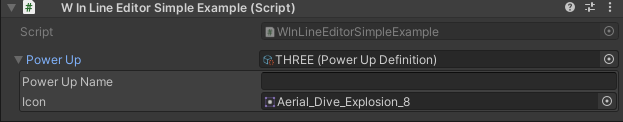
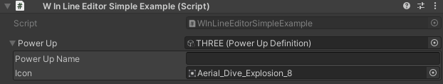
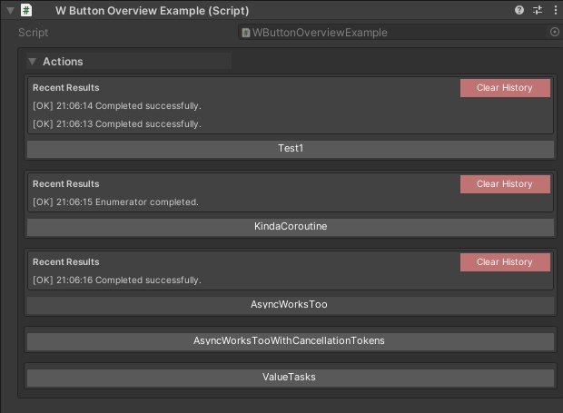
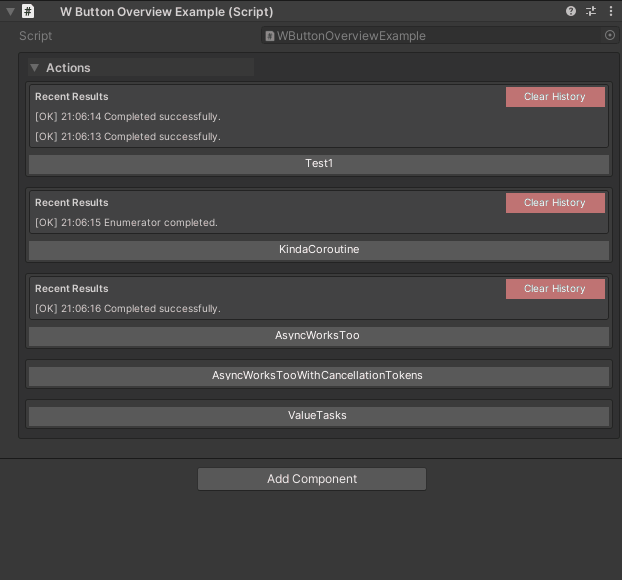
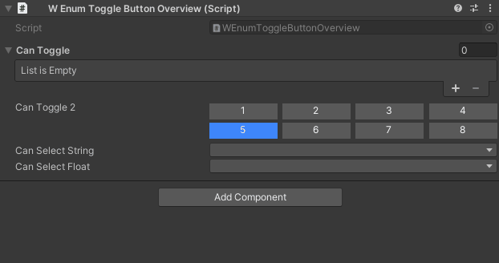
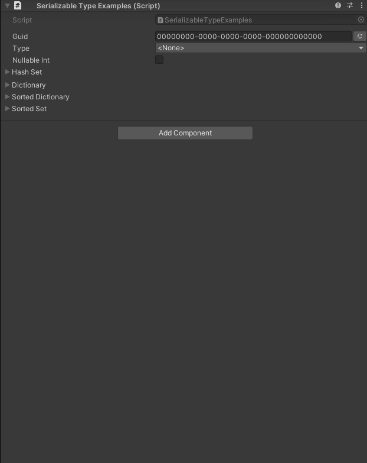

# Inspector & Serialization Features Overview

**Stop writing boilerplate. Start designing in the inspector.**

Unity Helpers includes a powerful suite of inspector attributes and serialization types that transform how you author components and data. These features eliminate repetitive code, provide designer-friendly workflows, and make your inspector experience rival commercial tools like Odin Inspector.

---

## Why Use These Features?

**Time Savings:**

- **Grouping & Organization**: Replace 50+ lines of custom editor code with a single `[WGroup]` attribute
- **Method Buttons**: Expose test methods in the inspector without writing custom editors
- **Conditional Display**: Show/hide fields based on values without PropertyDrawer boilerplate
- **Selection Controls**: Turn enums into toggle buttons, primitives into dropdowns - all declaratively
- **Serialization**: Store GUIDs, dictionaries, sets, and types with built-in Unity support

**Professional Quality:**

- Designer-friendly interfaces reduce programmer bottlenecks
- Project-wide settings ensure consistent styling and behavior
- Pagination, animation, and polish - built-in

---

## Feature Categories

### 1. Layout & Organization

Control how fields are grouped and organized in the inspector:

- **[WGroup & WGroupEnd](./inspector-grouping-attributes.md#wgroup--wgroupend)** - Boxed sections with optional collapse, auto-inclusion

```csharp
using UnityEngine;
using WallstopStudios.UnityHelpers.Core.Attributes;

public class TwoWGroupExample : MonoBehaviour
{
    [WGroup("Group 1", collapsible: true)]
    public float health;
    public int intValue;
    public string stringValue;

    [WGroup("Group 2", collapsible: true)]
    public float speed;
    public int otherIntValue;
    public string otherStringValue;
}
```


**[→ Full Guide: Inspector Grouping Attributes](./inspector-grouping-attributes.md)**

---

### 2. Inline Editing

Edit nested objects without losing context:

- **[WInLineEditor](./inspector-inline-editor.md)** - Embed inspectors for ScriptableObjects, Materials, Textures directly below the field

```csharp
using UnityEngine;
using WallstopStudios.UnityHelpers.Core.Attributes;

[CreateAssetMenu(fileName = "PowerUpDefinition", menuName = "Power-Up Definition")]
public class PowerUpDefinition : ScriptableObject
{
    public string powerUpName;
    public Sprite icon;
}

public class WInLineEditorSimpleExample : MonoBehaviour
{
    [WInLineEditor]
    public PowerUpDefinition powerUp;
}
```




**[→ Full Guide: Inspector Inline Editor](./inspector-inline-editor.md)**

---

### 3. Method Invocation

Expose methods as clickable buttons in the inspector:

- **[WButton](./inspector-button.md)** - One-click method execution with result history, async support, custom styling, grouping

```csharp
using System;
using System.Collections;
using System.Threading;
using System.Threading.Tasks;
using UnityEngine;
using WallstopStudios.UnityHelpers.Core.Attributes;
using WallstopStudios.UnityHelpers.Core.Extension;

public class WButtonOverviewExample : MonoBehaviour
{
    [WButton]
    private void Test1()
    {
        this.Log($"We did it!");
    }

    [WButton]
    private IEnumerator KindaCoroutine()
    {
        this.Log($"Starting coroutine...");
        yield return new WaitForSeconds(1f);
        this.Log($"Coroutine finished!");
    }

    [WButton]
    private async Task AsyncWorksToo()
    {
        await Task.Delay(TimeSpan.FromSeconds(1));
        this.Log($"Did it work?");
    }

    [WButton]
    private async Task AsyncWorksTooWithCancellationTokens(CancellationToken ct)
    {
        await Task.Delay(TimeSpan.FromSeconds(1), ct);
        this.Log($"Did it work?");
    }

    [WButton]
    private async ValueTask ValueTasks(CancellationToken ct)
    {
        await Task.Delay(TimeSpan.FromSeconds(1), ct);
        this.Log($"Did it work?");
    }
}
```




**[→ Full Guide: Inspector Buttons](./inspector-button.md)**

---

### 4. Conditional Display

Show or hide fields based on runtime values:

- **[WShowIf](./inspector-conditional-display.md)** - Visibility rules with comparison operators (Equal, GreaterThan, IsNull, etc.), inversion, stacking

```csharp
using UnityEngine;
using WallstopStudios.UnityHelpers.Core.Attributes;

public enum ExampleEnum
{
    Option1,
    Option2,
    Option3,
}

public class WShowIfExamples : MonoBehaviour
{
    public bool toggle;

    [WShowIf(nameof(toggle))]
    public string hiddenByBool;

    public int intValue;

    [WShowIf(nameof(intValue), WShowIfComparison.GreaterThan, 5)]
    public string hiddenByInt;

    public ExampleEnum enumValue;

    [WShowIf(nameof(enumValue), ExampleEnum.Option2, ExampleEnum.Option3)]
    public string hiddenByEnum;
}
```


**[→ Full Guide: Inspector Conditional Display](./inspector-conditional-display.md)**

---

### 5. Selection & Dropdowns

Provide designer-friendly selection controls:

- **[WEnumToggleButtons](./inspector-selection-attributes.md#wenumtogglebuttons)** - Visual toggle buttons for enums and flag enums
- **[WValueDropDown](./inspector-selection-attributes.md#wvaluedropdown)** - Generic dropdown for any type
- **[IntDropdown](./inspector-selection-attributes.md#intdropdown)** - Integer selection from predefined values
- **[StringInList](./inspector-selection-attributes.md#stringinlist)** - String selection with search and pagination

```csharp
using System.Collections.Generic;
using UnityEngine;
using WallstopStudios.UnityHelpers.Core.Attributes;

public class WEnumToggleButtonOverview : MonoBehaviour
{
    [WEnumToggleButtons]
    [IntDropDown(1, 2, 3, 4, 5, 6, 7, 8)]
    public List<int> canToggle; // Works in lists!

    [WEnumToggleButtons]
    [IntDropDown(1, 2, 3, 4, 5, 6, 7, 8)]
    public int canToggle2;

    [StringInList(typeof(WEnumToggleButtonOverview), nameof(GetStringValues))]
    public string canSelectString;

    [WValueDropDown(typeof(WEnumToggleButtonOverview), nameof(GetFloatValues))]
    public float canSelectFloat;

    private IEnumerable<string> GetStringValues()
    {
        yield return "String1";
        yield return "String2";
        yield return "String3";
    }

    private IEnumerable<float> GetFloatValues()
    {
        yield return 1.0f;
        yield return 2.0f;
        yield return 3.0f;
    }
}
```



**[→ Full Guide: Inspector Selection Attributes](./inspector-selection-attributes.md)**

---

### 6. Validation & Protection

Protect data integrity with validation attributes:

- **[WReadOnly](./inspector-validation-attributes.md#wreadonly)** - Display fields as read-only in the inspector
- **[WNotNull](./inspector-validation-attributes.md#wnotnull)** - Validate required references at runtime with `CheckForNulls()`

**[→ Full Guide: Inspector Validation Attributes](./inspector-validation-attributes.md)**

---

### 7. Serialization Types

Unity-friendly wrappers for complex data:

- **[WGuid](../serialization/serialization-types.md#wguid)** - Immutable GUID using two longs (faster than System.Guid for Unity)
- **[SerializableDictionary](../serialization/serialization-types.md#serializabledictionary)** - Key/value pairs with custom drawer
- **[SerializableSet](../serialization/serialization-types.md#serializablehashset--serializablesortedset)** - HashSet and SortedSet with duplicate detection, pagination, reordering
- **[SerializableType](../serialization/serialization-types.md#serializabletype)** - Type references that survive refactoring
- **[SerializableNullable](../serialization/serialization-types.md#serializablenullable)** - Nullable value types



**[→ Full Guide: Serialization Types](../serialization/serialization-types.md)**

---

### 8. Project Settings

Centralized configuration for all inspector features:

- **[UnityHelpersSettings](./inspector-settings.md)** - Global settings for pagination, colors, animations, history

**Location:** `ProjectSettings/UnityHelpersSettings.asset`

**Settings:**

- Pagination sizes (buttons, sets, dropdowns)
- Button placement and history capacity
- Color palettes for themes (light/dark/custom)
- Animation speeds for foldouts and groups
- Auto-include defaults


```csharp
using UnityEngine;
using WallstopStudios.UnityHelpers.Core.Attributes;

public class WButtonSettingsExample : MonoBehaviour
{
    [WButton(colorKey: "Documentation Example")]
    private void Button() { }
}
```


**[→ Full Guide: Inspector Settings](./inspector-settings.md)**

---

## Quick Start Example

Here's a complete example showcasing multiple inspector features together:

```csharp
using UnityEngine;
using WallstopStudios.UnityHelpers.Core.Attributes;
using WallstopStudios.UnityHelpers.Core.DataStructure.Adapters;

public class CharacterStats : MonoBehaviour
{
    // Grouped fields with collapsible sections
    [WGroup("Combat", "Combat Stats", collapsible: true)]
    public float maxHealth = 100f;           // In group
    public float defense = 10f;              // In group (auto-included)
    [WGroupEnd("Combat")]                    // attackPower IS included, then closes
    public float attackPower = 25f;          // In group (last field)

    // Conditional visibility based on enum
    public enum WeaponType { Melee, Ranged, Magic }
    public WeaponType weaponType;

    [WShowIf(nameof(weaponType), WShowIfComparison.Equal, WeaponType.Ranged)]
    public int ammoCapacity = 30;

    // Flag enum as toggle buttons
    [System.Flags]
    public enum Abilities { None = 0, Jump = 1, Dash = 2, Block = 4 }

    [WEnumToggleButtons(showSelectAll: true)]
    public Abilities unlockedAbilities;

    // Serializable collections
    public SerializableDictionary<string, int> stats;
    public WGuid entityId = WGuid.NewGuid();

    // Inspector button
    [WButton("Reset Stats")]
    private void ResetStats() => maxHealth = defense = attackPower = 100f;
}
```

For individual feature examples, see the detailed guides linked above.

---

## Feature Comparison

| Feature                 | Unity Default | Odin Inspector        | Unity Helpers                 |
| ----------------------- | ------------- | --------------------- | ----------------------------- |
| **Grouping/Boxes**      | Custom Editor | `[BoxGroup]`          | `[WGroup]`                    |
| **Foldouts**            | Custom Editor | `[FoldoutGroup]`      | `[WGroup(collapsible: true)]` |
| **Method Buttons**      | Custom Editor | `[Button]`            | `[WButton]`                   |
| **Conditional Display** | Custom Drawer | `[ShowIf]`            | `[WShowIf]`                   |
| **Enum Toggles**        | Custom Drawer | `[EnumToggleButtons]` | `[WEnumToggleButtons]`        |
| **Dictionaries**        | Not Supported | `[ShowInInspector]`   | `SerializableDictionary<K,V>` |
| **Sets**                | Not Supported | Custom                | `SerializableHashSet<T>`      |
| **Type References**     | Not Supported | Custom                | `SerializableType`            |
| **Nullable Values**     | Not Supported | Custom                | `SerializableNullable<T>`     |
| **Color Themes**        | Not Supported | Built-in              | Project Settings              |
| **Cost**                | Free          | $55-$95               | Free (MIT)                    |

---

## Design Philosophy

**Declarative Over Imperative:**

- Attributes describe _what_, not _how_
- No custom PropertyDrawers for common patterns
- Configuration over code

**Designer-Friendly:**

- Visual controls for visual people
- Reduce programmer bottlenecks
- Iteration without recompiling

**Performance-Conscious:**

- Cached reflection delegates
- Pooled buffers for UI rendering
- Minimal GC allocations

**Project-Consistent:**

- Centralized settings asset
- Predictable behavior across all inspectors

---

## Getting Started

1. **Install Unity Helpers** - See [Installation Guide](../../../README.md#installation)

2. **Explore Examples** - Check the guides linked above

3. **Configure Settings** - Open `ProjectSettings/UnityHelpersSettings.asset` to customize pagination, colors, and animations

4. **Add Attributes** - Start with `[WGroup]` and `[WButton]` for immediate impact

5. **Use Serialization Types** - Replace custom wrappers with `SerializableDictionary`, `SerializableSet`, etc.

---

## Detailed Documentation

### Inspector Attributes

- **[Inspector Grouping Attributes](./inspector-grouping-attributes.md)** - WGroup layout control
- **[Inspector Inline Editor](./inspector-inline-editor.md)** - WInLineEditor for nested object editing
- **[Inspector Buttons](./inspector-button.md)** - WButton for method invocation
- **[Inspector Conditional Display](./inspector-conditional-display.md)** - WShowIf for dynamic visibility
- **[Inspector Selection Attributes](./inspector-selection-attributes.md)** - WEnumToggleButtons, WValueDropDown, IntDropdown, StringInList
- **[Inspector Validation Attributes](./inspector-validation-attributes.md)** - WReadOnly, WNotNull

### Serialization

- **[Serialization Types](../serialization/serialization-types.md)** - WGuid, SerializableDictionary, SerializableSet, SerializableType, SerializableNullable

### Configuration

- **[Inspector Settings](./inspector-settings.md)** - UnityHelpersSettings asset reference

---

## See Also

- **[Odin Inspector Migration Guide](../../guides/odin-migration-guide.md)** - Step-by-step migration from Odin Inspector
- **[Editor Tools Guide](../editor-tools/editor-tools-guide.md)** - 20+ automation tools for sprites, animations, validation
- **[Relational Components](../relational-components/relational-components.md)** - Auto-wire components with attributes
- **[Effects System](../effects/effects-system.md)** - Data-driven buffs/debuffs
- **[Main Documentation](../../../README.md)** - Complete feature list

---

**Next Steps:**

Choose a guide based on what you want to learn first:

- Want organized inspectors? → [Inspector Grouping Attributes](./inspector-grouping-attributes.md)
- Want method buttons? → [Inspector Buttons](./inspector-button.md)
- Want conditional fields? → [Inspector Conditional Display](./inspector-conditional-display.md)
- Want better selection controls? → [Inspector Selection Attributes](./inspector-selection-attributes.md)
- Want data validation? → [Inspector Validation Attributes](./inspector-validation-attributes.md)
- Want to serialize complex data? → [Serialization Types](../serialization/serialization-types.md)
