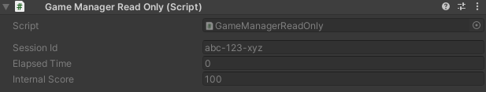
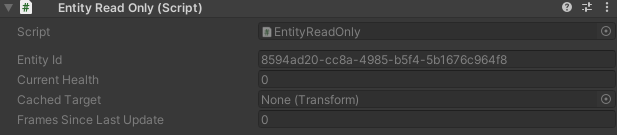
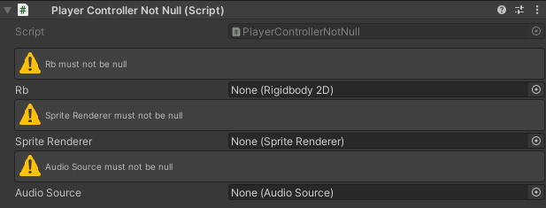
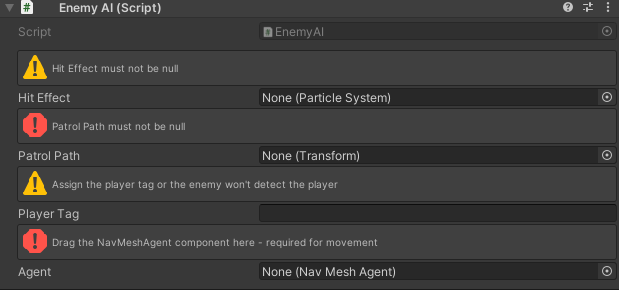
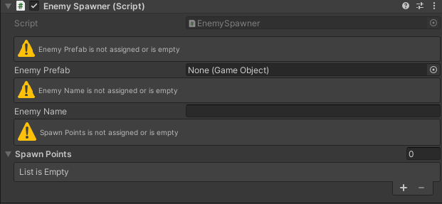
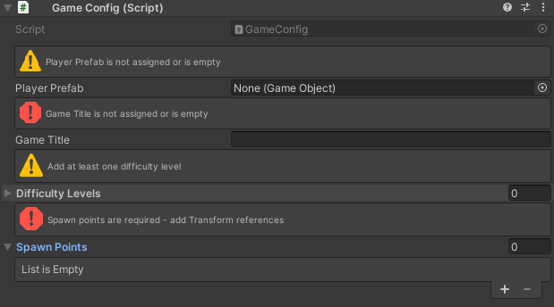

# Inspector Validation Attributes

**Protect your data with declarative validation and read-only presentation.**

Unity Helpers provides validation attributes that help maintain data integrity and prevent accidental modifications. These attributes work seamlessly with the Unity inspector and can validate fields at runtime.

---

## Table of Contents

- [WReadOnly](#wreadonly)
- [WNotNull](#wnotnull)
- [ValidateAssignment](#validateassignment)
- [Best Practices](#best-practices)

---

## WReadOnly

Displays a field in the inspector as read-only, preventing accidental modifications while keeping the value visible.

### Basic Usage

```csharp
using UnityEngine;
using WallstopStudios.UnityHelpers.Core.Attributes;

public class GameManagerReadOnly : MonoBehaviour
{
    [WReadOnly]
    public string sessionId = "abc-123-xyz";

    [WReadOnly]
    public float elapsedTime = 0f;

    [WReadOnly]
    [SerializeField]
    private int internalScore = 100;
}
```

**Behavior:**

- Field appears grayed out in the inspector
- Value is visible but cannot be edited through the inspector
- Useful for displaying computed values, debug info, or auto-generated IDs
- Works with any serializable field type

> **Visual Reference**
>
> 
>
> _Fields marked with [WReadOnly] appear grayed out and cannot be edited_

### Common Use Cases

```csharp
using UnityEngine;
using WallstopStudios.UnityHelpers.Core.Attributes;

public class EntityReadOnly : MonoBehaviour
{
    // Auto-generated unique identifier
    [WReadOnly]
    public string entityId = System.Guid.NewGuid().ToString();

    // Computed property exposed for debugging
    [WReadOnly]
    [SerializeField]
    private float _currentHealth;

    // Reference that should only be set via code
    [WReadOnly]
    public Transform cachedTarget;

    // Frame counter for debugging
    [WReadOnly]
    public int framesSinceLastUpdate;
}
```

**Why Use WReadOnly:**

- **Prevent accidents**: Stop designers from accidentally modifying auto-generated values
- **Debug visibility**: Show internal state without allowing modification
- **Documentation**: Make it clear which fields are managed by code vs. configured in the editor
- **Data integrity**: Protect computed or cached values from manual overrides

> **Visual Reference**
>
> 
>
> _Multiple field types (string, float, Transform, int) displayed as read-only_

---

## WNotNull

Validates that a field is not null, providing both **visual inspector feedback** and **runtime validation**. When a field marked with `[WNotNull]` is null, the inspector displays a warning or error HelpBox. Additionally, calling `CheckForNulls()` on an object will throw an `ArgumentNullException` for any null `[WNotNull]` fields.

### Basic Usage

```csharp
using UnityEngine;
using WallstopStudios.UnityHelpers.Core.Attributes;

public class PlayerControllerNotNull : MonoBehaviour
{
    [WNotNull]
    public Rigidbody2D rb;

    [WNotNull]
    public SpriteRenderer spriteRenderer;

    [WNotNull]
    [SerializeField]
    private AudioSource audioSource;

    private void Awake()
    {
        // Validates all [WNotNull] fields are assigned
        // Throws ArgumentNullException if any are null in Editor ONLY
        this.CheckForNulls();
    }
}
```

**Behavior:**

- **Inspector feedback**: Displays a HelpBox warning (yellow) or error (red) when the field is null
- **Runtime validation**: Call `this.CheckForNulls()` to validate all `[WNotNull]` fields
- Throws `ArgumentNullException` with the field name if any marked field is null
- Works with both Unity `Object` types and plain C# objects
- All validation runs **only in the Unity Editor** (stripped in builds for performance)

> **Visual Reference**
>
> 
>
> _Fields marked with [WNotNull] display a HelpBox in the inspector when null_

### WNotNullMessageType Enum

The `WNotNullMessageType` enum controls how null fields are displayed in the inspector:

| Value     | Description                                 |
| --------- | ------------------------------------------- |
| `Warning` | Displays a yellow warning HelpBox (default) |
| `Error`   | Displays a red error HelpBox                |

### Constructor Overloads

The `[WNotNull]` attribute supports multiple constructor overloads for flexibility:

#### Default Warning

```csharp
// Default: warning message type with auto-generated message
[WNotNull]
public GameObject target;
// Inspector shows: "target must be assigned"
```

#### Specify Message Type

```csharp
// Error message type with auto-generated message
[WNotNull(WNotNullMessageType.Error)]
public AudioSource criticalAudioSource;
// Inspector shows red error: "criticalAudioSource must be assigned"
```

#### Custom Message

```csharp
// Warning with custom message
[WNotNull("Player needs a target to attack")]
public Transform attackTarget;
// Inspector shows yellow warning: "Player needs a target to attack"
```

#### Full Customization

```csharp
// Error with custom message
[WNotNull(WNotNullMessageType.Error, "Audio source is required for sound effects")]
public AudioSource audioSource;
// Inspector shows red error: "Audio source is required for sound effects"
```

### Inspector Display Examples

```csharp
using UnityEngine;
using WallstopStudios.UnityHelpers.Core.Attributes;

public class EnemyAI : MonoBehaviour
{
    // Yellow warning - nice to have
    [WNotNull]
    public ParticleSystem hitEffect;

    // Red error - critical reference
    [WNotNull(WNotNullMessageType.Error)]
    public Transform patrolPath;

    // Warning with helpful context
    [WNotNull("Assign the player tag or the enemy won't detect the player")]
    public string playerTag;

    // Error with specific instructions
    [WNotNull(WNotNullMessageType.Error, "Drag the NavMeshAgent component here - required for movement")]
    public UnityEngine.AI.NavMeshAgent agent;
}
```

> **Visual Reference**
>
> 
>
> _Warning (yellow) and Error (red) HelpBoxes for null fields in the inspector_

### Runtime Validation with CheckForNulls()

The `CheckForNulls()` extension method validates all `[WNotNull]` fields at runtime:

```csharp
using UnityEngine;
using WallstopStudios.UnityHelpers.Core.Attributes;

public class EnemySpawner : MonoBehaviour
{
    [WNotNull]
    public GameObject enemyPrefab;

    [WNotNull]
    public Transform spawnPoint;

    [WNotNull(WNotNullMessageType.Error)]
    public EnemyManager enemyManager;

    private void Start()
    {
        // If any [WNotNull] field is null, this throws with the field name
        // Example: ArgumentNullException("enemyPrefab")
        this.CheckForNulls();

        // Safe to use - we know these are assigned
        SpawnEnemy();
    }

    private void SpawnEnemy()
    {
        GameObject enemy = Instantiate(enemyPrefab, spawnPoint.position, Quaternion.identity);
        enemyManager.RegisterEnemy(enemy);
    }
}
```

### Editor-Only Validation

Both the inspector HelpBox display and the `CheckForNulls()` extension method are only active in the Unity Editor:

```csharp
// The validation code only runs in UNITY_EDITOR
// In builds, CheckForNulls() does nothing (stripped for performance)
this.CheckForNulls();
```

This means:

- **Development**: Visual feedback in inspector + runtime null checking with detailed exception messages
- **Production**: Zero runtime cost (all validation code is stripped)

### Combining with Other Attributes

```csharp
public class UIManager : MonoBehaviour
{
    // Required reference with error severity - validated at runtime
    [WNotNull(WNotNullMessageType.Error)]
    [SerializeField]
    private Canvas mainCanvas;

    // Optional reference - not validated
    [SerializeField]
    private AudioSource clickSound;

    // Read-only and required
    [WReadOnly]
    [WNotNull]
    public RectTransform cachedRect;

    // Group with validation and custom message
    [WGroup("UI Elements")]
    [WNotNull("Start button required for main menu")]
    public Button startButton;                     // In group

    [WNotNull(WNotNullMessageType.Error, "Quit button required for main menu")]
    [WGroupEnd("UI Elements")]                     // quitButton IS included, then closes
    public Button quitButton;                      // In group (last field)
}
```

**Why Use WNotNull:**

- **Visual feedback**: See missing references immediately in the inspector without running the game
- **Severity control**: Use warnings for nice-to-have references, errors for critical ones
- **Custom messages**: Provide helpful context about why a reference is needed
- **Early failure**: Catch missing references at game start with `CheckForNulls()`, not when first used
- **Clear errors**: Get the exact field name in the exception message
- **Documentation**: Make required references explicit in code
- **Zero runtime cost**: All validation stripped from builds

---

## ValidateAssignment

Validates that a field is properly assigned, providing **visual inspector feedback** when validation fails. Unlike `[WNotNull]` which only checks for null references, `[ValidateAssignment]` validates that fields are "properly assigned" based on their type—including checking for empty strings, empty collections, and null references.

### What ValidateAssignment Validates

| Field Type                | Validation Rule          |
| ------------------------- | ------------------------ |
| Unity `Object` references | Not null                 |
| Strings                   | Not null or whitespace   |
| `IList` (arrays, List<T>) | Has at least one element |
| `ICollection`             | Has at least one element |
| `IEnumerable`             | Has at least one element |
| Other types               | Not null                 |

### Basic Usage

```csharp
using System.Collections.Generic;
using UnityEngine;
using WallstopStudios.UnityHelpers.Core.Attributes;

public class EnemySpawner : MonoBehaviour
{
    [ValidateAssignment]
    public GameObject enemyPrefab;

    [ValidateAssignment]
    public string enemyName;

    [ValidateAssignment]
    public List<Transform> spawnPoints;

    private void Start()
    {
        // Logs warnings for any invalid [ValidateAssignment] fields
        this.ValidateAssignments();
    }
}
```

**Behavior:**

- **Inspector feedback**: Displays a HelpBox warning (yellow) or error (red) when the field is invalid
- **Runtime validation**: Call `this.ValidateAssignments()` to log warnings for invalid fields
- **Programmatic checking**: Call `this.AreAnyAssignmentsInvalid()` to check if any fields are invalid
- Works with Unity `Object` types, strings, collections, and any reference type
- Inspector validation runs **only in the Unity Editor** (stripped in builds for performance)

> **Visual Reference**
>
> 
>
> _Fields marked with [ValidateAssignment] display a HelpBox in the inspector when invalid_

### ValidateAssignmentMessageType Enum

The `ValidateAssignmentMessageType` enum controls how invalid fields are displayed in the inspector:

| Value     | Description                                 |
| --------- | ------------------------------------------- |
| `Warning` | Displays a yellow warning HelpBox (default) |
| `Error`   | Displays a red error HelpBox                |

### Constructor Overloads

The `[ValidateAssignment]` attribute supports multiple constructor overloads for flexibility:

#### Default Warning

```csharp
// Default: warning message type with auto-generated message
[ValidateAssignment]
public GameObject target;
// Inspector shows: "target must be assigned"
```

#### Specify Message Type

```csharp
// Error message type with auto-generated message
[ValidateAssignment(ValidateAssignmentMessageType.Error)]
public AudioSource criticalAudioSource;
// Inspector shows red error: "criticalAudioSource must be assigned"
```

#### Custom Message

```csharp
// Warning with custom message
[ValidateAssignment("Enemy name is required for UI display")]
public string enemyName;
// Inspector shows yellow warning: "Enemy name is required for UI display"
```

#### Full Customization

```csharp
// Error with custom message
[ValidateAssignment(ValidateAssignmentMessageType.Error, "Spawn points list cannot be empty")]
public List<Transform> spawnPoints;
// Inspector shows red error: "Spawn points list cannot be empty"
```

### Inspector Display Examples

```csharp
using UnityEngine;
using WallstopStudios.UnityHelpers.Core.Attributes;
using System.Collections.Generic;

public class GameConfig : MonoBehaviour
{
    // Yellow warning - validates not null
    [ValidateAssignment]
    public GameObject playerPrefab;

    // Red error - validates string not empty/whitespace
    [ValidateAssignment(ValidateAssignmentMessageType.Error)]
    public string gameTitle;

    // Warning with helpful context - validates list not empty
    [ValidateAssignment("Add at least one difficulty level")]
    public List<string> difficultyLevels;

    // Error with specific instructions - validates array not empty
    [ValidateAssignment(ValidateAssignmentMessageType.Error, "Spawn points are required - add Transform references")]
    public Transform[] spawnPoints;
}
```

> **Visual Reference**
>
> 
>
> _Warning (yellow) and Error (red) HelpBoxes for various invalid field types_

### Runtime Validation Methods

Two extension methods are available for runtime validation of `[ValidateAssignment]` fields:

#### ValidateAssignments()

Logs warnings to the console for all invalid fields:

```csharp
using UnityEngine;
using WallstopStudios.UnityHelpers.Core.Attributes;

public class LevelManager : MonoBehaviour
{
    [ValidateAssignment]
    public GameObject[] enemyPrefabs;

    [ValidateAssignment]
    public string levelName;

    private void Start()
    {
        // Logs a warning for each invalid [ValidateAssignment] field
        this.ValidateAssignments();
    }
}
```

#### AreAnyAssignmentsInvalid()

Returns `true` if any `[ValidateAssignment]` field is invalid:

```csharp
using UnityEngine;
using WallstopStudios.UnityHelpers.Core.Attributes;

public class SpawnManager : MonoBehaviour
{
    [ValidateAssignment]
    public GameObject spawnPrefab;

    [ValidateAssignment]
    public List<Transform> spawnLocations;

    private void Start()
    {
        if (this.AreAnyAssignmentsInvalid())
        {
            Debug.LogError("SpawnManager has invalid assignments - spawning disabled");
            enabled = false;
            return;
        }

        // Safe to proceed - all assignments are valid
        SpawnEnemies();
    }
}
```

### ValidateAssignment vs WNotNull

Both attributes validate fields and provide inspector feedback, but they serve different purposes:

| Feature                    | ValidateAssignment             | WNotNull                       |
| -------------------------- | ------------------------------ | ------------------------------ |
| **Null object check**      | ✓                              | ✓                              |
| **Empty string check**     | ✓                              | ✗                              |
| **Empty collection check** | ✓                              | ✗                              |
| **Runtime behavior**       | Logs warnings                  | Throws `ArgumentNullException` |
| **Best for**               | Comprehensive field validation | Strict null reference checking |

**When to use which:**

- Use `[ValidateAssignment]` when you need to validate that strings are non-empty or collections have elements
- Use `[WNotNull]` when you want strict null checking with an exception thrown at runtime
- Use `[ValidateAssignment]` when you want softer runtime validation (warnings instead of exceptions)
- Use `[WNotNull]` for critical references where the game should fail fast if not assigned

```csharp
public class PlayerSetup : MonoBehaviour
{
    // Use WNotNull for critical references - throws if null
    [WNotNull(WNotNullMessageType.Error)]
    public Rigidbody2D rb;

    // Use ValidateAssignment for string validation
    [ValidateAssignment]
    public string playerName;

    // Use ValidateAssignment for collection validation
    [ValidateAssignment(ValidateAssignmentMessageType.Error, "Add at least one weapon")]
    public List<GameObject> startingWeapons;

    private void Awake()
    {
        // Throws ArgumentNullException if rb is null
        this.CheckForNulls();

        // Logs warnings if playerName is empty or startingWeapons is empty
        this.ValidateAssignments();
    }
}
```

### Combining with Other Attributes

```csharp
using UnityEngine;
using WallstopStudios.UnityHelpers.Core.Attributes;
using System.Collections.Generic;

public class UIManager : MonoBehaviour
{
    // Group with validation
    [WGroup("Required UI Elements")]
    [ValidateAssignment(ValidateAssignmentMessageType.Error)]
    public Canvas mainCanvas;                      // In group

    [ValidateAssignment("Button text cannot be empty")]
    public string startButtonText;                 // In group (auto-included)

    [ValidateAssignment(ValidateAssignmentMessageType.Error, "Add menu items to display")]
    [WGroupEnd("Required UI Elements")]            // menuItems IS included, then closes
    public List<GameObject> menuItems;             // In group (last field)

    // Conditional validation
    [WShowIf(nameof(useCustomTheme))]
    [ValidateAssignment("Custom theme name required when using custom theme")]
    public string customThemeName;

    public bool useCustomTheme;
}
```

**Why Use ValidateAssignment:**

- **Comprehensive validation**: Validates strings, collections, and references—not just null checks
- **Visual feedback**: See invalid fields immediately in the inspector
- **Severity control**: Use warnings for nice-to-have fields, errors for critical ones
- **Custom messages**: Provide helpful context about validation requirements
- **Non-throwing validation**: Use `ValidateAssignments()` for warnings instead of exceptions
- **Programmatic checking**: Use `AreAnyAssignmentsInvalid()` for conditional logic
- **Zero runtime cost**: All validation stripped from builds

---

## Best Practices

### 1. Validate Early

Call `CheckForNulls()` and `ValidateAssignments()` in `Awake()` or `Start()` to catch missing references immediately:

```csharp
private void Awake()
{
    // Throws for critical null references
    this.CheckForNulls();
    // Logs warnings for empty strings, collections, etc.
    this.ValidateAssignments();
}
```

### 2. Choose the Right Validation Attribute

```csharp
// Use WNotNull for critical object references (throws on null)
[WNotNull(WNotNullMessageType.Error)]
public Rigidbody2D rb;

// Use ValidateAssignment for strings (validates not empty/whitespace)
[ValidateAssignment]
public string playerName;

// Use ValidateAssignment for collections (validates not empty)
[ValidateAssignment(ValidateAssignmentMessageType.Error)]
public List<Transform> waypoints;
```

### 3. Use WReadOnly for Computed Values

```csharp
[WReadOnly]
public float Speed => rb.velocity.magnitude;
```

### 4. Combine with Relational Components

```csharp
// Auto-wired but protected from manual changes
[WReadOnly]
[SiblingComponent]
public Collider2D col;
```

### 5. Document Intent

```csharp
// Required: Must be assigned in inspector
[WNotNull]
public AudioClip attackSound;

// Required: Must not be empty
[ValidateAssignment]
public string characterName;

// Optional: May be null
public AudioClip hitSound;
```

### 6. Use with ScriptableObjects

```csharp
[CreateAssetMenu]
public class GameConfig : ScriptableObject
{
    [WNotNull]
    public GameObject playerPrefab;

    [WNotNull]
    public Material defaultMaterial;

    [ValidateAssignment("Game title cannot be empty")]
    public string gameTitle;

    [ValidateAssignment(ValidateAssignmentMessageType.Error)]
    public List<string> supportedLanguages;

    private void OnEnable()
    {
        this.CheckForNulls();
        this.ValidateAssignments();
    }
}
```

---

## See Also

- **[Inspector Grouping Attributes](inspector-grouping-attributes.md)** - Organize related fields
- **[Inspector Conditional Display](inspector-conditional-display.md)** - Show/hide fields conditionally
- **[Relational Components](../relational-components/relational-components.md)** - Auto-wire component references
