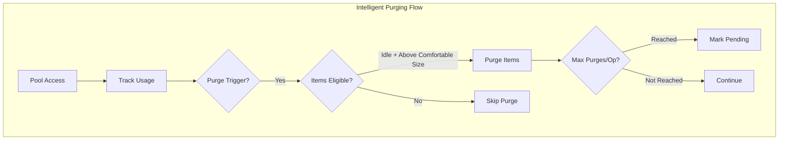
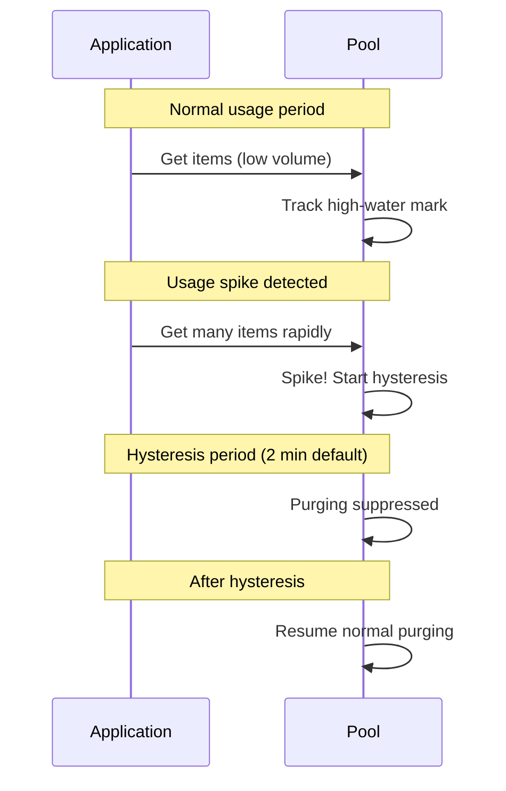

---
---

# Intelligent Pooling System

## TL;DR — Why Use This

- Automatic memory management with intelligent purging that adapts to usage patterns.
- Avoid GC spikes by spreading purges across frames and responding to memory pressure.
- Type-specific policies for different object lifetimes (short-lived lists vs long-lived audio sources).
- Zero-configuration defaults that "just work" with opt-in customization.

---

## Contents

- [Overview](#overview)
- [Quick Start](#quick-start)
- [PoolOptions Configuration](#pooloptions-configuration)
- [Global Settings (PoolPurgeSettings)](#global-settings-poolpurgesettings)
- [Eviction Policies](#eviction-policies)
- [Memory Pressure Detection](#memory-pressure-detection)
- [Size-Aware Policies](#size-aware-policies)
- [Access Frequency Tracking](#access-frequency-tracking)
- [Application Lifecycle Hooks](#application-lifecycle-hooks)
- [Global Pool Registry](#global-pool-registry)
- [Best Practices](#best-practices)

---

## Overview

The intelligent pooling system provides automatic memory management for `WallstopGenericPool<T>` instances. Instead of pools growing unbounded or requiring manual purge calls, the system:

1. **Tracks usage patterns** - Monitors high-water marks and access frequency
2. **Purges intelligently** - Only removes items unlikely to be needed soon
3. **Spreads work** - Limits purges per operation to avoid GC spikes
4. **Responds to pressure** - Aggressive cleanup when memory is low
5. **Respects object size** - Large objects get stricter policies



---

## Quick Start

### Basic Usage (Zero Configuration)

By default, intelligent purging is **enabled** with conservative settings:

```csharp
using WallstopStudios.UnityHelpers.Utils;

// Pools automatically use intelligent purging
var pool = new WallstopGenericPool<List<int>>(
    createFunc: () => new List<int>(),
    actionOnGet: list => list.Clear()
);

// Rent and return as usual - purging happens automatically
var list = pool.Get();
list.Add(1);
list.Add(2);
pool.Release(list);
```

### Disable Globally (One-Liner Opt-Out)

```csharp
// Disable all intelligent purging
PoolPurgeSettings.DisableGlobally();
```

### Per-Type Configuration

```csharp
using WallstopStudios.UnityHelpers.Utils;

// Configure specific type behavior
PoolPurgeSettings.Configure<ExpensiveObject>(options =>
{
    options.IdleTimeoutSeconds = 600f;  // 10 minutes
    options.MinRetainCount = 5;         // Always keep 5
    options.WarmRetainCount = 10;       // Keep 10 when active
});

// Configure all List<T> variants
PoolPurgeSettings.ConfigureGeneric(typeof(List<>), options =>
{
    options.IdleTimeoutSeconds = 120f;  // 2 minutes
    options.BufferMultiplier = 1.5f;    // 50% buffer
});

// Disable purging for specific types
PoolPurgeSettings.Disable<CriticalResource>();
```

---

## PoolOptions Configuration

`PoolOptions<T>` provides per-pool configuration:

```csharp
using WallstopStudios.UnityHelpers.Utils;

var options = new PoolOptions<MyObject>
{
    // Size limits
    MaxPoolSize = 100,           // Hard cap on pool size
    MinRetainCount = 0,          // Absolute minimum to keep
    WarmRetainCount = 2,         // Keep 2 when active

    // Timing
    IdleTimeoutSeconds = 300f,   // 5 minutes before eligible
    PurgeIntervalSeconds = 60f,  // Periodic check interval

    // Intelligent purging
    UseIntelligentPurging = true,
    BufferMultiplier = 2.0f,     // 2x peak usage buffer
    RollingWindowSeconds = 300f, // 5 minute window
    HysteresisSeconds = 120f,    // 2 minute spike cooldown
    SpikeThresholdMultiplier = 2.5f, // 2.5x average = spike
    MaxPurgesPerOperation = 10,  // Spread large purges

    // Triggers
    Triggers = PurgeTrigger.OnRent | PurgeTrigger.OnReturn,

    // Callbacks
    OnPurge = (item, reason) => Debug.Log($"Purged: {reason}")
};

var pool = new WallstopGenericPool<MyObject>(
    createFunc: () => new MyObject(),
    options: options
);
```

### PurgeTrigger Flags

| Trigger    | Description                                  |
| ---------- | -------------------------------------------- |
| `OnRent`   | Check when item is rented (lazy cleanup)     |
| `OnReturn` | Check when item is returned                  |
| `Periodic` | Timer-based checks at `PurgeIntervalSeconds` |
| `Explicit` | Only purge when `Purge()` is called manually |

### PurgeReason Values

| Reason             | Description                                    |
| ------------------ | ---------------------------------------------- |
| `IdleTimeout`      | Item was idle longer than `IdleTimeoutSeconds` |
| `CapacityExceeded` | Pool exceeded `MaxPoolSize`                    |
| `MemoryPressure`   | System memory pressure detected                |
| `AppBackgrounded`  | Application went to background                 |
| `SceneUnloaded`    | Scene was unloaded                             |
| `Explicit`         | Manual `Purge()` call                          |
| `BudgetExceeded`   | Global pool budget exceeded                    |

---

## Global Settings (PoolPurgeSettings)

Configure system-wide defaults:

```csharp
using WallstopStudios.UnityHelpers.Utils;

// Enable/disable globally
PoolPurgeSettings.GlobalEnabled = true;

// Configure defaults
PoolPurgeSettings.DefaultGlobalIdleTimeoutSeconds = 300f;
PoolPurgeSettings.DefaultGlobalMinRetainCount = 0;
PoolPurgeSettings.DefaultGlobalWarmRetainCount = 2;
PoolPurgeSettings.DefaultGlobalBufferMultiplier = 2.0f;
PoolPurgeSettings.DefaultGlobalRollingWindowSeconds = 300f;
PoolPurgeSettings.DefaultGlobalHysteresisSeconds = 120f;
PoolPurgeSettings.DefaultGlobalSpikeThresholdMultiplier = 2.5f;
PoolPurgeSettings.DefaultGlobalMaxPurgesPerOperation = 10;

// Lifecycle hooks
PoolPurgeSettings.PurgeOnLowMemory = true;       // Application.lowMemory
PoolPurgeSettings.PurgeOnAppBackground = true;   // Application.focusChanged
PoolPurgeSettings.PurgeOnSceneUnload = true;     // SceneManager.sceneUnloaded
```

### Retention Model

The system uses a two-tier retention model:

- **MinRetainCount**: Absolute floor. Pool never purges below this, even when completely idle.
- **WarmRetainCount**: Floor for "active" pools (accessed within IdleTimeoutSeconds). Prevents cold-start allocations.

```text
Effective Floor = max(MinRetainCount, isActive ? WarmRetainCount : 0)
```

**Example:**

- `MinRetainCount = 0`, `WarmRetainCount = 2`
- Active pool: keeps at least 2 items warm
- Idle pool (no access for IdleTimeoutSeconds): can purge to 0

---

## Eviction Policies

### Comfortable Size Calculation

The "comfortable size" determines when purging is needed:

```text
ComfortableSize = max(EffectiveMinRetain, RollingHighWaterMark * BufferMultiplier)
```

Only items that would leave the pool above comfortable size AND have been idle longer than `IdleTimeoutSeconds` are purged.

### Hysteresis Protection

After a usage spike, purging is suppressed for `HysteresisSeconds` to prevent purge-allocate cycles:



### Gradual Purging

Large purge operations are spread across multiple calls:

```csharp
// Configure max items purged per operation
options.MaxPurgesPerOperation = 10;

// Pool tracks pending purges
if (pool.HasPendingPurges)
{
    // More items to purge on next trigger
}

// Force immediate full purge (bypasses limit)
pool.ForceFullPurge();
```

---

## Memory Pressure Detection

The system monitors memory pressure and adjusts purging aggressiveness:

```csharp
using WallstopStudios.UnityHelpers.Utils;

// Check current pressure level
MemoryPressureLevel level = MemoryPressureMonitor.CurrentPressure;

switch (level)
{
    case MemoryPressureLevel.None:
        // Normal operation
        break;
    case MemoryPressureLevel.Low:
        // Minor pressure, slightly more aggressive
        break;
    case MemoryPressureLevel.Medium:
        // Moderate pressure, reduced buffers
        break;
    case MemoryPressureLevel.High:
        // Significant pressure, aggressive purging
        break;
    case MemoryPressureLevel.Critical:
        // Emergency cleanup, bypass limits
        break;
}
```

### Pressure Detection Sources

| Metric                | Threshold                        |
| --------------------- | -------------------------------- |
| Absolute Memory       | Managed heap exceeds threshold   |
| GC Collection Rate    | Frequent GC collections detected |
| Memory Growth Rate    | Rapid memory increase            |
| Application.lowMemory | Unity's low memory callback      |

---

## Size-Aware Policies

Large objects (allocated on the Large Object Heap) get stricter policies:

```csharp
using WallstopStudios.UnityHelpers.Utils;

// Enable size-aware policies
PoolPurgeSettings.SizeAwarePoliciesEnabled = true;

// Configure thresholds
PoolPurgeSettings.LargeObjectThresholdBytes = 85000;  // .NET LOH threshold
PoolPurgeSettings.LargeObjectBufferMultiplier = 1.0f; // No buffer (vs 2.0x)
PoolPurgeSettings.LargeObjectIdleTimeoutMultiplier = 0.5f; // 50% shorter
PoolPurgeSettings.LargeObjectWarmRetainCount = 1;     // Keep 1 (vs 2)
```

### PoolSizeEstimator

Estimate object sizes for policy decisions:

```csharp
using WallstopStudios.UnityHelpers.Utils;

// Estimate single item size
long size = PoolSizeEstimator.EstimateItemSizeBytes<MyLargeObject>();

// Estimate array size
long arraySize = PoolSizeEstimator.EstimateArraySizeBytes<byte>(length: 100000);

// Check if on LOH
bool isLargeObject = size >= PoolPurgeSettings.LargeObjectThresholdBytes;
```

---

## Access Frequency Tracking

Pools track access patterns for intelligent decisions:

```csharp
using WallstopStudios.UnityHelpers.Utils;

// Get frequency statistics
PoolFrequencyStatistics stats = pool.FrequencyStatistics;

// Access metrics
float rentalsPerMinute = stats.RentalsPerMinute;
float avgInterRentalTime = stats.AverageInterRentalTimeSeconds;
float lastAccess = stats.LastAccessTime;

// Helper properties
bool isHighFrequency = stats.IsHighFrequency;  // > 60 rentals/min
bool isLowFrequency = stats.IsLowFrequency;    // < 1 rental/min
bool isUnused = stats.IsUnused;                // No recent access
```

---

## Application Lifecycle Hooks

The system responds to application lifecycle events:

```csharp
using WallstopStudios.UnityHelpers.Utils;

// Configure lifecycle responses
PoolPurgeSettings.PurgeOnLowMemory = true;     // Application.lowMemory
PoolPurgeSettings.PurgeOnAppBackground = true; // Application loses focus
PoolPurgeSettings.PurgeOnSceneUnload = true;   // Scene unloaded
```

### Mobile Considerations

On mobile platforms:

- **App backgrounded**: Aggressive purge to reduce memory footprint
- **Low memory**: Emergency purge, bypasses gradual limits
- **Scene unload**: Clean up scene-specific pools

---

## Global Pool Registry

Track and manage all pools system-wide:

```csharp
using WallstopStudios.UnityHelpers.Utils;

// Configure global budget
PoolPurgeSettings.GlobalMaxPooledItems = 50000;

// Get global statistics
GlobalPoolStatistics globalStats = GlobalPoolRegistry.GetStatistics();
int totalPooled = globalStats.TotalPooledItems;
float budgetUtilization = globalStats.BudgetUtilization;
int registeredPools = globalStats.RegisteredPoolCount;

// Force budget enforcement
GlobalPoolRegistry.EnforceBudget();

// Try non-blocking budget check
if (GlobalPoolRegistry.TryEnforceBudgetIfNeeded())
{
    // Budget was over, items purged
}
```

### LRU Cross-Pool Eviction

When the global budget is exceeded, items are evicted across all pools using LRU ordering based on pool access times.

---

## Best Practices

### Configuration Hierarchy

Settings are resolved in priority order:

1. **Per-instance PoolOptions** (highest priority)
2. **Programmatic type configuration** (`PoolPurgeSettings.Configure<T>`)
3. **Generic type pattern** (`PoolPurgeSettings.ConfigureGeneric`)
4. **Attribute-based** (`[PoolPurgePolicy]` on type)
5. **Settings asset configuration**
6. **Built-in type defaults**
7. **Global defaults** (lowest priority)

### Type-Specific Recommendations

```csharp
// Short-lived temporary collections
PoolPurgeSettings.Configure<List<int>>(o =>
{
    o.IdleTimeoutSeconds = 60f;
    o.WarmRetainCount = 5;
});

// Long-lived expensive objects
PoolPurgeSettings.Configure<AudioSource>(o =>
{
    o.IdleTimeoutSeconds = 600f;
    o.MinRetainCount = 2;
    o.WarmRetainCount = 4;
});

// Large buffers (be aggressive)
PoolPurgeSettings.Configure<byte[]>(o =>
{
    o.IdleTimeoutSeconds = 30f;
    o.BufferMultiplier = 1.0f;
    o.WarmRetainCount = 1;
});
```

### Performance Tips

1. **Use gradual purging** - Default `MaxPurgesPerOperation = 10` prevents GC spikes
2. **Size buffers appropriately** - 2x buffer is conservative, 1.5x for memory-constrained
3. **Monitor frequency stats** - Use `FrequencyStatistics` to tune per-type settings
4. **Enable size-aware policies** - Large objects need stricter handling
5. **Use lifecycle hooks** - Let the system handle mobile backgrounding

### Debugging

```csharp
// Log purge events
var options = new PoolOptions<MyObject>
{
    OnPurge = (item, reason) =>
    {
        Debug.Log($"[Pool] Purged {typeof(MyObject).Name}: {reason}");
    }
};

// Check global stats periodically
void OnGUI()
{
    var stats = GlobalPoolRegistry.Statistics;
    GUILayout.Label($"Pools: {stats.RegisteredPoolCount}");
    GUILayout.Label($"Items: {stats.TotalPooledItems}/{PoolPurgeSettings.GlobalMaxPooledItems}");
    GUILayout.Label($"Budget: {stats.BudgetUtilization:P0}");
}
```

---

## Related Documentation

- [Data Structures](./data-structures.md) - Cache and other collections
- [Helper Utilities](./helper-utilities.md) - Coroutine wait pools (Buffers)
- [Editor Tools Guide](../editor-tools/editor-tools-guide.md) - Project settings
