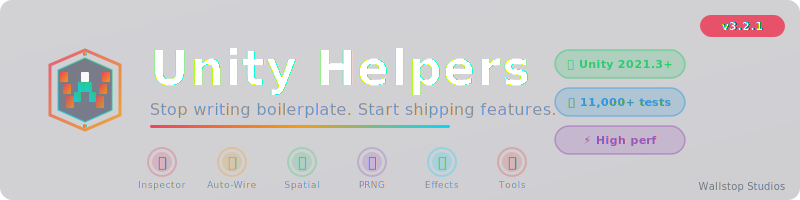

<div class="md-banner" markdown>
{ width="800" }
</div>

<div class="md-badges" markdown>
[](https://github.com/wallstop/unity-helpers)
[](https://github.com/wallstop/unity-helpers/wiki)
[](https://openupm.com/packages/com.wallstop-studios.unity-helpers/)
</div>

---

**Utilities tested in commercial releases**

Unity Helpers reduces repetitive work with utilities tested in commercial releases. Benchmarks show 10-15x faster random generation than Unity.Random and significant speedups for common reflection operations. From auto-wiring components to fast spatial queries, this toolkit provides common utilities for Unity development.

---

## Quick Install

=== "OpenUPM (Recommended)"

    ```bash
    openupm add com.wallstop-studios.unity-helpers
    ```

=== "Git URL"

    In Unity Package Manager, click **Add package from git URL** and enter:

    ```text
    https://github.com/wallstop/unity-helpers.git
    ```

=== "NPM Registry"

    Add scoped registry in `manifest.json`:

    ```json
    {
      "scopedRegistries": [
        {
          "name": "npm",
          "url": "https://registry.npmjs.org",
          "scopes": ["com.wallstop-studios"]
        }
      ],
      "dependencies": {
        "com.wallstop-studios.unity-helpers": "3.0.0"
      }
    }
    ```

=== "Source"

    Download the [latest release](https://github.com/wallstop/unity-helpers/releases) `.unitypackage` or clone the repository.

---

## What Makes This Different

<div class="feature-grid" markdown>

<div class="feature-card" markdown>

### Inspector Tooling

Grouping, buttons, conditional display, toggle grids for Unity inspectors, free and open source.

[Learn more :material-arrow-right:](./features/inspector/inspector-overview.md){ .md-button }

</div>

<div class="feature-card" markdown>

### 10-15x Faster Random

`PRNG.Instance` provides high-performance random generation with API including weighted selection, Gaussian distribution, and Perlin noise.

[Learn more :material-arrow-right:](./features/utilities/random-generators.md){ .md-button }

</div>

<div class="feature-card" markdown>

### Zero-Boilerplate Component Wiring

Auto-wire components with attributes like `[SiblingComponent]`, `[ParentComponent]`, and `[ChildComponent]`. Works with DI containers.

[Learn more :material-arrow-right:](./features/relational-components/relational-components.md){ .md-button }

</div>

<div class="feature-card" markdown>

### Data-Driven Effects System

Designer-friendly buffs and debuffs as ScriptableObjects. Add new effects via data instead of code changes.

[Learn more :material-arrow-right:](./features/effects/effects-system.md){ .md-button }

</div>

<div class="feature-card" markdown>

### O(log n) Spatial Queries

QuadTree, KdTree, RTree, OctTree, and SpatialHash for 2D and 3D. Efficient spatial queries without linear iteration.

[Learn more :material-arrow-right:](./features/spatial/spatial-trees-2d-guide.md){ .md-button }

</div>

<div class="feature-card" markdown>

### 20+ Editor Tools

Automate sprite, animation, texture, and prefab workflows. Reduces manual repetitive tasks.

[Learn more :material-arrow-right:](./features/editor-tools/editor-tools-guide.md){ .md-button }

</div>

</div>

---

## First Time Here?

Pick your starting point based on your biggest pain point:

| Your Problem                      | Your Solution                                                                                                                      | Time to Value |
| --------------------------------- | ---------------------------------------------------------------------------------------------------------------------------------- | ------------- |
| Writing custom editors            | [**Inspector Tooling**](./features/inspector/inspector-overview.md) - Inspector attributes, free                                   | ~2 minutes    |
| Writing `GetComponent` everywhere | [**Relational Components**](./features/relational-components/relational-components.md) - Auto-wire with attributes                 | ~2 minutes    |
| Need buffs/debuffs system         | [**Effects System**](./features/effects/effects-system.md) - Designer-friendly ScriptableObjects                                   | ~5 minutes    |
| Slow spatial searches             | [**Spatial Trees**](./features/spatial/spatial-trees-2d-guide.md) - O(log n) queries                                               | ~5 minutes    |
| Random is too slow/limited        | [**Random Generators**](./features/utilities/random-generators.md) - 10-15x faster with weighted selection, Gaussian, Perlin noise | ~1 minute     |
| Need save/load system             | [**Serialization**](./features/serialization/serialization.md) - Unity types supported                                             | ~10 minutes   |
| Manual sprite workflows           | [**Editor Tools**](./features/editor-tools/editor-tools-guide.md) - 20+ automation tools                                           | ~3 minutes    |

!!! tip "Not sure where to start?"

    The [Getting Started Guide](./overview/getting-started.md) walks through the top 3 features in 5 minutes.

---

## Quick Examples

### Auto-Wire Components

```csharp title="Player.cs"
using UnityEngine;
using WallstopStudios.UnityHelpers.Core.Attributes;

public class Player : MonoBehaviour
{
    // Auto-finds on same GameObject
    [SiblingComponent] private SpriteRenderer spriteRenderer;

    // Auto-finds in parent hierarchy
    [ParentComponent] private Rigidbody2D rigidbody;

    // Auto-finds all in children
    [ChildComponent] private Collider2D[] childColliders;

    void Awake()
    {
        this.AssignRelationalComponents(); // One call wires all marked fields
    }
}
```

### Fast Random Generation

```csharp title="LootDrop.cs"
using WallstopStudios.UnityHelpers.Core.Random;
using WallstopStudios.UnityHelpers.Core.Extension;

public class LootDrop : MonoBehaviour
{
    void Start()
    {
        // 10-15x faster than UnityEngine.Random
        IRandom rng = PRNG.Instance;

        // Basic usage
        int damage = rng.Next(10, 20);
        float chance = rng.NextFloat();

        // Weighted random selection
        string[] loot = { "Common", "Rare", "Epic", "Legendary" };
        float[] weights = { 0.6f, 0.25f, 0.10f, 0.05f };
        int index = rng.NextWeightedIndex(weights);
        Debug.Log($"Dropped: {loot[index]}");
    }
}
```

### Inspector Attributes

```csharp title="CharacterStats.cs"
using UnityEngine;
using WallstopStudios.UnityHelpers.Core.Attributes;

public class CharacterStats : MonoBehaviour
{
    [WGroup("combat", "Combat Stats", collapsible: true)]
    public float maxHealth = 100f;
    [WGroupEnd("combat")]
    public float defense = 10f;

    public enum WeaponType { Melee, Ranged, Magic }
    public WeaponType weaponType;

    [WShowIf(nameof(weaponType), WShowIfComparison.Equal, WeaponType.Ranged)]
    public int ammoCapacity = 30;

    [WButton("Heal to Full", groupName: "Debug")]
    private void HealToFull() { maxHealth = 100f; }
}
```

---

## Production Ready

<div class="feature-grid" markdown>

<div class="feature-card" markdown>

### 8,000+ Tests

8,000+ automated tests.

</div>

<div class="feature-card" markdown>

### Shipped in Commercial Games

Used in commercial game releases.

</div>

<div class="feature-card" markdown>

### IL2CPP & WebGL Compatible

Compatible with IL2CPP and WebGL. Includes optimizations for AOT compilation.

</div>

<div class="feature-card" markdown>

### Schema Evolution

Schema evolution support for backward-compatible serialization. Forward and backward compatible serialization.

</div>

</div>

---

## Documentation

- **[Getting Started](./overview/getting-started.md)** - Quick start guide (5 minutes)
- **[Feature Index](./overview/index.md)** - Alphabetical reference of all features
- **[Glossary](./overview/glossary.md)** - Term definitions
- **[Roadmap](./overview/roadmap.md)** - Upcoming features and priorities

### Features

- [Inspector Tooling](./features/inspector/inspector-overview.md) - Attributes, buttons, validation
- [Relational Components](./features/relational-components/relational-components.md) - Auto-wire with attributes
- [Effects System](./features/effects/effects-system.md) - Data-driven buffs/debuffs
- [Spatial Trees](./features/spatial/spatial-trees-2d-guide.md) - Fast spatial queries
- [Serialization](./features/serialization/serialization.md) - JSON and Protobuf with Unity types
- [Data Structures](./features/utilities/data-structures.md) - Heaps, tries, and more
- [Random Generators](./features/utilities/random-generators.md) - High-performance PRNGs
- [Editor Tools](./features/editor-tools/editor-tools-guide.md) - Sprite, animation, texture automation

### Performance

- [Random Performance](./performance/random-performance.md)
- [Spatial Tree 2D Performance](./performance/spatial-tree-2d-performance.md)
- [Spatial Tree 3D Performance](./performance/spatial-tree-3d-performance.md)
- [Relational Components Performance](./performance/relational-components-performance.md)

---

## License

Unity Helpers is released under the [MIT License](./project/license.md). Use it freely in commercial and personal projects.

---

<div class="md-cta" markdown>
**Ready to get started?**

[Getting Started Guide](./overview/getting-started.md){ .md-button .md-button--primary }
[View on GitHub](https://github.com/wallstop/unity-helpers){ .md-button }

</div>
